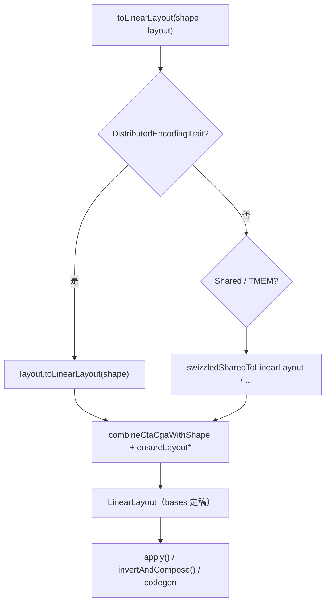

# 020 LinearLayout：原理、用法与真实 Layout 的对应

> **本文目标**：不罗列 API，而是回答三个问题——**LinearLayout 是什么**、**它和 IR 里的 blocked/linear 有什么关系**、**编译器里怎么用**。
>
> 前置阅读：`010_layout.md` §2（硬件层次）、§3（tile/slot 语义）。本文是它的 **编译器内部数学表示**。

---

## 0. 阅读路线

**章节目录**（按编号）：

```
§1  两个世界          → 人看的 tile 表 vs 编译器里的 bases
§2  第一性原理        → 为什么用 XOR、为什么只定义 2 的幂
§3  映射如何实现      → bases 存储 + apply() 执行 + operator* 组合
§4  手把手推导        → 从 blocked 参数算出 bases（含完整例子）
§5  所有 Layout 转换  → 三种模式 + MMA 手算（§5.4.1）+ Slice 详解（§5.7）+ 速查表见附录 A
§6  shape 的影响      → ensureLayout* / combineCtaCga 如何改 bases
§7  编译器怎么用      → invertAndCompose 手算、convert_layout、codegen
§8  自己构造与验证    → 对照单元测试逐行验证
§9  代码索引
附录 A               → 14 种 encoding → LL 完整转换表
```

**推荐首次阅读顺序**（不必按章号）：

```
§1–§3  建立「硬件→逻辑」和 apply
  ↓
§4.3–4.4  手推 1D/2D blocked（必做习题）
  ↓
§6.4 + §6.3.1  看 wrap/broadcast 如何改 bases，以及非单射后果
  ↓
§7.2–7.5  invertAndCompose 手算 + codegen 落点
  ↓
§5.1–5.4.1 + §5.7  三种转换模式 + nvidia_mma 手算 + Slice（跳过附录 A，需要时再查）
  ↓
§8.4  跑一个单元测试对照
```

与 `010_layout.md` 的分工：

| 文档 | 视角 | 核心问题 |
|------|------|----------|
| `010_layout.md` §3 | 人读 IR、手算 tile | 逻辑坐标 $i$ → 哪个 thread 持有？ |
| **本文** | 编译器内部 | 硬件坐标 $(r,\ell,w,b)$ → 逻辑坐标 $(i_0,i_1,\ldots)$？ |
| `010_layout.md` §4 | 5 分钟直觉 | LinearLayout 是什么（浅读即可） |
| `010_layout.md` §6–§9 | encoding 语义 | blocked / MMA / Shared / TMEM 各自含义 |
| **本文 §5 + 附录 A** | encoding → bases | 编译器如何把参数变成 bases |

两者描述 **同一张映射表**，只是方向不同、表示不同。读本文 **不能替代** `010` 的 MMA/Shared 章节——本文讲「怎么变成 bases」，`010` 讲「这个 encoding 在硬件上是什么意思」。

---

## §1 两个世界：tile 表 vs LinearLayout

### 1.1 人看的 Layout（`010_layout.md` §3）

`blocked` 的参数 `sizePerThread`、`threadsPerWarp`、`warpsPerCTA`、`order` 描述的是一个 **有限 tile** 内的分工：

```
layout 表里每个格子写 thread id
tensor 比 tile 大 → wrap（重复 tile）
tensor 比 tile 小 → broadcast（多 thread 持同一元素）
```

这是 **slot → thread id** 的方向（逻辑坐标 → 硬件）。

### 1.2 编译器内的 LinearLayout

LinearLayout 是 **硬件坐标 → 逻辑坐标** 的函数：

```
L(register, lane, warp, block) = (dim0, dim1, ...)
```

含义：在 register=`r`、lane=`ℓ`、warp=`w`、block=`b` 这个硬件位置上，寄存器里存的是张量 `T[dim0, dim1, ...]`。

> **术语**：下文 `lane`（ℓ）= warp 内 thread id（0–31），即 CUDA 的 `threadIdx.x % 32`；`warp` = CTA 内 warp id。Shared layout 用另一套输入维（`offset, block`），见 §3.5。

### 1.3 为什么是反方向？

Codegen 的典型问题是：

> 我现在在 thread `(ℓ, w)` 的 register `r` 上，要 load/store 张量的哪个元素？

所以需要 **硬件 → 逻辑**，而不是逻辑 → 硬件。`invert()` 可以做反向，但正向定义更自然。

### 1.4 同一件事，两种写法

以 `blocked({1}, {4}, {4}, order=[0])`、shape=`[16]` 为例（来自单元测试 `SimpleBlocked`）：

**tile 视角**（16 个元素，4 lane × 4 warp）：

```
元素:  0  1  2  3  4  5  6  7  8  9 10 11 12 13 14 15
thread: 0  1  2  3  4  5  6  7  8  9 10 11 12 13 14 15
```

**LinearLayout 视角**（bases）：

```
lane:  L(ℓ=1)=(1),  L(ℓ=2)=(2)     ← lane 低 2 bit 沿 dim0 递增
warp:  L(w=1)=(4),  L(w=2)=(8)     ← warp 低 2 bit 沿 dim0 递增
register: （空，每 thread 只有 1 个元素）
```

验证：`L(lane=3, warp=2) = L(2⊕1, 2) = (2)⊕(1)⊕(8) = 11` ✓

---

## §2 第一性原理：bit 分配模型

### 2.1 核心洞察

GPU 上的 thread id、warp id、register 索引 **本质上都是整数**，可以拆成二进制 bit。LinearLayout 利用一个事实：

> 如果映射在 GF(2) 上是线性的，则只需定义每个输入 bit 单独为 1 时的输出（**basis**），其余输入都是 basis 的 XOR。

**线性性规则**：

```
L(a ⊕ b, ...) = L(a, ...) ⊕ L(b, ...)
```

其中 ⊕ 是按位 XOR。对输出坐标的每个分量也做 XOR（无进位加法）。

### 2.2 为什么 GPU 布局满足线性性？

- thread id = `lane | (warp << 5)`，本身就是 bit 拼接
- coalesced / blocked 布局：沿某一维递增时，只是某些输出 bit 翻转
- swizzle：`col' = col ⊕ f(row)` 全是 XOR/AND/移位，GF(2) 线性

**反例**（不能用 LinearLayout 精确表示）：`L(x) = x + 1`（有进位）、任意置换表。

**非 2 的幂大小**：输入/输出维的大小不必是 2 的幂，但 basis 仍按 bit（$2^i$）定义；`outDims` 存的是实际元素数，内部可能按 `nextPow2` 分配 bit 空间。若实际大小小于 bit 覆盖范围，layout 可能 **非满射**（有些逻辑坐标没有对应硬件位置）——见 `LinearLayout.h` L356–392。

### 2.3 经典例子：swizzled layout

来自 `LinearLayout.h` 头部注释。4 warp × 4 thread，张量 4×4：

只需定义 4 个 basis：

```
L(ℓ=1, w=0) = (1,1)
L(ℓ=2, w=0) = (2,2)
L(ℓ=0, w=1) = (0,1)   ← 注意：这是 warp bit，不是 lane
L(ℓ=0, w=2) = (0,2)
```

整张表由 XOR 填满，结果是 `(t, w) → (t, w⊕t)` 的 swizzle：

```
      w=0    1     2     3
ℓ=0  (0,0) (0,1) (0,2) (0,3)
ℓ=1  (1,1) (1,0) (1,3) (1,2)
ℓ=2  (2,2) (2,3) (2,0) (2,1)
ℓ=3  (3,3) (3,2) (3,1) (3,0)
```

反过来看 4×4 逻辑矩阵，每个元素 `(row, col)` 由哪个 `(lane, warp_id)` 访问：

```
          col=0  col=1  col=2  col=3
row=0     (0,0)  (0,1)  (0,2)  (0,3)
row=1     (1,1)  (1,0)  (1,3)  (1,2)
row=2     (2,2)  (2,3)  (2,0)  (2,1)
row=3     (3,3)  (3,2)  (3,1)  (3,0)
```

这里表项 `(a,b)` 表示 `lane=a, warp_id=b`。因为这个 swizzle 是 `(lane, warp) -> (row, col) = (lane, warp ⊕ lane)`，所以反向关系是：

```
lane = row
warp_id = row ⊕ col
```

因此正向表和反向表是同一个 bijection 的两个方向：

| 视角 | 表头/表项含义 | 公式 |
|------|---------------|------|
| 正向表 | 输入是 `(lane, warp_id)`，表项是逻辑 `(row, col)` | `row = lane`, `col = warp_id ⊕ lane` |
| 反向表 | 输入是逻辑 `(row, col)`，表项是 `(lane, warp_id)` | `lane = row`, `warp_id = row ⊕ col` |

#### 和 `swizzled_shared<{vec=1, perPhase=1, maxPhase=4}>` 的关系

如果只看 4×4 矩阵里的 XOR 形状，这个例子可以类比为：

```
vec = 1
perPhase = 1
maxPhase = 4
```

因为 shared swizzle 在 `vec=1` 时可以写成：

```
outCol = inCol ⊕ phase
phase  = (inRow / perPhase) % maxPhase
```

代入 `perPhase=1, maxPhase=4`，对 4×4 矩阵就是：

```
phase  = row
outCol = col ⊕ row
```

这和上面的反向公式 `warp_id = row ⊕ col` 在数学上是同一个 XOR 模式：每一行使用不同的 phase，row0 不变，row1 XOR 1，row2 XOR 2，row3 XOR 3。

但要注意语义差别：

| 例子 | 输入维 | 输出维 | 表项表示 |
|------|--------|--------|----------|
| 本节 `LinearLayout.h` 玩具例子 | `(lane, warp_id)` | `(row, col)` | 哪个线程/warp 持有哪个逻辑元素 |
| `swizzled_shared` | shared memory 的逻辑 `(row, col)` / offset | swizzled 后的 shared 物理列/offset | 逻辑元素放到 shared 的哪个物理位置 |

所以可以这样理解：**若假设一个 lane 只负责 1 个元素，并把 `warp_id` 类比成未 swizzle 前的列号，那么这个 4×4 XOR 图案和 `vec=1, perPhase=1, maxPhase=4` 的 shared swizzle 图案一致**；但严格说，本节例子本身不是一个完整的 `SharedEncodingAttr`，而是一个用 `(lane, warp)` 作为输入维的 register-side `LinearLayout` 示例。

#### 这里的 ℓ 和 w 分别是什么？

这段例子来自 `LinearLayout.h` 的头部注释，它为了讲清楚数学形式，把硬件输入简化成两个维度：

| 符号 | 在例子中的含义 | 对真实 GPU 的类比 |
|------|----------------|-------------------|
| `ℓ` / `t` | warp 内 thread/lane 的低 2 bit，取值 `0..3` | `lane = threadIdx.x % 32`，这里只截取 4 个 lane 做玩具例子 |
| `w` | CTA 内 warp id 的低 2 bit，取值 `0..3` | `warp = threadIdx.x / 32`，这里只假设一个 CTA 有 4 个 warp |

输出 `(x, y)` 是逻辑张量 `T[x, y]` 的坐标。也就是说：

```
L(ℓ, w) = (x, y)
```

表示“第 `w` 个 warp 里的第 `ℓ` 个 lane 持有/访问的是逻辑张量元素 `T[x, y]`”。真实 Triton register layout 通常还有 `register` 和 `block` 输入维：

```
L(register, lane, warp, block) = (dim0, dim1, ...)
```

这里只省略它们，是为了突出 lane bit 与 warp bit 如何通过 XOR 组合出一个 swizzle。

#### 这是一个什么 layout？

这是一个 **2D swizzled layout**，输入坐标是硬件侧的 `(lane, warp)`，输出坐标是逻辑张量侧的 `(row, col)`：

```
(ℓ, w) -> (ℓ, w ⊕ ℓ)
```

换句话说，第一维 `row` 直接等于 lane：

```
row = ℓ
```

第二维 `col` 不是直接等于 warp，而是把 warp id 和 lane id 做 XOR：

```
col = w ⊕ ℓ
```

所以 `ℓ=0` 时没有变化，看到的是 `(0,w)`；`ℓ=1` 时第二维被翻转低 bit，例如 `w=0 -> col=1`、`w=1 -> col=0`；`ℓ=2` 时翻转另一个 bit。表格里的每一行就是在固定 lane 后，对不同 warp 做 `w ⊕ ℓ` 的结果。

这种 layout 的重点不是“连续铺平”，而是 **按 bit 重排逻辑列坐标**。在真实 GPU layout 里，类似 swizzle 常用于让不同 lane/warp 访问的地址分散到不同 bank/cache line 模式中，降低冲突；在 `LinearLayout` 里，它可以统一表示成 GF(2) 上的线性映射，只需要写 power-of-two 输入点的 basis。

**要点**：不需要为每个 `(ℓ,w)` 对写映射，只写 `2^k` 个 basis 即可。

### 2.4 矩阵视角（帮助理解 compose / invert）

把所有输入 bit 排成一列，输出 bit 排成一列：

```
output_bits = M × input_bits   (mod 2)
```

- `apply()` = 矩阵乘向量
- `compose(A, B)` = 矩阵乘法 `B × A`
- `operator*` = 分块对角矩阵（直和）

#### invert 是怎么做的？

如果一个 layout 是：

```
硬件 bits x  --M-->  逻辑 bits y
y = M x   (mod 2)
```

那么 `invert()` 想要的是反方向：

```
逻辑 bits y  --M^-1-->  硬件 bits x
x = M^-1 y   (mod 2)
```

所以本质上就是在 GF(2) 上做矩阵求逆。GF(2) 的意思是所有运算都只有 bit：加法是 XOR，乘法是 AND，没有进位。

以前面的 swizzle 为例：

```
row = lane
col = warp ⊕ lane
```

把输出 `(row,col)` 反解回输入 `(lane,warp)`：

```
lane = row
warp = row ⊕ col
```

因为：

```
col = warp ⊕ lane
=> warp = col ⊕ lane
=> warp = col ⊕ row
```

这就是一个可逆 layout；正向和反向都是线性的。

代码里 `invert()` 只处理真正可逆的情况：

```cpp
LinearLayout LinearLayout::invert() const {
  assert(isInvertible() &&
         "A linear layout must be surjective and square to be invertible");
  return pseudoinvert();
}
```

这里的条件是：

| 条件 | 含义 |
|------|------|
| `isSurjective()` | 每个逻辑坐标都能被某个硬件位置覆盖 |
| input bit 数 = output bit 数 | 矩阵是方阵 |
| 两者合起来 | 没有丢信息，也没有多余自由变量，才能唯一反解 |

如果 layout 有 broadcast，就通常不可逆。例如：

```
L(lane=0) = (0)
L(lane=1) = (0)
```

两个 lane 都映射到同一个逻辑元素 `(0)`，从 `(0)` 反推不出唯一 lane，因此不能做严格 `invert()`。

#### invertAndCompose：实际更常用的“反向转换”

编译器很多时候不是单独求 `A^-1`，而是要把一个 layout 的位置转换到另一个 layout 的位置。

例如：

```
R(register,lane,warp) = (dim0,dim1)    // register layout
S(offset)             = (dim0,dim1)    // shared layout
```

store 到 shared 时，已知 register 位置，想知道应该写到哪个 shared offset：

```
(register,lane,warp)
  --R-->
(dim0,dim1)
  --S^-1-->
offset
```

这就是：

```
R.invertAndCompose(S)
```

头文件里的形式化定义是：

```
if C = A.invertAndCompose(B),
then A(x) = B(C(x)).
```

如果 `B` 可逆，那就是：

```
C(x) = B^-1(A(x))
```

但 `invertAndCompose()` 比严格 `invert()` 更宽松：`B` 不一定 injective。也就是说，shared layout 允许多个 offset 存同一个逻辑元素；这时算法会选一个代表 offset，代码注释里说是选 “smallest offset / minimum norm solution”。

实现上它做的是线性方程求解：

```
A X = B
```

具体步骤在 `lstsq()`：

1. 把 `A` 和 `B` 的矩阵拼成 `[A | B]`
2. 在 GF(2) 上做 RREF（行最简形，高斯消元）
3. 提取 `A^{-1}B` 对应的解
4. 对自由变量取 0，得到一个确定的 pseudo-inverse 解

所以可以把三者区分成：

| API | 做什么 | 要求 |
|-----|--------|------|
| `invert()` | 严格求 `M^-1` | layout 必须可逆：满射 + bit 数相等 |
| `pseudoinvert()` | 求一个右逆/伪逆 | 要能覆盖目标；自由变量取 0 |
| `invertAndCompose(outer)` | 先反解 `outer`，再和当前 layout 组合 | 常用于 register ↔ shared layout conversion |

---

## §3 内部结构：bases + apply()

### 3.1 数据结构

```cpp
// triton/include/triton/Tools/LinearLayout.h
class LinearLayout {
  // bases[inDim][i] = L(inDim = 2^i) 在各输出维上的坐标
  MapVector<StringAttr, vector<vector<int32_t>>> bases;

  // 输出维名称 → 大小（元素数，非 log2）
  MapVector<StringAttr, int32_t> outDims;
};
```

**输入维命名约定**（Distributed）：

| 输入维 | 硬件含义 |
|--------|----------|
| `register` | 同 thread 内第几个寄存器槽 |
| `lane` | warp 内 thread id（0–31） |
| `warp` | CTA 内 warp id |
| `block` | cluster 内 CTA id |

**输出维**：`dim0`, `dim1`, …（对应张量各维）

### 3.2 apply()：全部运行时逻辑

```cpp
// triton/lib/Tools/LinearLayout.cpp:876-891
LinearLayout::apply(ins) const {
  for (每个输出维 outDim) {
    int32_t outVal = 0;
    for (auto &[inDim, val] : ins) {
      for (int i = 0; i < getInDimSizeLog2(inDim); i++) {
        if (val & (1 << i))            // 输入的第 i 个 bit 是否为 1
          outVal ^= getBasis(inDim, i, outDim);  // XOR 对应 basis 分量
      }
    }
    ret.push_back({outDim, outVal});
  }
}
```

#### rank-2 tensor 时 `apply()` 在算什么？

如果张量是 `MxNxf16`，它的 **逻辑 rank 是 2**，所以 `LinearLayout` 的输出维通常是：

```
outDims = {dim0, dim1}   // 对应 M 维和 N 维
```

但 `apply(ins)` 的输入不是 `(m, n)`，而是某个硬件位置/存储位置，例如 distributed tensor 常见的是：

```
ins = {
  register = r,
  lane     = ℓ,
  warp     = w,
  block    = b,
}
```

`apply()` 会分别为 `dim0` 和 `dim1` 算一个 XOR 累加结果：

```
dim0 = XOR(所有被置 1 的输入 bit 对 dim0 的 basis 分量)
dim1 = XOR(所有被置 1 的输入 bit 对 dim1 的 basis 分量)
```

最终得到：

```
L(register=r, lane=ℓ, warp=w, block=b) = (m, n)
```

这表示“这个硬件位置访问/持有的是 `T[m, n]`”。所以更准确的说法是：

| 项 | 含义 |
|----|------|
| tensor rank = 2 | `apply()` 会生成 2 个输出坐标：`dim0/dim1`，即 `(m,n)` |
| 输入维数量 | 不由 tensor rank 决定，而由 layout 类型决定，如 `register/lane/warp/block` |
| XOR 的对象 | 每个输入维的每个置 1 bit 对各输出维的 basis 分量 |
| `f16` | 不改变 `apply()` 的 XOR 公式；但会影响某些 layout 构造/选择，如 shared swizzle 的 `vec/perPhase` 约束 |

因此，对于 rank-2 的 `MxN` 张量，`apply()` 确实会返回 `MxN` 里的访问索引 `(m,n)`；但它不是“拿两个 tensor dim 参数做 XOR”，而是“拿硬件坐标的 bit，查 basis 后分别 XOR 出两个 tensor dim 的坐标”。

#### 不是 `dim0 列表 ⊕ dim1 列表`

一个常见误解是把 rank-2 tensor 想成：

```
dim0 = [x1, x2, ..., xm]
dim1 = [y1, y2, ..., yn]

index[i][j] = xi ⊕ yj
```

这只会得到一个 **标量表**，不能表示一般 `MxN` tensor 的完整逻辑索引。`LinearLayout` 对 rank-2 tensor 生成的是坐标 pair：

```
index[i][j] = (dim0_value, dim1_value)
```

在前面的 swizzle 玩具例子里，完整关系是：

```
(lane, warp_id) -> (row, col) = (lane, warp_id ⊕ lane)
```

也就是说，XOR 只发生在第二个输出维 `col` 上；第一个输出维 `row` 仍然直接等于 `lane`。如果只写 `lane ⊕ warp_id`，你得到的只是 `col`，会丢掉 `row` 信息。

更一般地，`apply()` 的计算方式是：

```
dim0 = XOR(输入 bit 对 dim0 的 basis 分量)
dim1 = XOR(输入 bit 对 dim1 的 basis 分量)
```

每个输入 bit 的 basis 本身就是一个 tuple，例如：

```
basis(lane bit 0) = (1, 1)
basis(warp bit 0) = (0, 1)
```

当 `lane=1, warp=1` 时：

```
L(1, 1) = (1,1) ⊕ (0,1) = (1,0)
```

所以可以枚举所有硬件输入组合来生成整张 `MxN` 访问表；但不是先准备两个 tensor 维度列表再两两 XOR，而是对每个硬件位置分别执行一次 `apply()`，得到它对应的 `(m,n)`。

#### 3.2.1 basis 直觉：「单 bit 灵敏度表」

**basis** = 只翻转 **一个** 输入 bit（该 bit = 1，其余全 0）时，逻辑坐标变成多少。

```
bases["lane"][0] = (1,0)   含义：L(lane=1, 其它=0) = (1,0)
bases["lane"][1] = (2,0)   含义：L(lane=2, 其它=0) = (2,0)
```

任意 `lane=5`：拆成 bit → `5=4+1` → 把第 0、2 个 basis XOR 起来：

```
L(lane=5) = basis(lane,0) ⊕ basis(lane,2) = (1,0) ⊕ (2,0) = (3,0)
```

**两个「0」别混**：

| | 是什么 | 效果 |
|--|--------|------|
| 输入 bit = 0 | 硬件坐标里这一位是 0 | `apply` **跳过**，不 XOR |
| basis = 0 | 表里记的输出偏移是 0 | 即使输入 bit = 1，XOR 进去也 **不改变** 输出 |

broadcast 改的是 **第二种**：basis 置零 → 该输入 bit **失效**，多个硬件坐标算出同一逻辑坐标。

#### 3.2.2 手算流程

1. `lane=5 = 4⊕1` → 把 `L(lane=4)` 和 `L(lane=1)` 的基向量 XOR
2. `warp=3 = 2⊕1` → 把 `L(warp=2)` 和 `L(warp=1)` 的基向量 XOR
3. 所有输入维的结果再 XOR，得到 `(dim0, dim1, …)`

### 3.3 IR 里长什么样

```mlir
#ttg.linear<{register = [[0, 1], [0, 2]],
             lane = [[1, 0], [2, 0]],
             warp = [[4, 0], [8, 0]],
             block = []}>
```

读法：

- `lane` 的第 0 个基 `[[1,0]]` → `L(lane=1) = (1, 0)`
- `lane` 的第 1 个基 `[[2,0]]` → `L(lane=2) = (2, 0)`
- 每个基向量 `[d0, d1]` 是输出坐标，不是输入

### 3.4 映射关系的三层实现

LinearLayout **不存映射表**，只存 basis；映射由两层机制共同完成：

```
┌─────────────────────────────────────────────────────────────┐
│  构造期（toLinearLayout）                                    │
│  各种 encoding 参数 → 算出 bases → 存入 LinearLayout 对象    │
└──────────────────────────┬──────────────────────────────────┘
                           │ bases 是"编译期常量"
                           ▼
┌─────────────────────────────────────────────────────────────┐
│  运行期 / codegen（apply）                                   │
│  给定 (register, lane, warp, block) → XOR 各 bit 的 basis     │
│  → 得到逻辑坐标 (dim0, dim1, ...)                            │
└─────────────────────────────────────────────────────────────┘
```

| 层次 | 何时发生 | 做什么 | 代码 |
|------|----------|--------|------|
| **存储** | `toLinearLayout()` 返回时 | 把每个输入 bit 的 basis 写入 `bases` map | 各 `*::toLinearLayout()` |
| **组合** | 构造多个子 layout 时 | `operator*` 直和/叠 bit；`compose` 链式变换 | `LinearLayout.cpp:704` |
| **执行** | codegen / 分析 pass | `apply()` 对输入坐标做 XOR | `LinearLayout.cpp:876` |

**关键**：IR 里的 `blocked`、`mma`、`swizzled_shared` 等 **从不直接参与地址计算**；编译器先把它们 **统一转成 LinearLayout**，之后所有映射查询都走 `apply()`。

### 3.5 两类输入坐标空间

不同 layout 类别使用不同的 **输入维名称**，但 `apply()` 逻辑完全相同：

| 类别 | 输入维 | 输出维 | 回答的问题 |
|------|--------|--------|-----------|
| **Distributed**（寄存器） | `register, lane, warp, block` | `dim0, dim1, …` | 这个 thread 的寄存器里存张量哪个元素？ |
| **Shared**（共享内存） | `offset, block` | `dim0, dim1, …` | shared 偏移 `offset` 处存的是张量哪个元素？ |
| **TMEM** | `row, col`（及 split 维） | `dim0, dim1` | TMEM 行列坐标对应哪个元素？ |

转换方向 **几乎总是 Encoding → LinearLayout**（单向）。`LinearEncodingAttr` / `SharedLinearEncodingAttr` 例外：它们 **直接存 bases**，`toLinearLayout()` 只是取出并按 shape 微调。

---

## §4 手把手推导：从 blocked 参数到 bases

### 4.1 转换公式（核心代码）

```cpp
// triton/lib/Dialect/TritonGPU/IR/LinearLayoutConversions.cpp:849-858
LinearLayout BlockedEncodingAttr::toLinearLayout(shape) const {
  LinearLayout ctaLayout =
      identityStandardND("register", getSizePerThread(), order) *
      identityStandardND("lane",     getThreadsPerWarp(),  order) *
      identityStandardND("warp",     getWarpsPerCTA(),     order);
  return combineCtaCgaWithShape(ctaLayout, getCTALayout(), shape);
}
```

三步含义：

1. 分别对 `register`、`lane`、`warp` 三个硬件维，用 `identityStandardND` 生成"如果只有这一维，数据怎么排"
2. 用 `operator*`（直积）拼成完整 CTA layout
3. `combineCtaCgaWithShape` 加上 `block` 维，并根据 `shape` 做 wrap/broadcast 调整

### 4.2 identityStandardND 做了什么

```cpp
// triton/lib/Tools/LayoutUtils.cpp:162-177
LinearLayout identityStandardND(inDimName, shape, order) {
  LinearLayout ret = empty();
  for (int i = 0; i < shape.size(); i++) {
    int dim = order[i];   // order[0] 是最 minor（变化最快）的维
    ret *= identity1D(shape[dim], inDimName, outDimNames[dim]);
  }
  return ret;
}
```

`identity1D(4, "lane", "dim0")` = `L(lane=x) = x`，x ∈ [0,4)。

**order 的作用**：`order=[1,0]` 表示先沿 dim1 铺（minor），再沿 dim0 铺（major）。输入维的低 bit → 先分配的输出维。

### 4.3 完整例子 A：1D blocked

**IR**：

```mlir
#ttg.blocked<{sizePerThread=[1], threadsPerWarp=[4], warpsPerCTA=[4], order=[0]}>
```

**shape** = `[16]`

**推导**：

| 步骤 | 操作 | 产生的 bases |
|------|------|-------------|
| register | `identityStandardND("register", [1], [0])` | 空（size=1，0 bit） |
| lane | `identity1D(4, "lane", "dim0")` | `L(ℓ=1)=(1), L(ℓ=2)=(2)` |
| warp | `identity1D(4, "warp", "dim0")` | `L(w=1)=(4), L(w=2)=(8)` |
| `*` 拼接 | lane 和 warp 的 bit 都映射到 dim0 | 如上 |
| shape 调整 | 16 = 4×4，无需额外 register bit | 最终同左 |

**验证** `L(lane=3, warp=2)`：

```
= L(ℓ=2⊕1, w=2) = (2)⊕(1)⊕(8) = 11
```

### 4.4 完整例子 B：2D blocked（对应 DistributedLinearLayout）

**Python（Gluon）**：

```python
layout = DistributedLinearLayout(
    reg_bases=[[0, 1], [0, 2]],    # L(reg=1)=(0,1), L(reg=2)=(0,2)
    lane_bases=[[1, 0], [2, 0]],   # L(lane=1)=(1,0), L(lane=2)=(2,0)
    warp_bases=[[4, 0], [8, 0]],   # L(warp=1)=(4,0), L(warp=2)=(8,0)
    block_bases=[],
    shape=[16, 16],
)
```

**等价的 blocked 参数**：

```
sizePerThread  = [1, 4]   # dim1 上 4 个元素 → register 2 bit
threadsPerWarp = [4, 1]   # 2 个 lane bit → dim0 方向 4 个 thread（另一维广播）
warpsPerCTA    = [4, 1]   # 2 个 warp bit → dim0 方向 4 个 warp
order          = [1, 0]   # dim1 minor（register bit 低），dim0 major
```

**逐行读懂 reg_bases**：

- `[[0,1]]`：register 的第 0 bit 翻转 → dim1 的 bit 0 → 沿 **列** 方向走 1 格
- `[[0,2]]`：register 的第 1 bit 翻转 → dim1 的 bit 1 → 沿列走 2 格

**逐行读懂 lane_bases**：

- `[[1,0]]`：lane bit 0 → dim0 bit 0
- `[[2,0]]`：lane bit 1 → dim0 bit 1

**逐行读懂 warp_bases**：

- `[[4,0]]`：warp bit 0 → dim0 bit 2（因为 4 = 2²，接在 lane 的 2 bit 后面）
- `[[8,0]]`：warp bit 1 → dim0 bit 3

**这个例子的 output dim 是什么？**

对 `shape=[16,16]` 的 rank-2 tensor：

| output dim | 对应张量维度 | 直观名字 | 由谁主要决定 |
|------------|--------------|----------|--------------|
| `dim0` | 第 0 维 | 行 `m` | `lane` 的低 2 bit + `warp` 的低 2 bit |
| `dim1` | 第 1 维 | 列 `n` | `register` 的 bit |

如果只看原始 blocked tile：

```
sizePerThread  = [1, 4]
threadsPerWarp = [4, 1]
warpsPerCTA    = [4, 1]
```

那么 CTA 内先形成一个 `16 × 4` 的覆盖：

```
dim0 = lane + 4 * warp      // 4 lane groups × 4 warp groups = 16 行
dim1 = register             // 每 thread 沿列方向 4 个 register = 4 列
```

注意这里缺的是 **列方向**，不是行方向：

```
原始 blocked tile:  dim0 × dim1 = 16 × 4
目标 tensor shape:  dim0 × dim1 = 16 × 16
差距:               dim1 还差 4 倍
```

所以不是在 `dim0`/行方向 repeat 4 次；`dim0` 已经由 `lane + 4*warp` 覆盖到 `0..15`。真正要补的是 `dim1`/列方向，把每个 thread 的 register 槽从 4 列扩展到 16 列。

当目标 tensor shape 是 `[16,16]` 时，`combineCtaCgaWithShape` 会通过 `ensureLayoutNotSmallerThan` 沿最 minor 的输入维 `register` 补足列方向。原始 `register` 只有 2 个 bit：

```
register = [[0,1], [0,2]]       // 覆盖 dim1 = 0..3
```

补足到 16 列后，多出两个列方向 bit：

```
register = [[0,1], [0,2], [0,4], [0,8]]   // 覆盖 dim1 = 0..15
```

所以最终可把 `register` 看成覆盖 `0..15`：

```mlir
#ttg.linear<{register = [[0, 1], [0, 2], [0, 4], [0, 8]],
             lane     = [[1, 0], [2, 0]],
             warp     = [[4, 0], [8, 0]],
             block    = []}>
```

于是一个硬件位置：

```
ins = {
  register = r,
  lane     = ℓ,
  warp     = w,
  block    = 0,
}
```

会被 `apply()` 映射成：

```
L(register=r, lane=ℓ, warp=w) = (dim0, dim1)
                                  = (ℓ ⊕ (4*w), r)
```

这里 `ℓ` 取 `0..3`、`w` 取 `0..3`，bit 不重叠，所以 `ℓ ⊕ (4*w)` 等价于普通加法 `ℓ + 4*w`。

#### 这里是实值，还是 codegen 表达式？

两种场景要分开看：

| 场景 | `r/ℓ/w` 是什么 | `apply` 结果是什么 |
|------|----------------|-------------------|
| 文档手算 / C++ `LinearLayout::apply(int32_t)` | 具体整数，比如 `r=3, ℓ=2, w=1` | 具体坐标，比如 `(6,3)` |
| TTGIR → LLVM codegen | MLIR SSA `Value`，比如运行时的 `laneId/warpId/blockId` | 生成计算 `(dim0,dim1)` 的 LLVM dialect IR 表达式 |

`LinearLayout` 自己只存 basis 常量；真实 lowering 时不会在编译期知道“当前线程一定是 lane 2、warp 1”。codegen 会先生成这些运行时值：

```cpp
auto [laneId, warpId] = getLaneAndWarpId(rewriter, loc);
Value blockId = ...;
```

然后调用：

```cpp
applyLinearLayout(loc, rewriter, ll,
  {{register, regValue}, {lane, laneId}, {warp, warpId}, {block, blockId}})
```

这个函数会生成类似“取 bit、shift/or 拼输入、matrix-vector product、xor 输出”的 IR。也就是说，文档里的：

```
(dim0, dim1) = (ℓ ⊕ (4*w), r)
```

在手算时可以代入具体数字；在 codegen 里更像是：

```
dim0_value = xor/shift/or/... 生成出来的 SSA Value
dim1_value = ...
```

只有 `register` 常常是 codegen 展开 vector registers 时的编译期常量（例如循环枚举 `reg=0..15`）；`laneId/warpId/blockId` 通常是运行时 SSA 值。`applyLinearLayout` 会先 constant-fold 已知的输入，再给未知输入生成 IR。

**手算** `L(reg=3, lane=2, warp=1)`：

```
reg=3 = 1⊕2
  → L(reg=1) ⊕ L(reg=2)
  → (0,1) ⊕ (0,2) = (0,3)

lane=2 → (2,0)
warp=1 → (4,0)

合计 XOR:
(0,1) ⊕ (0,2) ⊕ (2,0) ⊕ (4,0) = (6,3)
```

即 thread 在 warp=1、lane=2、register=3 处持有 `T[6, 3]`。

#### 拿到 `(6,3)` 后能算真实访存地址吗？

可以，但要看当前是在什么层次。

`LinearLayout` 的输出 `(6,3)` 只是 **逻辑张量坐标**：

```
T[6, 3]
```

如果这个坐标接下来用于一次普通 strided memory 访问，那么就可以继续用 stride 线性化：

```
element_offset = 6 * stride_dim0 + 3 * stride_dim1
byte_offset    = element_offset * sizeof(element)
addr           = base_ptr + byte_offset
```

例如 row-major 的 `16×16xf16`，按元素计：

```
stride_dim0 = 16
stride_dim1 = 1

element_offset = 6 * 16 + 3 * 1 = 99
byte_offset    = 99 * 2 = 198   // f16 = 2 bytes
```

所以访问的是：

```
*(base_ptr + 198 bytes)
```

但注意：`LinearLayout` 本身 **不存 stride，也不直接算地址**。它只回答：

```
这个 register/lane/warp/block 位置对应逻辑张量里的哪个 (dim0, dim1)
```

真正地址计算还需要外层 load/store 的 pointer、program id 偏移、用户传入的 strides、mask，以及目标 memory space 的规则：

| 场景 | `(dim0, dim1)` 后面怎么用 |
|------|---------------------------|
| global memory load/store | 用用户 stride 线性化成 pointer offset |
| shared memory | 还要经过 shared layout / swizzle 算 shared offset |
| distributed tensor 已在 register 中 | `(6,3)` 只是说明当前 register 槽持有逻辑元素 `T[6,3]`，不代表还要访存 |

所以可以把流程理解成：

```
硬件位置(register,lane,warp,block)
  --LinearLayout.apply-->
逻辑坐标(dim0,dim1) = (6,3)
  --strides / memory layout-->
物理地址偏移
```

再看几个 `apply()` 结果：

| `register` | `lane` | `warp` | 输出 `(dim0, dim1)` | 张量元素 |
|------------|--------|--------|---------------------|----------|
| 0 | 0 | 0 | `(0, 0)` | `T[0,0]` |
| 1 | 0 | 0 | `(0, 1)` | `T[0,1]` |
| 3 | 2 | 1 | `(6, 3)` | `T[6,3]` |
| 7 | 1 | 2 | `(9, 7)` | `T[9,7]` |
| 15 | 3 | 3 | `(15, 15)` | `T[15,15]` |

**覆盖范围**：原始 blocked 参数给出 CTA 内 `16×4=64` 个基础位置；目标 shape `[16,16]` 需要 256 个逻辑元素时，`combineCtaCgaWithShape` 会沿最 minor 的 `register` 输入维扩出额外列 bit，使最终 `LinearLayout` 的 out size 对齐到 `[16,16]`。

### 4.5 blocked 参数 → bit 预算对照表

| BlockedLayout 参数 | 代码调用 | 影响的输入维 | bit 数 |
|---|---|---|---|
| `sizePerThread[d]` | `identityStandardND("register", …)` | `register` | Σ log₂(sizePerThread[d]) |
| `threadsPerWarp[d]` | `identityStandardND("lane", …)` | `lane` | Σ log₂(threadsPerWarp[d]) |
| `warpsPerCTA[d]` | `identityStandardND("warp", …)` | `warp` | Σ log₂(warpsPerCTA[d]) |
| `order` | 传给 `identityStandardND` 的 `order` | 所有上述维 | 决定 bit 先分配到哪个 `dimK` |
| `CTALayout` | `combineCtaCgaWithShape` | `block` | cluster 内 CTA 排布 |

---

## §5 所有 Layout → LinearLayout：转换总览

### 5.1 统一入口与派发

```cpp
// LinearLayoutConversions.cpp:1183
LinearLayout TritonGPUDialect::toLinearLayout(shape, layout);
```



**注意**：没有 `LinearLayout → BlockedEncoding` 的通用反向转换。编译器只需要 **Encoding → LL**；`LinearEncodingAttr` 是最终形态，直接存 bases。

### 5.2 三种转换模式

所有 14 种 encoding 都可归入以下三类：

#### 模式 A：公式组合（`identityStandardND` + `operator*`）

**适用**：`blocked`、`nvidia_mma`、`amd_mfma/wmma`、dot operand（部分）

**思路**：每种硬件维单独生成一个"标准"子 layout，再用 `operator*` 拼接 bit。

```cpp
// blocked 典型结构
ctaLayout =
    identityStandardND("register", sizePerThread, order) *
    identityStandardND("lane",     threadsPerWarp, order) *
    identityStandardND("warp",     warpsPerCTA,    order);
return combineCtaCgaWithShape(ctaLayout, CTALayout, shape);
```

**映射含义**：`register` 的低 bit 管最 minor 的输出维，`lane` 的 bit 接在后面，`warp` 再后面——bit 按 minor-to-major 顺序分配到 `dimK`。

#### 模式 B：直接存储（bases 即 layout）

**适用**：`linear`、`shared_linear`、`padded_shared`（`linearComponent` 字段）

**思路**：用户在 IR / Python 里直接写 bases，`toLinearLayout(shape)` 取出后按 shape 做 broadcast/trim。

```cpp
// LinearEncodingAttr::toLinearLayout — Dialect.cpp:1116
auto ll = getLinearLayout();
ll = ensureLayoutNotSmallerThan(ll, namedShape);  // wrap
ll = ensureLayoutNotLargerThan(ll, namedShape);    // broadcast
return ll;
```

**映射含义**：bases 就是最终映射，没有中间公式。

#### 模式 C：手写 bases（非 identity 的线性映射）

**适用**：`swizzled_shared`、`nvmma_shared`、`amd_rotating_shared`

**思路**：对最 minor 的两维，按 swizzle 公式逐 bit 填 basis；高维用 `identity1D` 叠加。

```cpp
// swizzled_shared — LinearLayoutConversions.cpp:81-92
for (col = 1; col < numCols; col *= 2)
  bases.push_back({0, col});                    // 列 bit：identity
for (row = 1; row < numRows; row *= 2)
  bases.push_back({row, (vec * phase(row)) % numCols});  // 行 bit：swizzle XOR
ctaLayout = LinearLayout({{"offset", bases}}, {rowDim, colDim});
```

**映射含义**：offset 的每个 bit 翻转时，输出坐标的 row/col 按 swizzle 规则变化——swizzle 被编码进 row 方向的 basis 的 **col 分量**。

### 5.3 operator*：拼接映射的核心机制

`operator*` 是模式 A 能工作的关键。它把两个 layout **合并**，但不是简单把 bases 并排贴起来。源码里的函数签名可以读成：

```cpp
// LinearLayout.cpp:704-765
operator*(inner, outer) {
  // inner 更 minor，outer 更 major
  // 同名输入维：outer 的输入 bit 接在 inner 的输入 bit 后面
  // 同名输出维：outer 的输出 basis 左移 inner 已占用的输出 bit 宽度
  for (每个输入维 inDim) {
    if (inner 有这个输入维)
      result_basis[i] = inner.getBasis(inDim, i);
    if (outer 有这个输入维)
      result_basis[offset + i] = outer.getBasis(inDim, i) << shift;
  }
}
```

这里有两个容易混的维度：

| 规则 | 触发条件 | 结果 |
|------|----------|------|
| 输入 bit 拼接 | `inner` 和 `outer` 有同名输入维 | inner 的 bit 在前，outer 的 bit 在后 |
| 输出 basis 左移 | `inner` 和 `outer` 有同名输出维 | outer 的 basis 乘上 `2^(inner 在该输出维占用的 bit 数)` |

**blocked 的典型用法**是 `registerLayout * laneLayout * warpLayout`。这三个子 layout 的输入维不同（`register/lane/warp`），但它们通常共享输出维（如 `dim0/dim1`），所以 lane/warp 的 basis 仍会因为 **同名输出维** 被左移。这就是为什么“下一个 lane”通常不是移动 1 个元素，而是移动 `sizePerThread` 个元素。

**数值例子**（输入维不同，但输出维同名）：`identity1D(4,"lane","dim0") * identity1D(4,"warp","dim0")`

| 输入维 | bit 索引 | basis（dim0） | 来源 |
|--------|----------|--------------|------|
| lane | 0 | 1 | inner |
| lane | 1 | 2 | inner |
| warp | 0 | 4 | outer，因 `dim0` 同名而左移 2 bit（inner 占 2 bit） |
| warp | 1 | 8 | outer，左移 2 bit |

所以 `L(lane=3, warp=2) = (1⊕2) ⊕ (8) = 11`，与 §1.4 一致。

### 5.3.1 operator* vs compose vs invertAndCompose

三者最易混淆，用下表区分：

| 操作 | 数学语义 | 维的约束 | 典型场景 |
|------|----------|----------|----------|
| `A * B` | inner/outer 的 bit 空间拼接 | 同名输入维拼 bit；同名输出维左移 outer basis | 拼 `register`+`lane`+`warp`；`ensureLayoutNotSmallerThan` 追加 wrap bit |
| `A.compose(B)` | $B(A(x))$ | **A 的输出维 = B 的输入维**（名称相同） | 逻辑空间上的链式变换 |
| `A.invertAndCompose(B)` | $B^{-1}(A(x))$（伪逆） | A、B **共享输出维**（逻辑坐标作中介） | `convert_layout`、reg→shmem |

**compose 小例子**（1D）：$A:\texttt{in1}\to\texttt{out}$，$B:\texttt{out}\to\texttt{out2}$，则 $A.\texttt{compose}(B)$ 给出 $\texttt{in1}\to\texttt{out2}$。

**invertAndCompose 小例子**（来自 `LinearLayoutTest.cpp:InvertAndCompose_Simple`）：

```
A: in1 → out，bases = [L(1)=2, L(2)=1, L(4)=4]
B: in2 → out，bases = [L(1)=4, L(2)=1, L(4)=2]

B 的伪逆：out(1)→in2=2，out(2)→in2=4，out(4)→in2=1

A.invertAndCompose(B) 给出 in1 → in2：
  in1=1 → A(1)=2 → B⁻¹(2)=4
  in1=2 → A(2)=1 → B⁻¹(1)=2
  in1=4 → A(4)=4 → B⁻¹(4)=1
→ 结果 bases = [L(1)=4, L(2)=2, L(4)=1]
```

验证：`composition.compose(B) == A`（先映到 B 的输入维，再经 B 回到逻辑坐标，等于 A）。

### 5.4 转换速查（详情见附录 A）

14 种 encoding 的完整转换表、函数行号、Slice/Dot 细节见 **附录 A**。正文只记三类代表：

| 模式 | 代表 encoding | 一句话 |
|------|--------------|--------|
| A 公式组合 | `blocked`、`nvidia_mma` | `identityStandardND × operator*` + CGA |
| B 直接存 bases | `linear`、`shared_linear` | `getLinearLayout()` + shape 调整 |
| C 手写 swizzle | `swizzled_shared`、`nvmma_shared` | 最 minor 两维逐 bit 填 basis（§5.6） |

MMA / Dot / TMEM 的 **硬件语义**（指令形状、代际差异）见 `010_layout.md` §8–§9；**bases 怎么手算**见下文 §5.4.1。完整转换表见附录 A。

**Slice 转换**（简述）：parent LL → `removeStandardDim` → 去掉零 register bases。

**Dot operand 转换**（简述）：在 parent layout 上沿 K 维 broadcast，使多个 thread 持有同一 K 切片（§5.4.1 末有 `dot_op` 小例）。

### 5.4.1 模式 A 详解：`nvidia_mma` bases 手算

`nvidia_mma` 描述 Tensor Core **输出 C 矩阵**在寄存器里的排布（`010_layout.md` §8.2）。与 `blocked` 同属模式 A，但 bit 预算由 **PTX MMA 指令 tile** 固定，不由 `sizePerThread` 等参数自由指定。

#### 转换管线

```cpp
// LinearLayoutConversions.cpp:943-966
NvidiaMmaEncodingAttr::toLinearLayout(shape) {
  tileShape = getInstrShape();          // Ampere 2D: [M, N]，如 {16, 8}
  constexpr kWidth = 2;                 // NVIDIA MMA 固定
  ctaLayout = nvidiaMmaTile(ctx, tileShape, kWidth, order, getRepOrder());
  ctaLayout *= identityStandardND("warp", getWarpsPerCTA(), warpOrder);
  return combineCtaCgaWithShape(ctaLayout, getCTALayout(), shape);
}
```

核心在 `nvidiaMmaTile`（`LinearLayoutConversions.cpp` 的 `nvidiaMmaTile`，源码注释列出这 5 步）：按固定顺序用 `operator*` 叠 bit。

先区分两个说法：

| 说法 | 例子 | 含义 |
|------|------|------|
| `identity1D(8, ...)` 的 `8` | 8 个位置 | 这个子 layout 覆盖 8 个取值 |
| 需要的 bit 数 | `log2(8)=3` | bases 里会新增 3 个 bit：`1,2,4` |

| 步骤 | 代码 | 含义（`order=[1,0]` 即 dim1 minor、dim0 major 时） |
|------|------|-----------------------------------------------------|
| ① | `identity1D(kWidth, "register", dim_inner)` | inner 维（dim1）上 `kWidth=2` 个 register 位置，即 **1 个** register bit |
| ② | `identity1D(4, "lane", dim_inner)` | inner 维上 4 个 lane 位置，即 **2 个** lane bits |
| ③ | `identity1D(8, "lane", dim_outer)` | outer 维（dim0）上 8 个 lane 位置，即 **3 个** lane bits |
| ④ | `identity1D(m/8, "register", dim_outer)` | outer 维上 **log₂(m/8)** 个 register bit |
| ⑤ | `identity1D(n/(kWidth×4), "register", dim_inner)` | inner 维上重复子 tile 的 register bit |

其中 `m = tileShape[outer]`，`n = tileShape[inner]`，`inner = order[0]`，`outer = order[1]`。`kWidth=2` 来自 `NvidiaMmaEncodingAttr::toLinearLayout` 里的固定常量；`4 lanes`、`8 lanes`、`m/8`、`n/(kWidth*4)` 来自 `nvidiaMmaTile` 的源码注释，是 NVIDIA MMA 输出 C register layout 的固定几何。

**与 blocked 的对比**：blocked 的三维 bit 预算由 `sizePerThread / threadsPerWarp / warpsPerCTA` 决定；MMA 的 register/lane bit 预算由 **指令几何**（例如 `instrShape=[16,8]`、`kWidth=2`、lane 在 inner/outer 维的固定分组）硬编码，只有 `warpsPerCTA` 和 shape 仍走 `identityStandardND` / `ensureLayout*`。

#### 手算例子 A：MMAv2 16×16（`MMAv2_16x16` 测试）

**IR 参数**（简化）：

```mlir
#ttg.nvidia_mma<{versionMajor = 2, versionMinor = 0,
                 warpsPerCTA = [1, 1], instrShape = [16, 8], ...}>
```

**shape** = `[16, 16]`。`instrShape` 的 `[16, 8]` 是 **MMA 指令 tile**（M×N），不是最终 tensor shape。

**Step 1 — `nvidiaMmaTile`**：`tileShape={16,8}`，`kWidth=2`，`order=[1,0]` → inner=dim1，outer=dim0，m=16，n=8。

按上表叠 bit（每步 `operator*`，与 §4 相同）：

| 步骤 | 新增 bit | 产生的 basis |
|------|----------|-------------|
| ① kWidth=2 reg@dim1 | reg bit 0 | `L(reg=1)=(0,1)` |
| ② 4 lane@dim1 | lane bit 0,1 | `L(ℓ=1)=(0,2)`, `L(ℓ=2)=(0,4)` |
| ③ 8 lane@dim0 | lane bit 2,3,4 | `L(ℓ=4)=(1,0)`, `L(ℓ=8)=(2,0)`, `L(ℓ=16)=(4,0)` |
| ④ m/8=2 reg@dim0 | reg bit 1 | `L(reg=2)=(8,0)` |
| ⑤ n/(2×4)=1 | （size=1，0 bit） | — |

tile 覆盖 **16×8 = 128** 个 C 元素。这个 `128` 也可以从输入空间看出来：一个 warp 有 32 个 lane，步骤 ① 和 ④ 合起来给 `register` 2 个 bit，也就是每个 lane 有 4 个 C register 位置，所以 `32 lane × 4 register = 128`。此步后：

```
register: {{0,1}, {8,0}}
lane:     {{0,2}, {0,4}, {1,0}, {2,0}, {4,0}}
warp:     （空，warpsPerCTA=[1,1]）
```

这里容易误解：步骤 ①-③ 的确先形成一个 `8×8` 的中间块：

```
dim1: kWidth=2 register × 4 lane = 8
dim0: 8 lane = 8
```

但补成 `instrShape=[16,8]` 的不是“两个 warp tile”，而是步骤 ④ 的 **register bit**：

```
④ m/8=2 reg@dim0  → L(reg=2)=(8,0)
```

也就是说，同一个 warp 里的 32 个 lane，每个 lane 持有 4 个 register 结果：

```
32 lane × 4 register = 128 elements = 16 × 8
```

换个说法：可以把它看成 **单个 warp 持有两个 `8×8` half-tile**，两个 half-tile 在 dim0/M 方向上下拼起来，合成一个 `16×8` 的 MMA 输出 tile。不过这里说的是输出 C 的 **register layout**，不是一次 memory load；更准确是“warp 计算/持有两个 `8×8` C 子块”。

其中 `reg` 的低 bit 负责 dim1 内的 `kWidth=2`，另一个 reg bit 负责 dim0 上的 `+8` 半块。`warp` 维只有在 `warpsPerCTA` 大于 `[1,1]` 时才会继续拼更多 **warp-level MMA tile** 到 CTA 里；当前这个例子 `warpsPerCTA=[1,1]`，所以 `warp` basis 是空的。

**Step 2 — shape 扩展**：tensor dim1=16，tile 只覆盖 n=8 → `ensureLayoutNotSmallerThan` 在 register 维追加 `identity1D(2, "register", "dim1")`：

```
register: {{0,1}, {8,0}, {0,8}}    ← 新增 L(reg=4)=(0,8)，tile 沿 dim1 再铺一份
```

**golden**（`LinearLayoutConversionsTest.cpp::MMAv2_16x16` L434-444）与上表一致。

**手算验证** `L(reg=1, lane=4)`：

```
reg=1          → (0,1)
lane=4 = bit2  → (1,0)
合计 XOR       → (1, 1)
```

即 warp 内该 thread 持有 `C[1, 1]`。换 `reg=4` 单独可得 `L(reg=4)=(0,8)`，即 dim1 方向 tile 重复一次的偏移。

#### 手算例子 B：MMAv2 32×32（wrap 两维）

同一 `instrShape=[16,8]`，shape=`[32,32]`（`MMAv2_32x32` 测试）：

- dim1：16/8=2 → 再补一个 register bit `(0,16)`
- dim0：32/16=2 → 再补一个 register bit `(16,0)`

```
register: {{0,1}, {8,0}, {0,8}, {0,16}, {16,0}}
lane:     {{0,2}, {0,4}, {1,0}, {2,0}, {4,0}}   （与 16×16 相同）
```

规律：**MMA tile 固定，tensor 更大时由 register 高位 bit 做 wrap**——与 §6.4 blocked 的 wrap 机制相同，只是 tile 来自指令而非 `sizePerThread`。

#### 手算例子 C：`dot_op` 操作数（K 维 broadcast）

MMA **输出** layout 的 parent；`dot_op` 用更小的 `nvidiaMmaTile` + 沿 K 维 broadcast（`nvidiaDotToLinearLayout`，L969-996）。

**测试** `DotMMAv2_tile_kwidth8`：parent=`mma(2,0,{16,8},{1,1})`，A 操作数 `opIdx=0, kWidth=8`，shape=`[16,64]`：

```
register: {{0,1}, {0,2}, {0,4}, {8,0}, {0,32}}
lane:     {{0,8}, {0,16}, {1,0}, {2,0}, {4,0}}
warp:     （空）
```

与输出 C 的差异：

| | 输出 C（16×16） | A 操作数（16×64） |
|--|----------------|------------------|
| register 在 dim1 | `(0,1)`, wrap `(0,8)` | `(0,1),(0,2),(0,4)` + wrap `(0,32)` |
| lane 在 dim1 | `(0,2),(0,4)` | `(0,8),(0,16)` — K 维用 lane bit |
| tile 来源 | `instrShape` MN | `tileShape[M]=16, tileShape[K]=kWidth×8=64` |

**语义**：沿 K 维多个 thread 持有同一 M 行切片，供 `mma.sync` 消费——对应 `broadcastedDotOperandLayout` 在 K 维置零 warp/register 高位。

#### 对照测试

```bash
source "$(conda info --base)/etc/profile.d/conda.sh" && conda activate triton
cd triton/build && ./unittest/Dialect/TritonGPU/TritonGPUUnitTests \
  --gtest_filter='LinearLayoutConversionsTest.MMAv2_*:LinearLayoutConversionsTest.DotMMAv2_*'
```

### 5.5 SharedLinearEncodingAttr：shared 侧的 LinearLayout

前面大部分例子都是 **Distributed tensor**：

```
L(register, lane, warp, block) = (dim0, dim1, ...)
```

它回答的是：

```
这个 thread 的哪个 register 槽，持有逻辑张量里的哪个元素？
```

`SharedLinearEncodingAttr` 是 shared memory 侧的直接线性 encoding，它 mirror `LinearEncodingAttr`，但输入维换成 shared memory 的位置：

```
L(offset, block) = (dim0, dim1, ...)
```

它回答的是：

```
shared memory 的 offset 位置，存的是逻辑张量里的哪个元素？
```

对比：

| encoding | 输入维 | 输出维 | 典型问题 |
|----------|--------|--------|----------|
| `LinearEncodingAttr` / distributed linear | `register, lane, warp, block` | `dim0, dim1, ...` | 当前 thread/register 对应哪个逻辑元素 |
| `SharedLinearEncodingAttr` / shared linear | `offset, block` | `dim0, dim1, ...` | shared offset 对应哪个逻辑元素 |

TableGen 定义里说得很直接：

```
Linear shared encodings mirror LinearEncodingAttr but operate on shared
memory layouts. The LinearLayout parameter captures how shared memory
offsets (and optionally blocks) map to logical tensor indices.
```

也就是说，`SharedLinearEncodingAttr` 不用 `vec/perPhase/maxPhase` 这类领域参数重新生成 layout；它 **直接存一份 LinearLayout bases**。IR 形态类似：

```mlir
#ttg.shared_linear<{offset = [[0, 1], [0, 2], [1, 0], [2, 0]],
                    block = []},
                   alignment = 16>
```

读法：

```
offset bit 0 -> (0,1)   // shared offset +1 对应逻辑 dim1 +1
offset bit 1 -> (0,2)
offset bit 2 -> (1,0)   // shared offset +4 对应逻辑 dim0 +1
offset bit 3 -> (2,0)
```

所以：

```
L(offset=6) = L(2⊕4) = (0,2) ⊕ (1,0) = (1,2)
```

表示 shared memory 的第 6 个元素位置存的是逻辑张量 `T[1,2]`。

#### `offset` 是从哪里来的，为什么要用它反推逻辑坐标？

Shared memory 本质上是一段线性地址空间。即使逻辑上把 memdesc 看成 `MxN`，底层仍然是：

```
base_ptr + offset
```

这里的 `offset` 是 **以元素为单位的 shared memory 线性偏移**，不是 byte offset。比如 `offset=6` 表示从 shared allocation 的 base 开始数第 6 个元素；最后 lowering 成地址时才会由 GEP / element type 换算成字节地址。

为什么 layout 定义成：

```
L(offset, block) = (dim0, dim1, ...)
```

而不是直接定义 `(dim0,dim1) -> offset`？原因和 distributed layout 一样：Triton 的 `LinearLayout` 统一采用“存储/硬件位置 → 逻辑张量坐标”的方向。

| layout 类别 | 存储/硬件位置 | 逻辑坐标 |
|-------------|---------------|----------|
| distributed | `(register, lane, warp, block)` | `(dim0, dim1, ...)` |
| shared | `(offset, block)` | `(dim0, dim1, ...)` |

这样做的好处是：给定一个物理位置，可以直接知道它保存的是哪个逻辑元素；做 layout conversion、判断 broadcast/invertible、组合 layout 时也都走同一套 `LinearLayout` 代数。

真正访存时通常需要反方向：

```
已知要访问 T[i,j]  →  算 shared offset  →  base_ptr + offset
```

这时编译器会对 shared-side layout 做 `invert()`。代码在 `SharedMemoryObject::getShmemOffset()`：

```cpp
ll = ll.sublayout({str_attr("offset")}, dimNames);
auto offset =
    applyLinearLayout(loc, rewriter, ll.invert(), logicalOffsets)[0].second;
```

含义是：

```
shared layout:        offset -> logical dims
invert 后:            logical dims -> offset
applyLinearLayout:    为这个反向映射生成 LLVM dialect IR
```

然后：

```cpp
Value offset = getShmemOffset(...);
return b.gep(base.getType(), baseElemType, base, offset);
```

把元素 offset 接到 shared base pointer 上，得到真实 shared memory 地址。

所以 `offset` 会在两种语境出现：

| 语境 | `offset` 的角色 |
|------|----------------|
| 描述 shared layout | 输入维：`L(offset)=logical`，表示某个 shared 线性位置存哪个逻辑元素 |
| 生成 shared 地址 | 输出值：`logical -> offset`，通过 `invert()` 反推出要访问的 shared 线性位置 |

这也是为什么 `SharedLinearEncodingAttr` 要求去掉 zero bases 后可逆：如果多个不同 `offset` 对应同一个逻辑元素，编译器就没法唯一地从 `T[i,j]` 反推出应该访问哪个 shared offset。

几个约束也和 distributed 不同：

| 约束 | 含义 |
|------|------|
| 输入维必须是 `offset, block` | parser/verify 会检查；`block` 可为空 basis |
| 输出维必须是 `dim0, dim1, ...` | 和 tensor rank 对齐 |
| layout 必须 surjective | shared 位置要覆盖逻辑 tensor |
| 移除 zero bases 后要 invertible | 非广播部分能反推出唯一 offset/block |
| `toLinearLayout(shape)` 不自动 broadcast | shared linear layout 的 out size 必须已经等于 shape |

因此可以把 shared layout 的关系看成两层：

```
swizzled_shared / nvmma_shared / padded_shared
  --toLinearLayout-->
Shared-side LinearLayout: L(offset, block) = (dim0, dim1, ...)

shared_linear
  --toLinearLayout-->
直接返回它存的 LinearLayout
```

后面的 `swizzled_shared` 小节讲的是另一种 shared encoding：它不直接存完整 bases，而是通过 `vec/perPhase/maxPhase/order` 这组参数 **生成** 一个 shared-side LinearLayout。

### 5.6 模式 C 详解：swizzled_shared 如何编码 swizzle

**参数**：`vec`, `perPhase`, `maxPhase`, `order`

**目标**：`offset`（shared 线性偏移）→ `(row, col)` 逻辑坐标，且 col 维带 XOR swizzle。

**bases 构造**（2D 情况，`order[0]=col`, `order[1]=row`）：

| offset bit | 对应操作 | basis `[row, col]` |
|------------|----------|-------------------|
| col 的 bit 0 | offset += 1 | `[0, 1]` |
| col 的 bit 1 | offset += 2 | `[0, 2]` |
| row 的 bit 0 | offset += numCols | `[1, (vec*phase(1))%numCols]` |
| row 的 bit 1 | offset += 2*numCols | `[2, (vec*phase(2))%numCols]` |

其中 `phase(row) = (row/perPhase) % maxPhase`。

**为何这里可以放进 LinearLayout**：这句话有前提，不能按普通整数代数随便推广。`swizzled_shared` 的 verifier 会约束 `perPhase/maxPhase/vec` 等参数通常是 power-of-two 形态；在这种条件下，`row / perPhase` 等价于右移掉若干低 bit，`% maxPhase` 等价于截取若干 bit。也就是说，`phase(row)` 在这里实际是在取 row 的一段二进制位，所以 row basis 的 col 分量可以用 GF(2) 的 XOR 组合出来。

因此更准确地说：在这些参数约束下，`phase(row1 ⊕ row2) = phase(row1) ⊕ phase(row2)` 对参与 swizzle 的 bit 成立；两个 row basis 的 col 分量 XOR 后，正好等于合并 row 值的 swizzle 效果。如果 `perPhase/maxPhase` 是任意整数，这个结论不一定成立。

**手算**：`vec=2, perPhase=1, maxPhase=2, numCols=8`

因为 shared memory 是 row-major 布局（`offset = row × numCols + col`），且 `numCols = 8 = 2³`，所以 **offset 的二进制位域** 天然地分解为：

- 低 3 位（bit 0~2）编码 col（0~7）
- bit 3 及以上编码 row

这就是为什么 `offset=1`（`0b00000001`，bit 0 置位）对应 **col 的 bit 0**，而 `offset=8`（`0b00001000`，bit 3 置位，即 row 域的最低位）对应 **row 的 bit 0**：

- `L(offset=8)` = row bit 0 → `[1, (2*((8/8)%2))%8]` = `[1, 2]`
- `L(offset=1)` = col bit 0 → `[0, 1]`
- `L(offset=9)` = `[1,2]⊕[0,1]` = `[1,3]` → row=1, col=3=1⊕2 ✓（swizzle）

> `L(offset=8)` 中的 `8` 是 offset 的十进制值，对应 0-indexed 的 bit 3（`2³`），1-indexed 的 bit 4。文档全文统一用 offset 值标识 basis，不直接用 bit 编号。

### 5.6.1 对比：order=[1,0] vs order=[0,1] 完整手算

下面用具体参数分别计算 **BlockedLayout** 和 **swizzled_shared** 两种 layout 在 `order=[1,0]`（默认 col-fast）和 `order=[0,1]`（row-fast / 转置）下的 LinearLayout。通过对比可以清楚看到 `order` 的作用。

共同设置：tensor `shape=[4, 8]`（dim0=4 rows, dim1=8 cols）

---

#### BlockedEncodingAttr：`sizePerThread=[2,2]`, `threadsPerWarp=[2,4]`, `warpsPerCTA=[1,1]`

`BlockedEncodingAttr::toLinearLayout` 的核心是：
```cpp
ctaLayout = identityStandardND("register", sizePerThread, order) *
            identityStandardND("lane", threadsPerWarp, order) *
            identityStandardND("warp", warpsPerCTA, order)
```

`identityStandardND` 按 `order` 顺序排列每个输出维的位数（`order[0]` 是最 minor / 最连续的维）：

| | `order=[1,0]` | `order=[0,1]` |
|--|--|--|
| register=[2,2] 位分配 | dim0→1 bit, dim1→1 bit | dim0→1 bit, dim1→1 bit |
| lane=[2,4] 位分配 | dim0→1 bit, dim1→2 bits | dim0→1 bit, dim1→2 bits |
| warp=[1,1] 位分配 | 无 | 无 |
| 输出维顺序（最终 `combineCtaCgaWithShape` 后） | `[dim0, dim1]` | `[dim0, dim1]` |

**register 层 bases**（输入维 = register）：

**order=[1,0]：**
```
register bit 0 → dim1 = [0, 1]    # 最 minor 的 register bit 对应 dim1
register bit 1 → dim0 = [1, 0]    # 次 minor 的 register bit 对应 dim0
```

**order=[0,1]：**
```
register bit 0 → dim0 = [1, 0]    # 最 minor 的 register bit 对应 dim0
register bit 1 → dim1 = [0, 1]    # 次 minor 的 register bit 对应 dim1
```

**lane 层 bases**（输入维 = lane）：

**order=[1,0]：**（threadsPerWarp=[2,4]，dim1=4 占 2 bit，dim0=2 占 1 bit）
```
lane bit 0 → dim1 = [0, 1]    # 最 minor 对应 dim1 (col)
lane bit 1 → dim1 = [0, 2]    # 连续的两个 lane bit 都去 dim1
lane bit 2 → dim0 = [1, 0]    # 然后才到 dim0 (row)
```

**order=[0,1]：**（threadsPerWarp=[2,4]，dim0=2 占 1 bit，dim1=4 占 2 bit）
```
lane bit 0 → dim0 = [1, 0]    # 最 minor 对应 dim0 (row)
lane bit 1 → dim1 = [0, 1]    # 然后到 dim1 (col)
lane bit 2 → dim1 = [0, 2]    # 再一个 dim1 bit
```

#### 为什么这里的 lane bit 0 是 `[0,1]`，后面组合后变成 `[0,2]`

这里的“lane 层 bases”只是在看单独的：

```cpp
identityStandardND("lane", threadsPerWarp, order)
```

它还不知道 `sizePerThread=[2,2]`。对 `threadsPerWarp=[2,4]`、`order=[1,0]` 来说，lane 维自己内部就是一个 2D identity layout：

```
lane 的低 2 bit 编码 dim1 的 4 个 lane 位置：0,1,2,3
lane 的下一个 bit 编码 dim0 的 2 个 lane 位置：0,1
```

所以单看 lane layout：

```
lane bit 0 -> dim1 += 1  => [0,1]
lane bit 1 -> dim1 += 2  => [0,2]
lane bit 2 -> dim0 += 1  => [1,0]
```

这一步只用了 `threadsPerWarp` 参数，表示的是“lane 网格中相邻 lane 的坐标差”，还没有纳入 `sizePerThread`；因此它不是最终 tensor 元素坐标差。

真正的 CTA layout 是：

```cpp
registerLayout * laneLayout
```

`operator*` 会把左边的 `registerLayout` 当作更 minor 的部分。因为 register 在 dim1 上已经有 1 个 bit（`sizePerThread[1]=2`，即 register bit 0 -> `[0,1]`），所以 laneLayout 中作用到 dim1 的 basis 会左移 1 位：

```
单独 lane: lane bit 0 -> [0,1]
组合之后: lane bit 0 -> [0,1 << 1] = [0,2]
```

直观理解：一个 lane 负责 `sizePerThread[1]=2` 个连续 col 元素，因此下一个 lane 在 col 方向不是移动 1，而是移动 2。

**完整 LinearLayout（register + lane + warp 组合）：**

这里有一个容易误解的点：`operator*` 不是把 register/lane/warp 的 bases 原样并排拼接。它把左边 layout 当作更 minor 的部分；当右边 layout 作用到同一个输出维时，会按左边已经占用的 out-dim bit 宽度把右边的 basis 左移。

因此 `sizePerThread` 和 `threadsPerWarp` 组合后，lane basis 会自然带上线程内 tile 的 stride：

**order=[1,0]（col-fast）：**
```
输入维         bits                        bases (dim0, dim1)
──────────────────────────────────────────────────────────
register bit 0 → dim1最minor              [0, 1]
register bit 1 → dim0                    [1, 0]
lane bit 0     → dim1，左移1位             [0, 2]
lane bit 1     → dim1                     [0, 4]
lane bit 2     → dim0，左移1位             [2, 0]
```

此时 CTA layout 已经覆盖 `dim0=4`、`dim1=8`，刚好匹配 `shape=[4,8]`，所以 `combineCtaCgaWithShape` 不需要额外 wrap。注意 `lane bit 0 -> [0,2]` 正是 tile 模型中“lane 的 col stride 等于 `sizePerThread[1]=2`”的效果：

```
dim1 = reg_bit0*1 ⊕ lane_bit0*2 ⊕ lane_bit1*4
dim0 = reg_bit1*1 ⊕ lane_bit2*2
```

所以 `register` 管线程内连续元素，`lane` 管线程间 stride；这个 stride 不是在 `identityStandardND("lane", ...)` 里单独写死的，而是在 `registerLayout * laneLayout` 的左移规则中形成的。

**order=[0,1]（row-fast）：**
```
输入维         bits                        bases (dim0, dim1)
──────────────────────────────────────────────────────────
register bit 0 → dim0最minor              [1, 0]
register bit 1 → dim1次minor              [0, 1]
lane bit 0     → dim0，左移1位             [2, 0]
lane bit 1     → dim1，左移1位             [0, 2]
lane bit 2     → dim1                     [0, 4]
warp           → 无
```

这里也刚好覆盖 `dim0=4`、`dim1=8`，不需要 wrap。差别是 **dim0 随 reg/lane 变化最快**（dim0 的 basis 占据最 minor 的 bit 位置）。

**对比结论**：两种 order 的 bases **集合相同**——`{[1,0], [2,0], [0,1], [0,2], [0,4]}`，只是 **这些 basis 被分配到 register/lane 的哪个 bit 位置不同**。

- `order=[1,0]`：register bit0 是 dim1，lane bit0 是 dim1 的下一位
- `order=[0,1]`：register bit0 是 dim0，lane bit0 是 dim0 的下一位

用代码来想就是 `identityStandardND(..., order)` 先决定每个单独 layout 的 minor-to-major 顺序，然后 `operator*` 再根据已有 out-dim bit 宽度做左移。本质上就是**交换 dim0/dim1 在 register/lane 输入 bit 中的偏移量**。

---

#### SwizzledSharedEncodingAttr：`vec=2, perPhase=1, maxPhase=2`

| | `order=[1,0]` (col-fast) | `order=[0,1]` (row-fast) |
|--|--|--|
| colDim = order[0] | **dim1** (col, N=8) | **dim0** (row, M=4) |
| rowDim = order[1] | **dim0** (row, M=4) | **dim1** (col, N=8) |
| numCols / numRows | 8 / 4 | 4 / 8 |
| 中间 CTA 输出维顺序 `[rowDim, colDim]` | `[dim0, dim1]` | `[dim1, dim0]` |
| col bases（col 幂次循环） | `{0,1}` `{0,2}` `{0,4}` ← 3 个 bit | `{0,1}` `{0,2}` ← 2 个 bit |
| row bases（row 幂次循环 + swizzle） | `{1,2}` `{2,0}` ← 2 个 bit | `{1,2}` `{2,0}` `{4,0}` ← 3 个 bit |

**排布视觉对比**（网格中数字表示 shared memory **offset**，空白列代表 N=8 已截断，如需第 8 行可自行扩展）：

**基线：无 swizzle 的 row-major（offset = row×8 + col）**
```
     col0 col1 col2 col3 col4 col5 col6 col7
row0:  0    1    2    3    4    5    6    7
row1:  8    9   10   11   12   13   14   15
row2: 16   17   18   19   20   21   22   23
row3: 24   25   26   27   28   29   30   31
```

**order=[1,0]（col-fast，dim1 连续，swizzle 作用于 col 地址 → pair 级 swap）**
```
     col0 col1 col2 col3 col4 col5 col6 col7
row0:  0    1    2    3    4    5    6    7     ← phase=0，无 swizzle
row1: 10   11    8    9   14   15   12   13     ← pairs [0,1]↔[2,3], [4,5]↔[6,7]
row2: 16   17   18   19   20   21   22   23     ← phase=0，无 swizzle
row3: 26   27   24   25   30   31   28   29     ← 同 row1 的 swizzle 模式
```
规律：`perPhase=1`，每行**交替** phase 0 / phase 1。phase 1 时 col 地址的每 `vec=2` 个元素为一做 `XOR 2`。

**order=[0,1]（row-fast，dim0 连续，swizzle 作用于 row 地址 → 垂直方向 pair swap）**
```
     col0 col1 col2 col3 col4 col5 col6 col7
row0:  0    6    8   14   16   22   24   30
row1:  1    7    9   15   17   23   25   31
row2:  2    4   10   12   18   20   26   28
row3:  3    5   11   13   19   21   27   29
```
规律：`perPhase=1`，每列内 `vec=2` 个元素为一做 `XOR 2`（垂直方向出现 pair swap 效果）。切换一次 phase 后（`maxPhase=2`）回到 phase 0。此处 swizzle 表达式 `(2 * ((row/1) % 2)) % 4` → row=odd 时 XOR=2，row=even 时 XOR=0。

**线性布局表达式**（offset bit → 输出坐标增量）：

**order=[1,0]：**
```
L(offset=1)  = col bit 0 → [ 0,  1]     # dim0 += 0, dim1 += 1
L(offset=2)  = col bit 1 → [ 0,  2]     # dim0 += 0, dim1 += 2
L(offset=4)  = col bit 2 → [ 0,  4]     # dim0 += 0, dim1 += 4
L(offset=8)  = row bit 0 → [ 1,  2]     # dim0 += 1, dim1 ⊕= 2 (swizzle)
L(offset=16) = row bit 1 → [ 2,  0]     # dim0 += 2, dim1 ⊕= 0 (phase=0, 无swizzle)
```

> **注意**：上面"col bit / row bit"的分界线取决于 `numCols = shape[order[0]]`。本例 `shape=[4,8]`、`order=[1,0]`，所以 `numCols=8`、`numRows=4`；col 循环跑了 3 次（1,2,4），row 循环跑了 2 次（1,2），因此 `offset<8` 是 col bit，`offset≥8` 是 row bit。如果 shape 不同分界也会变——例如 `shape=[4,16]` 则 `numCols=16`，col 循环跑 4 次（1,2,4,8），row 循环仍跑 2 次，分界会移到 `offset<16`。

几何含义：**dim1 (col) 是 shared memory 中连续排列的维度** → offset 低 3 位编码 col，高 2 位编码 row；swizzle 对 col 地址做 XOR。

**order=[0,1]：**

`swizzledSharedToLinearLayout` 内部先用输出维顺序 `[rowDim, colDim] = [dim1, dim0]` 构造 CTA layout，最后 `combineCtaCgaWithShape` 会 `transposeOuts` 回标准 `[dim0, dim1]`。为方便对比，下面统一用最终的 `(dim0, dim1)` 坐标写出每个 offset bit 对逻辑坐标的增量：

```
L(offset=1)  = col bit 0 → (dim0, dim1) = ( 1,  0)   # dim0(row) += 1
L(offset=2)  = col bit 1 → (dim0, dim1) = ( 2,  0)   # dim0(row) += 2
L(offset=4)  = row bit 0 → (dim0, dim1) = ( 2,  1)   # dim0 ⊕= 2 (swizzle), dim1(col) += 1
L(offset=8)  = row bit 1 → (dim0, dim1) = ( 0,  2)   # dim0 ⊕= 0, dim1(col) += 2
L(offset=16) = row bit 2 → (dim0, dim1) = ( 0,  4)   # dim0 ⊕= 0, dim1(col) += 4
```

> **注意**：这里 `numCols=4`（shape=[4,8] 在 order=[0,1] 下 colDim=0），col 循环只跑了 2 次，因此 `offset<4` 是 col bit，`offset≥4` 是 row bit——与上一种 order 的分界线不同。

几何含义：**dim0 (row) 是 shared memory 中连续排列的维度** → offset 低 2 位编码 row，高 3 位编码 col；swizzle 对 row 地址做 XOR。

> 两种 order 的 basis 都在最终 `(dim0, dim1)` 坐标下写出以方便对比。order=[0,1] 的中间 CTA layout 使用 `[dim1, dim0]`，但 `toLinearLayout(shape)` 返回前会转回标准输出维顺序。本质就是 row/col 的角色互换。

#### 源码实现：参数 → LinearLayout 的构造过程

`swizzledSharedToLinearLayout()`（L56-102）的核心逻辑只有两个循环 + 一个 `LinearLayout` 构造函数：

```cpp
// ① 确定 col/row 维度和尺寸（以 order 为准）
int colDim = shared.getOrder()[0];          // 连续维
int rowDim = shared.getOrder()[1];          // 非连续维
int numCols = shapePerCTA[colDim];
int numRows = shapePerCTA[rowDim];

// ② 构造 basis 列表。第 i 个 basis 对应输入的第 i 个 bit
std::vector<std::vector<int>> bases2D;

// === col 循环：纯线性编码，无 swizzle ===
for (int col = 1; col < numCols; col *= 2)
    bases2D.push_back({0, col});   // {row贡献, col贡献}

// === row 循环：row 贡献 + 可选的 swizzle XOR ===
for (int row = 1; row < numRows; row *= 2) {
    int vec      = shared.getVec();
    int perPhase = shared.getPerPhase();
    int maxPhase = shared.getMaxPhase();
    bases2D.push_back({row, (vec * ((row / perPhase) % maxPhase)) % numCols});
}

// ③ 构造 LinearLayout：1D(offset) → 2D(rowDim, colDim)
//    第 i 个 basis = 输入 bit i 对应的输出增量
LinearLayout ctaLayout =
    LinearLayout({{"offset", bases2D}}, {rowDimName, colDimName});
```

**三个关键点：**

1. **col 循环先 push → 占最低的 input bit**。每个 basis 是 `{0, col}`，col 取 1,2,4,...，所以连续维的地址被编码在 offset 的低位。

2. **row 循环后 push → 占高位 input bit**。basis 的 row 贡献是 `{row, ...}`，row 取 1,2,4,...；同时 col 贡献加了一个 swizzle 项 `(vec * ((row/perPhase) % maxPhase)) % numCols`——**当 row/perPhase 跨过 maxPhase 整数倍时，XOR 值归零再循环**。

3. **`LinearLayout({{"offset", bases2D}}, outDims)`** 构造了一个 1 输入维 → 2 输出维的 layout。输入维 "offset" 的 bases 列表长度决定了这个 layout 的输入位宽。例如本例 `bases2D` 有 5 个元素 → 输入 5 个 bit → 编码 32 个 offset。

**逐参数含义对号入座：**

| SwizzledShared 参数 | 代码中出现的位置 | 作用 |
|---|---|---|
| `order[0]` | 第 74 行 `colDim = order[0]` | 指定哪个逻辑维是连续维（col） |
| `order[1]` | 第 75 行 `rowDim = order[1]` | 指定哪个逻辑维是非连续维（row） |
| `shapePerCTA[colDim]` | 第 76 行 `numCols` | 决定 col 循环执行次数 = `log₂(numCols)` 个 input bit |
| `shapePerCTA[rowDim]` | 第 77 行 `numRows` | 决定 row 循环执行次数 = `log₂(numRows)` 个 input bit |
| `vec` | 第 89 行 swizzle 计算 | swizzle 的基本单位：`vec=2` 表示以 2 个元素为一 pair 做 XOR |
| `perPhase` | 第 89 行 `row / perPhase` | 每隔多少行切换一次 phase（即改变 XOR 值） |
| `maxPhase` | 第 89 行 `% maxPhase` | phase 的总数，超过后 XOR 值回到 0 重新循环 |

**以 `order=[1,0], vec=2, perPhase=1, maxPhase=2, shape=[4,8]` 为例：**

```
numCols=8, numRows=4

col 循环：col=1 → basis {0,1}   (input bit 0)
         col=2 → basis {0,2}   (input bit 1)
         col=4 → basis {0,4}   (input bit 2)

row 循环：row=1 → swizzle = (2 * ((1/1)%2)) % 8 = 2 → basis {1,2}  (input bit 3)
         row=2 → swizzle = (2 * ((2/1)%2)) % 8 = 0 → basis {2,0}  (input bit 4)
```

此处 `perPhase=1` 意味着 **每行切换一次 phase**：row=1 时 phase=(1/1)%2=1 → 产生 swizzle XOR；row=2 时 phase=(2/1)%2=0 → 无 swizzle。`maxPhase=2` 说明只有 0 和 1 两种 phase，循环往复。

#### LinearLayout 的输入维总览

不同 TritonGPU layout 使用不同的输入维（维度名是约定，不是硬编码；底层数学是同一套 GF(2) 线性映射）：

| Layout 类型 | 输入维 | 含义 | 来源 |
|---|---|---|---|---|
| `blocked`（register） | `[register, lane, warp, block]` | 线程序列号 → warp 内 thread × warp × CTA | `TritonGPUAttrDefs.td` encoding |
| `nvidia_mma`（register） | `[register, lane, warp, block]` | register/lane bit 分配由 MMA 指令几何决定 | `TritonGPUAttrDefs.td` encoding |
| `shared`（swizzled / linear / amd） | `[offset, block]` | shared memory 元素偏移 × CTA | `TritonGPUAttrDefs.td` encoding |
| `nvmma_shared` | `[offset, block]` | 多一层 MMA 专用的 swizzle 编码 | `TritonGPUAttrDefs.td` encoding |
| TMA descriptor | `[offset, block]` | 与 shared 相同；TMA 用 offset 描述跨步访存 | `TritonGPUAttrDefs.td` encoding |
| reg-to-reg 暂存 | `[offset, iteration, block]` | codegen 内部构造的临时 layout："一次暂存 tile × 重复次数" | ❌ codegen 内部，无对应 attr |
| gather | `[register, lane, warp, block, dim{axis}]` | register layout 上多加一维 `dim{axis}` 编码被 gather 的轴 | ❌ codegen 内部，无对应 attr |
| TMA msg | `[msg, block]` | TMA 多消息复制时 `msg` = 消息序号 | ❌ codegen 内部，无对应 attr |

> **"offset" 不是一个特殊的转换中间态**，它只是 shared layout 的输入维名字。同一个 LinearLayout 机制，换一套输入维和 basis 就能描述不同硬件层（register / shared / TMA）的映射。codegen 时用 `invertAndCompose` 在 register layout 和 shared layout 之间做转换，核心都是 GF(2) 上的线性代数。

#### 对比总结

| aspect | order=[1,0] | order=[0,1] |
|--------|-------------|-------------|
| 物理含义 | dim1 (col) 是 memory-contiguous 维 | dim0 (row) 是 memory-contiguous 维 |
| swizzle 作用对象 | col 地址（dim1） | row 地址（dim0） |
| Blocked register 最 minor bit | 对应 dim1 | 对应 dim0 |
| Blocked lane 最 minor bit | 对应 dim1 | 对应 dim0 |
| 适用场景 | 标准 row-major 访存模式 | row-fast / col-major 风格访存模式 |

简单说：**`order` 决定了哪个逻辑维度是 "fast/contiguous" 维，`order[0]` 就是这个 fastest-varying 维**。把 `order` 从 `[1,0]` 换成 `[0,1]`，不是在语义上真的执行一次 tensor transpose，而是让 layout 构造时把 fast/slow 维的角色互换；因此 swizzle 也随之作用到另一个逻辑维。

### 5.7 SliceEncodingAttr：从 parent 去掉一个维

`SliceEncodingAttr` 是一个 **wrapper layout**——它不自己定义任何 distribution，而是对 parent layout 做 **dimension removal**（squeeze 掉一个维）。

**定义**（`TritonGPUAttrDefs.td:1344`）：
```
#ttg.slice<{dim = 0, parent = #ttg.blocked<...>}>
```

语义：先把 tensor 在 `dim` 处 **expand 一个 size=1 的维**，用 parent layout 去做 distribution，然后再把那个维 **squeeze 掉**。效果是：保留 parent layout 在其他维度上的分布；如果这个 size=1 的哑维引入了只服务于它的 register basis，后续会把这些废 basis 清掉。

```
原始 tensor [4, 8] → expand dim=0 → [1, 4, 8] → parent layout 分配 → squeeze dim=0 → [4, 8] 但分配变了
```

#### 转换算法

`SliceEncodingAttr::toLinearLayout`（L1014）只有 4 步：

```cpp
LinearLayout SliceEncodingAttr::toLinearLayout(ArrayRef<int64_t> shape) const {
  // ① 在 child shape 的 getDim() 位置插入 1，得到 parent shape
  SmallVector<int64_t> parentShape(shape);
  parentShape.insert(parentShape.begin() + getDim(), 1);

  // ② 用 parent shape 算 parent 的 LinearLayout
  LinearLayout parentLL = toLinearLayout(parentShape, getParent());

  // ③ 从 parent LL 中去掉 getDim() 这个输出维，降 rank
  auto sliceLL = removeStandardDim(parentLL, getDim());

  // ④ 清理 register 维中全零的 basis（被 squeeze 掉的维原来的贡献变成废 bit）
  auto bases = sliceLL.getBases();
  std::vector<std::vector<int>> newRegBases;
  for (const auto &basis : bases[S("register")]) {
    if (llvm::any_of(basis, [](int b) { return b != 0; }))
      newRegBases.push_back(basis);
  }
  bases[S("register")] = newRegBases;
  return LinearLayout(std::move(bases), sliceLL.getOutDimNames());
}
```

关键辅助函数 `removeStandardDim`（`LayoutUtils.cpp:565`）：

```cpp
LinearLayout removeStandardDim(const LinearLayout &layout, int dim) {
  // 把 dim 对应的输出维名从 outDimNames 中去掉
  auto dims = to_vector(layout.getOutDimNames());
  dims.erase(dims.begin() + dim);
  // sublayout：只保留 dims 里的输出维（去掉 dim 那一列）
  auto newLayout = layout.sublayout(layout.getInDimNames(), dims);
  // 把剩下的输出维重命名为 dim0, dim1, ...
  return LinearLayout(newLayout.getBases(), renamedDims, /*isSurjective*/ false);
}
```

#### 完整手算例子

**参数**：child `shape = [16]`（1D），`dim = 0`，parent = `BlockedEncodingAttr{sizePerThread=[1,2], threadsPerWarp=[1,4], warpsPerCTA=[1,1], order=[1,0]}`

**Step ①**：构造 parent shape

```
parentShape = [1, 16]     // child [16] 的 dim=0 位置插入 1
```

**Step ②**：计算 parent LL

`identityStandardND("register", [1,2], [1,0])`：
- order=[1,0] → dim1(size=2) 先得 bit，dim0(size=1) 不得 bit
- register: bit 0 → dim1 += 1

`identityStandardND("lane", [1,4], [1,0])`：
- order=[1,0] → dim1(size=4) 先得 2 bits，dim0(size=1) 不得 bit
- lane: bit 0 → dim1 += 1, bit 1 → dim1 += 2

`identityStandardND("warp", [1,1], [1,0])`：无 basis

`combineCtaCgaWithShape` 无额外 CGA，但此时 CTA layout 在 dim1 上只覆盖 8 个元素：

```
dim1 = register_bit0*1 ⊕ lane_bit0*2 ⊕ lane_bit1*4
```

parent shape 是 `[1,16]`，所以 `ensureLayoutNotSmallerThan` 会在最 minor 输入维 `register` 上补一个 wrap bit，使 dim1 覆盖从 8 扩展到 16：

```
register bit 1 → dim1 += 8
```

所以 parentLL 的 bases 如下（输出维顺序 `[dim0, dim1]`）：

```
register bit 0 → [0, 1]    // dim0 无变化, dim1 += 1
register bit 1 → [0, 8]    // wrap 出来的 bit，使 dim1 覆盖到 16
lane bit 0     → [0, 2]    // dim0 无变化, dim1 += 2
lane bit 1     → [0, 4]    // dim0 无变化, dim1 += 4
```

dim0 列全为 0（因为 parent 的 dim0 size=1，没有 basis 贡献给它）。

**Step ③**：`removeStandardDim(parentLL, 0)` → 去掉 dim0 列，重命名 dim1 → dim0

```
register bit 0 → [1]     // 去掉了 [0, 1] 中的 0
register bit 1 → [8]     // 去掉了 [0, 8] 中的 0
lane bit 0     → [2]     // 去掉了 [0, 2] 中的 0
lane bit 1     → [4]     // 去掉了 [0, 4] 中的 0
```

输出维从 `[dim0, dim1]` 变为 `[dim1]`，重命名为 `[dim0]`。

**Step ④**：清理全零 register basis

没有全零的（每个 basis 都有非零值），不变。

**最终结果**：一个 1D LinearLayout

```
register(2bits) × lane(2bits) → dim0
```

这和一个原生 1D BlockedLayout `{sizePerThread=[2], threadsPerWarp=[4]}` 在 `shape=[16]` 上做 `toLinearLayout` 后的结果 **完全一样**：原生 1D layout 也会先覆盖 8 个元素，再由 `ensureLayoutNotSmallerThan` 给 register 补一个 `+8` 的 wrap bit。也就是说，Slice 的效果等价于把 parent 在 dim0 上的 distribution 信息扔掉，只剩 dim1。

#### 另一个例子：2D → 2D（保留 offset）

如果 child shape = `[4, 8]`，`dim = 0`，parent = `SwizzledSharedEncodingAttr{vec=2, perPhase=1, maxPhase=2, order=[1,0]}`：

parentShape = `[1, 4, 8]`。parent LL 的 swizzle 映射 `offset → (dim0, dim1, dim2)`。

- dim0（插入的 size=1 维）：所有 basis 贡献 0
- dim1（4）= row, dim2（8）= col：swizzle 照常

`removeStandardDim(parentLL, 0)` 后，dim0 列被删掉，dim1/dim2 重命名为 dim0/dim1。结果就是一个 `[4, 8]` 的普通 swizzled shared LL，**完全不受 slice 影响**——因为被 slice 掉的是一个 size=1 的哑维。

#### 什么时候 register 清理会生效？

当 parent layout 中 **存在 register bits 只映射到被 slice 掉的维** 时，Step ④ 会清理它们。例如：

child `shape=[16]`，`dim=0`，parent shape 是 `[1,16]`，但 parent 的 blocked 参数写成 `sizePerThread=[2,2], threadsPerWarp=[1,4], order=[1,0]`：

- `sizePerThread[0]=2` 会先生成一个 register bit 映射到插入的 dim0。
- 因为 parent shape 的 dim0 实际大小只有 1，`ensureLayoutNotLargerThan` 会把这个 dim0 basis 置零。
- `removeStandardDim(parentLL, 0)` 删除 dim0 列后，这个 register basis 变成全零向量 `[0]`。
- Step ④ 把这个全零 register basis 删除。

因此 slice 后 register 占用会减少，这正确反映了“被 slice 掉的 size=1 维不应该继续占用实际 register 槽”。

#### SliceEncodingAttr 的语义总结

| 方面 | 说明 |
|------|------|
| 本质 | parent layout 的 **dimension removal adapter** |
| 与 LinearLayout 关系 | **有** `toLinearLayout`，结果是一个普通 LL |
| 算法 | expand parent shape → parent LL → removeStandardDim → 清理废 basis |
| 对 bases 的影响 | 删除一列、扔掉全零的 register bits |
| 常见用途 | expand_dims 的逆、rank-reducing load/store、pass 优化中的 layout 变换 |

> **关键理解**：Slice 转换后的 LinearLayout **与其他 layout 的 LL 完全兼容**。`convert_layout`、`invertAndCompose`、codegen 都不需要特殊处理它——它只是另一个产生普通 LinearLayout 的 encoding。

#### Slice 的"反向"：expand（升维）怎么做？

`SliceEncodingAttr::toLinearLayout` **只定义从 parent（高 rank）到 child（低 rank）的方向**。如果反过来——你有一个 child shape 的 LinearLayout，想把它"升维"插回一个 size=1 的轴——那是 **`expand_dims` 操作而不是 `SliceEncodingAttr`**。

但在 `toLinearLayout` 内部，Step ①-② 模拟了这个"升维"过程：

```cpp
// Step ①：child shape [4,8] → parent shape [1,4,8]（插入 size=1）
parentShape.insert(parentShape.begin() + getDim(), 1);

// Step ②：用 parent shape 算 parent 的 LinearLayout
LinearLayout parentLL = toLinearLayout(parentShape, getParent());
```

也就是说：**Slice 的 `toLinearLayout` 先假装把 child 升维成 parent，算出 parent 的 LL，再降回来**。

#### Slice 的 dim 在不同 order 下的行为

**`dim` 是 child 输出空间的维索引，和 parent 的 `order` 是两个独立的概念。** `order` 控制 parent 的输出维哪个是 fast 哪个是 slow；`dim` 控制被移除的是输出空间中的哪一列。两者通过 Step ③ 的 `removeStandardDim` 解耦：

```
parent LL（输出维 [dim0, dim1, dim2]）：
  register bit 0 → [a0, a1, a2]    ← order 影响 a0,a1,a2 的分布
  lane bit 0     → [b0, b1, b2]

  │  用 dim=1（去掉中间列）
  ▼
child LL（输出维 [dim0, dim1]）：
  register bit 0 → [a0, a2]        ← 直接删掉第 1 列
  lane bit 0     → [b0, b2]
```

具体取决于 `dim` 的位置：

| child `shape` | `dim` | parent `shape` | `removeStandardDim` 删哪列 | 对剩余 basis 的影响 |
|---|---|---|---|---|
| `[8]` | 0 | `[1, 8]` | 删 dim0（第 0 列） | 只保留原来编码 dim1 的贡献；dim0 贡献被扔掉 |
| `[8]` | 1 | `[8, 1]` | 删 dim1（第 1 列） | 只保留原来编码 dim0 的贡献；dim1 贡献被扔掉 |
| `[4,8]` | 0 | `[1, 4, 8]` | 删 dim0（第 0 列） | dim1/dim2 的列不受影响，重命名为 dim0/dim1 |
| `[4,8]` | 1 | `[4, 1, 8]` | 删 dim1（第 1 列） | dim0/dim2 的列不受影响，重命名为 dim0/dim1 |

**order 只参与 Step ② 的 parent LL 构造**，不直接影响 `removeStandardDim`。例如 parent 的 `order=[1,0]` 或 `order=[0,1]`，在 Step ③ 中被删的始终是 `dim` 指向的那一列输出，和 bit 在每列里的具体值无关。

#### Expand 处理详解：为什么 size=1 的轴不会浪费 register？

Step ① 插入的 size=1 维在 Step ② 中会触发 `ensureLayoutNotLargerThan`（见 §6），它的效果是：

> **把所有 output coordinate 的 `≥1` 的取值 clamp/zero 掉**，因为该维实际只有 1 个位置。

举例：parent `[1, 16]`，parent 的 blocked 参数设为 `sizePerThread=[2,2], threadsPerWarp=[1,4], order=[1,0]`：

```
// identityStandardND 时为 dim0(size=2) 创建了一个 register bit：
register bit 0 → [1, 0]     // dim0 += 1

// 但 ensureLayoutNotLargerThan 发现 dim0 实际 size=1
// → 把 dim0 列的所有值 clamp 到 < 1，即置 0：
register bit 0 → [0, 0]     // 被 zero 了
```

这个 basis 变成全零后，Step ④ 的清理逻辑把它删除：

```cpp
for (const auto &basis : bases[S("register")]) {
  if (llvm::any_of(basis, [](int b) { return b != 0; }))
    newRegBases.push_back(basis);     // 全零 → 不 push
}
```

**结论：被 slice 掉的 size=1 维不会浪费实际 register。** 如果它在 parent 中分配了 register bits（因为 `sizePerThread[dim]>1`），`ensureLayoutNotLargerThan` 会把它 zero 掉，然后 Step ④ 清理干净。

#### 不同 `order` 对 expand 影响的对比

以 child `[16]`、`dim=0`、parent blocked `sizePerThread=[2,2]` 为例，对比两种 order：

```
order=[1,0]：dim1(fast)=dim1, dim0(slow)=dim0
  parent shape=[1, 16]
  identityStandardND 时 dim1(size=16) 占所有 bits，dim0(size=1) 无 bit
  → 无 register bits 被 zero
  → Step ④ 无清理

order=[0,1]：dim0(fast)=dim0, dim1(slow)=dim1
  parent shape=[1, 16]
  identityStandardND 时 dim0(size=1) 先拿 bit（register bit 0 → [1, 0]）
  但 size=1 → ensureLayoutNotLargerThan 置为 [0, 0]
  dim1(size=16) 再拿 lane bits → [0, 1], [0, 2], [0, 4]
  removeStandardDim 后：
    register bit 0 → [0]（全零）→ Step ④ 删除
    lane bits      → [1], [2], [4]
```

order=[0,1] 比 order=[1,0] **多了一个被清洗掉的 register bit**。因为 order=[0,1] 把 fast 维给了 dim0（size=1），导致 `sizePerThread[0]=2` 在 fast 维创建了一个 bit，但立刻被 size=1 约束 zero 掉。而 order=[1,0] 把 fast 维给了 dim1（size=16），dim0 作为 slow 维即使 `sizePerThread[0]=2` 也会被推到更高位的 register bits，不会在 size=1 时冲突。

### 5.8 小结：§5 转换关系一图

```
                        toLinearLayout(shape)
                              │
              ┌───────────────┼───────────────┐
              ▼               ▼               ▼
     DistributedEncoding  SharedEncoding   TMEMEncoding
     (Blocked/Linear/     (Swizzled/LL/    (TensorMem/
      MMA/Dot/Slice)       NVMMA/Rotating)   TensorMemScales)
              │               │               │
              │  模式 A/B     │  模式 B/C     │  手写
              │  formula/bases│  hand-write   │  bases
              ▼               ▼               ▼
         ┌─────────────────────────────────────────┐
         │            LinearLayout                  │
         │  (register/lane/warp/offset → dim0,...)  │
         └─────────────────────────────────────────┘
```

所有的 encoding 最终都归一到 LinearLayout。§6 接着讲这个 LL 如何被 shape 进一步调整（wrap/broadcast）。

---

## §6 shape 如何改变 bases（wrap / broadcast）

`toLinearLayout(shape)` 在生成 bases 之后，还要根据 **tensor shape** 调整。这是转换管线的最后一步，对应 `010_layout.md` §3 的 wrap/broadcast。

### 6.1 调整三部曲

几乎所有 Distributed / Shared encoding 的 `toLinearLayout` 都以类似管线结束：

```cpp
// 典型结尾（blocked 为例）
LinearLayout ctaLayout = identityStandardND(...) * ...;   // ① 生成 CTA 内 bases
return combineCtaCgaWithShape(ctaLayout, CTALayout, shape);  // ②③④ 合并 + 调整
```

`combineCtaCgaWithShape`（L1267）内部：

```cpp
// 1. CGA layout（block 维）裁剪到 shape
cgaLayout = ensureLayoutNotLargerThan(cgaLayoutAttr.getLinearLayout(), shape);

// 2. 计算 CTA 应覆盖的子 shape
ctaShape[dim] = shape[dim] / cgaLayout.getOutDimSize(dim);

// 3. CTA layout 先放大（wrap）再裁剪（broadcast）
ctaLayout = ensureLayoutNotSmallerThan(ctaLayout, ctaShape);  // wrap
ctaLayout = ensureLayoutNotLargerThan(ctaLayout, ctaShape);   // broadcast

// 4. 拼接：ctaLayout * cgaLayout，输出维 = shape
return (ctaLayout * cgaLayout).transposeOuts(outDimNames);
```

| 函数 | 何时调用 | 做了什么 | tile 模型对应 |
|------|----------|----------|--------------|
| `ensureLayoutNotSmallerThan` | shape > layout 覆盖 | 在 `register`/`offset` 维 **加** `identity1D` bases | **wrap**（tile 重复） |
| `ensureLayoutNotLargerThan` | shape < layout 覆盖 | 默认把最大 basis **置零**；`broadcastRegisters=false` 时删除 register basis | **broadcast** |
| `combineCtaCgaWithShape` | 有 CTALayout | 加 `block` 维，拼 CTA+CGA | 多 CTA cluster |

### 6.2 ensureLayoutNotSmallerThan：wrap 的实现

```cpp
// LayoutUtils.cpp:115-134
// shape 比 layout 大 → 在 register/offset 维追加 identity1D bases
for (outDim : outDims) {
  if (desiredSize > actualSize)
    ret *= identity1D(desiredSize / actualSize, kDim, outDim);
}
```

**效果**：多出来的 bit 沿输出维继续递增 → tile 沿该维重复。

### 6.3 ensureLayoutNotLargerThan：broadcast 的实现

```cpp
// LayoutUtils.cpp:38-106
// shape 比 layout 小 → 从最大 basis 开始置零
for (outDim : outDims) {
  if (actualSize > desiredSize) {
    // 按 outValue 从大到小排序，逐个 basis[outDim] = 0
    actualSize >>= 1;
  }
}
```

**效果**：某些输入 bit 翻转不再改变输出 → 多个硬件位置映射到同一逻辑坐标。

#### 6.3.1 非单射、broadcast 与伪逆

`ensureLayoutNotLargerThan` 把 basis 置零后，layout 变为 **非单射**（多个硬件坐标映到同一逻辑坐标）——这正是 broadcast 的数学表示。

| 概念 | 含义 | 在代码里 |
|------|------|----------|
| **单射** | 每个硬件位置对应不同逻辑坐标 | 不存在非零输入 bit 组合映射到 0；`getFreeVariableMasks()` 全 0 |
| **非单射** | 多 hardware → 同一 logical | broadcast 后常见；会出现自由变量 |
| **满射** | 每个逻辑坐标至少有一个 hardware 位置 | `invertAndCompose` 要求目标 layout 满射 |
| **可逆** | 能唯一正反转换 | `invert()` 要求 layout 满射且 input/output bit 数相等 |
| **自由变量** | 翻转不改变输出的输入 bit | `getFreeVariableMasks()` |

注意：**“没有零 basis”不等价于单射**。反例：

```
L(bit0) = 1
L(bit1) = 1
```

两个 basis 都非零，但 `bit0 ⊕ bit1` 会映射到 `1 ⊕ 1 = 0`，所以输入 `(1,1)` 和 `(0,0)` 得到同一个逻辑坐标。真正要检查的是“是否存在某个非零输入组合整体映射到 0”，代码层面对应自由变量。

**为何 `invertAndCompose` 在 broadcast 下仍可用**：它用的是 **伪逆** $B^{-1}$，不是真逆。当 $B$ 非单射时，算法为每个逻辑坐标选 **最小的** hardware 坐标（如 shared 取最小 offset）。见 `LinearLayout.h` L734–765。

**与 §8 验证清单的关系**：第 3 条「不同硬件坐标不应映到同一逻辑坐标」**仅在无 broadcast 时**成立；有 broadcast 时改用 `getFreeVariableMasks()` 检查哪些 bit 是自由的。

### 6.4 数值例子

#### shape 大于 layout（wrap）

测试 `ShapeLargerThanLayout`：`blocked({1},{4},{4})`，shape=`[128]`（layout 只覆盖 16 元素）：

```
// 原始 bases
lane:  {{1}, {2}}
warp:  {{4}, {8}}

// ensureLayoutNotSmallerThan 后，register 维补上高 bit bases
register: {{16}, {32}, {64}}   ← identity1D(8, "register", "dim0") 的效果
lane:     {{1}, {2}}
warp:     {{4}, {8}}
```

**含义**：tile 沿 dim0 重复 8 次，"第几代重复"编码在 register 高位 bit。

#### shape 小于 layout（broadcast）

测试 `ShapeSmallerThanLayout`：`blocked({4},{4},{4})`，shape=`[8]`（layout 覆盖 64 元素）：

```
register: {{1}, {2}}
lane:     {{4}, {0}}    ← ensureLayoutNotLargerThan 把高 bit 基置零
warp:     {{0}, {0}}    ← 全部 broadcast
```

**含义**：多出来的 warp/lane bit 不改变输出坐标 → 多个 thread 持有同一元素。

### 6.5 与 tile 模型的对应

| tile 模型（§3） | LinearLayout 表现 | 实现函数 |
|----------------|-------------------|----------|
| wrap：tile 重复 | register/offset 维加高位 bases | `ensureLayoutNotSmallerThan` |
| broadcast：多 slot 同元素 | 某些 bases 变为全零 | `ensureLayoutNotLargerThan` |
| CGA 多 CTA | `block` 维有非零 bases | `combineCtaCgaWithShape` |

### 6.6 完整转换管线（一图总结）

```
Encoding 参数
    │
    ├─ 模式 A: identityStandardND × N  ─┐
    ├─ 模式 B: 直接读 bases            ─┤
    └─ 模式 C: 手写 swizzle bases      ─┘
                    │
                    ▼
            ctaLayout（CTA 内 bases）
                    │
                    ▼
    ensureLayoutNotSmallerThan(ctaShape)   ← wrap
                    │
                    ▼
    ensureLayoutNotLargerThan(ctaShape)     ← broadcast
                    │
                    ▼
    ctaLayout * cgaLayout（加 block 维）
                    │
                    ▼
         LinearLayout（定稿）
                    │
                    ▼
              apply() 执行映射
```

---

## §7 编译器里 LinearLayout 怎么用

### 7.1 生命周期

```
TTGIR encoding (blocked / linear / mma / swizzled_shared / ...)
        │
        ▼
各 encoding::toLinearLayout(shape)          ← §5：参数 → bases（构造期）
  ├─ 模式 A: identityStandardND × operator*
  ├─ 模式 B: 直接读 bases
  └─ 模式 C: 手写 swizzle bases
        │
        ▼
combineCtaCgaWithShape + ensureLayout*      ← §6：按 shape 调整 bases
        │
        ▼
LinearLayout（bases 定稿）
        │
        ├─► Layout 分析（coalescing、bank conflict）→ apply()
        ├─► ttg.convert_layout → invertAndCompose（§7.2）
        ├─► reg→shmem / pipeliner → invertAndCompose（§7.3）
        └─► TTGIR → LLVM：applyLinearLayout 生成 XOR 地址（§7.5）
```

**核心**：IR 里的 encoding 是 **人类/前端友好的参数化**；LinearLayout 是 **编译器内部统一的映射执行引擎**。两者之间通过 `toLinearLayout()` 单向转换。

### 7.2 convert_layout 的数学

要把 layout A 的数据重排成 layout B：

```cpp
// 找到 C 使得 A(x) = B(C(x))，即 C = B⁻¹ ∘ A
auto AtoB = A.invertAndCompose(B);
// AtoB(hardware_coords_A) = hardware_coords_B
```

这就是 `ttg.convert_layout` 的数学本质——通过共享的逻辑坐标空间做中介。分析 pass 里同样用法见 `Utility.cpp`（`dstLayout.invertAndCompose(srcLayout)`）。

#### 7.2.1 手算例子：两个 1D layout 互转

来自 `LinearLayoutTest.cpp::InvertAndCompose_Simple`（§5.3.1 已给出 bases）。补充 **语义**：

- layout A 把 `in1` 映到逻辑坐标 `out`
- layout B 把 `in2` 映到同一逻辑坐标 `out`
- `A.invertAndCompose(B)` 回答：**我在 A 的硬件位置 `in1`，对应 B 的哪个硬件位置 `in2`？**

shuffle 即对每个元素执行 $C(\text{hw}_A) = B^{-1}(A(\text{hw}_A))$。

若 B 有 broadcast（`InvertAndCompose_NonInjective` 测试），$B^{-1}$ 选最小代表元，结果 layout 可能非满射——仍满足 `composition.compose(B) == A`。

### 7.3 从 register 到 shared memory

```cpp
auto R = toLinearLayout(shape, regLayout);   // (reg,ℓ,w,b) → (i,j)
auto S = toLinearLayout(shape, shmemLayout); // (offset,b) → (i,j)
auto regToShmem = R.invertAndCompose(S);     // (reg,ℓ,w,b) → offset
```

`PipeliningUtility.cpp`、`CoalesceAsyncCopy.cpp` 等 pass 用同一模式分析 async copy 的连续性与 bank conflict。

### 7.4 你需要关心的操作（按用途，非完整 API）

| 你想做什么 | 用什么 | 注意 |
|-----------|--------|------|
| 给定硬件坐标，算逻辑坐标 | `apply()` | 整数版；IR 版见下 |
| 给定逻辑坐标，算谁持有 | `invert().apply()` | 仅单射时；broadcast 用 `pseudoinvert()` |
| 两种 layout 之间转数据 | `invertAndCompose()` | 目标 layout 须满射 |
| 拼接 register/lane/warp | `operator*` | 不同输入维 = 直和 |
| 逻辑空间链式变换 | `compose()` | A 的输出维 = B 的输入维 |
| 只看某一个硬件维 | `sublayout()` | |
| 查 broadcast 的自由 bit | `getFreeVariableMasks()` | §6.3.1 |
| blocked → bases | `BlockedEncodingAttr::toLinearLayout()` | |

完整 API 见 `LinearLayout.h`。**进阶 API**（`reshapeIns`/`reshapeOuts`、`quotient`、`removeZeroBasesAlongDim`）用于维重排与 Slice；**维顺序只影响 reshape 类操作**（header L154–158），不影响 `apply()`。

### 7.5 TTGIR → LLVM：layout 如何变成地址计算

整数版 `apply()` 在 `LinearLayout.cpp:876`；codegen 走 MLIR 版：

```cpp
// lib/Conversion/TritonGPUToLLVM/Utility.cpp:238
applyLinearLayout(loc, rewriter, layout, indices);
// indices = [{register, val}, {lane, val}, {warp, val}, ...]
// 对每个输入 bit：若该 bit 为 1，XOR 对应 basis 分量 → 生成 llvm xor/and 指令
```

典型调用链：

| 场景 | 入口 | 用的 layout |
|------|------|-------------|
| 枚举 thread 持有的元素坐标 | `emitIndices()` | `toLinearLayout(shape, encoding)` |
| `make_range` 生成下标 | `MakeRangeOpToLLVM` | 同上 |
| 逻辑坐标 → hardware | `applyLinearLayout(..., ll.invert(), …)` | 逆 layout |

**要点**：LLVM 阶段 **不再读** `#ttg.blocked` 参数，只读已转换好的 `LinearLayout` bases，按 bit 做 XOR——与 §3.2 手算流程一一对应。

### 7.6 Gluon

Gluon 前端可直接构造 `DistributedLinearLayout`（bases + shape），经 `gluon_ir.cc` 编成 `#ttg.linear<…>`，绕过 blocked 参数化：

```python
# python/triton/experimental/gluon/language/_layouts.py
layout = gl.DistributedLinearLayout(
    reg_bases=[[0, 1], [0, 2]],
    lane_bases=[[1, 0], [2, 0]],
    warp_bases=[[4, 0], [8, 0]],
    block_bases=[],
    shape=[16, 16],
)
# ↔ #ttg.linear<{register=..., lane=..., warp=..., block=...}>
```

新 pass 与实验性 kernel 优先走 `linear` encoding；blocked 仍通过 §4 的公式转成同一套 bases。

---

## §8 自己构造与验证

### 8.1 构造三步法

**Step 1**：确定输入/输出维

| 场景 | 输入维 | 输出维 |
|------|--------|--------|
| 寄存器 distributed | register, lane, warp, block | dim0, dim1, … |
| 共享内存 | offset, block | dim0, dim1, … |

**Step 2**：为每个输入维分配 bit 预算

从目标排布反推：沿 dim0 需要多少 bit？沿 dim1 呢？分别来自哪些硬件维？

**Step 3**：填 bases

对每个输入维的 bit `i`：想象"只有这个 bit 为 1"，输出坐标是多少？写入 `bases[inDim][i]`。

### 8.2 验证清单

```cpp
// 1. 原点
layout.apply({{register,0},{lane,0},{warp,0},{block,0}})
  == [(dim0,0), (dim1,0), ...]

// 2. 每个输入维的最低 bit 单独翻转
layout.apply({{lane,1},{warp,0},...})  == 预期的 L(lane=1)

// 3. 单射性：无 broadcast 时，不同硬件坐标不应映到同一逻辑坐标
//    有 broadcast 时，用 getFreeVariableMasks() 查哪些 bit 是自由的（§6.3.1）

// 4. 总输入大小 vs shape：|register|×|lane|×|warp|×|block| 与 shape 的关系
```

单元测试 `unittest/Dialect/TritonGPU/LinearLayoutConversionsTest.cpp` 有大量 blocked → LL 的 golden 值，可对照手算。

### 8.3 从 blocked 构造（推荐路径）

如果不确定 bases，**不要手填**——用 blocked 参数让编译器生成：

```python
# Gluon
layout = gl.BlockedLayout(
    size_per_thread=[1, 4],
    threads_per_warp=[4, 1],
    warps_per_cta=[4, 1],
    order=[1, 0],
)
```

需要非标准排布时，再用 `DistributedLinearLayout` 直接写 bases。

### 8.4 动手验证：对照 `SimpleBlocked` 测试

`LinearLayoutConversionsTest.cpp::SimpleBlocked` 是 §4.3 的 golden，建议逐步对照：

**输入**：`blocked({1},{4},{4})`，shape=`[16]`

**期望 bases**（测试 L155–162）：

```
register: （空）
lane:     {{1}, {2}}      ← L(ℓ=1)=(1), L(ℓ=2)=(2)
warp:     {{4}, {8}}      ← L(w=1)=(4), L(w=2)=(8)
block:    （空）
outDim:   dim0
```

**手算核对**（与 §1.4、§4.3 一致）：

| 硬件坐标 | 计算 | 逻辑坐标 |
|----------|------|----------|
| lane=0, warp=0 | 0 | 0 |
| lane=3, warp=0 | 1⊕2 | 3 |
| lane=0, warp=2 | 8 | 8 |
| lane=3, warp=2 | 1⊕2⊕8 | 11 |

**本地运行**（需已编译 Triton）：

```bash
source "$(conda info --base)/etc/profile.d/conda.sh" && conda activate triton
cd triton/build && ./unittest/Dialect/TritonGPU/TritonGPUUnitTests \
  --gtest_filter=LinearLayoutConversionsTest.SimpleBlocked
```

相关测试：`ShapeLargerThanLayout`（§6.4 wrap）、`ShapeSmallerThanLayout`（§6.4 broadcast）。

---

## §9 代码索引

| 文件 | 内容 |
|------|------|
| `include/triton/Tools/LinearLayout.h` | 类定义、原理注释（L20-120 必读） |
| `lib/Tools/LinearLayout.cpp` | `apply`（L876）、`operator*`（L704）、`compose`、`invert` |
| `lib/Conversion/TritonGPUToLLVM/Utility.cpp` | `applyLinearLayout`（L238）、`emitIndices`（L424） |
| `lib/Tools/LayoutUtils.cpp` | `identityStandardND`（L162）、`ensureLayoutNotLargerThan`（L38）、`ensureLayoutNotSmallerThan`（L115）、`removeStandardDim`（L565） |
| `lib/Dialect/TritonGPU/IR/LinearLayoutConversions.cpp` | **所有 encoding → LL**（1692 行） |
| `include/triton/Dialect/TritonGPU/IR/TritonGPUAttrDefs.td` | 所有 encoding 参数定义 |
| `lib/Dialect/TritonGPU/IR/Dialect.cpp` | IR 解析、`LinearEncodingAttr::verify`、`toLinearLayout`；`BlockedEncodingAttr` 解析（L816）、`LinearEncodingAttr` 解析（L947）、`toLinearLayout`（L1116） |
| `python/.../gluon/language/_layouts.py` | `DistributedLinearLayout`、`BlockedLayout` |
| `python/src/gluon_ir.cc` | Python layout ↔ IR attribute（L206-216：`DistributedLinearLayout ↔ #ttg.linear`） |

**Encoding 代码位置速查**（原 §5.7）：

| | BlockedEncodingAttr | LinearEncodingAttr |
|--|---------------------|-------------------|
| 存储 | 4 个参数元组 | 完整 bases 表 |
| 映射逻辑 | 运行时由公式生成 | bases 即 layout |
| 灵活性 | 标准 blocked 族 | 任意 GF(2) 线性映射 |
| 方向 | 遗留 encoding | 新 pass / Gluon 首选 |
| `python/.../gluon/language/_layouts.py` | `DistributedLinearLayout`、`BlockedLayout` |
| `python/src/gluon_ir.cc` | Python layout ↔ IR attribute |
| `unittest/.../LinearLayoutConversionsTest.cpp` | 所有 encoding → LL 的 golden 值 |
| `unittest/Tools/LinearLayoutTest.cpp` | `invertAndCompose`、非单射等核心性质 |

---

## 附录 A：14 种 encoding → LinearLayout 完整转换表

### A.1 Distributed（7 种）

| Encoding | 转换模式 | 转换函数 | 输入参数 → bases 的逻辑 |
|----------|----------|----------|------------------------|
| `BlockedEncodingAttr` | A | `BlockedEncodingAttr::toLinearLayout` L850 | `identityStandardND(register\|lane\|warp, …) * 3` + CGA |
| `LinearEncodingAttr` | B | `LinearEncodingAttr::toLinearLayout` Dialect.cpp:1116 | 直接 `getLinearLayout()` + shape 调整 |
| `SliceEncodingAttr` | 变换 | `SliceEncodingAttr::toLinearLayout` L1014 | parent LL → `removeStandardDim` → 去掉零 register bases |
| `DotOperandEncodingAttr` | A（变体） | 按 parent 派发 L1000 | blocked parent → `fmaDotToLinearLayout`；mma parent → `nvidiaDotToLinearLayout` 等 |
| `NvidiaMmaEncodingAttr` | A | `nvidiaMmaTile` L901 + warp L963 | PTX 规定的 kWidth/4/8 等常数 × `identity1D` |
| `AMDMfmaEncodingAttr` | A | `mfmaTileToLinearLayout` L321 | MFMA 指令 tile 形状 × warp |
| `AMDWmmaEncodingAttr` | A | `toLinearLayout` L644 | WMMA tile × warp |

**Slice 转换细节**：详见 **§5.7** 完整手算例子。核心流水线：

```cpp
// 1. 在 parent shape 中插入 size=1 的被切维
parentShape.insert(getDim(), 1);
parentLL = toLinearLayout(parentShape, getParent());
// 2. 去掉该输出维，降 rank（removeStandardDim）
// 3. 清理 register 维的全零 bases（被砍掉的维原来占用的 register bit 变废）
```

**Dot operand 转换细节**：在 parent layout 基础上，沿 K 维 **broadcast**——`broadcastedDotOperandLayout` 把 K 维的 shape 设为 1，使多个 thread/warp 持有同一 K 切片（矩阵乘所需）。

### A.2 Shared（5 种）

| Encoding | 转换模式 | 转换函数 | 输入参数 → bases 的逻辑 |
|----------|----------|----------|------------------------|
| `SwizzledSharedEncodingAttr` | C | `swizzledSharedToLinearLayout` L56 | 最 minor 两维手写 swizzle bases；其余维 `identity1D` |
| `SharedLinearEncodingAttr` | B | `SharedLinearEncodingAttr::toLinearLayout` | 直接存 LL，输入维 `offset, block` |
| `PaddedSharedEncodingAttr` | B | `getLinearComponent()` | padding + 线性分量直接存 LL |
| `NVMMASharedEncodingAttr` | C | `getCoreMatrixLinearLayout` L159 | Hopper WGMMA 的 2D core matrix swizzle |
| `AMDRotatingSharedEncodingAttr` | C | `sharedToLinearLayoutAMDRotating` L104 | AMD 旋转 swizzle（phase XOR blockNo） |

### A.3 TMEM（2 种）

| Encoding | 转换函数 | 输入维 |
|----------|----------|--------|
| `TensorMemoryEncodingAttr` | `tensorMemoryToLinearLayout` L1038 | `row, col` |
| `TensorMemoryScalesEncodingAttr` | `tensorMemoryScalesToLinearLayout` | 类似 |

---

## 附录 B：与 `010_layout.md` 的交叉引用

| 概念 | 010_layout | 本文 |
|------|-----------|------|
| tile / slot | §3.1–3.5 | §1、§6 |
| wrap / broadcast | §3.2 | §6.1–6.5、§6.3.1 |
| order | §2.2 | §4.2 |
| blocked 参数 | §6 | §4、§5.6 |
| LinearLayout 简介 | §4 | 全文 |
| MMA / Dot / TMEM 语义 | §8–§9 | §5.4.1（手算）、附录 A（转换） |
| 所有 encoding 列表 | §5 | 附录 A |
| encoding → LL 转换 | §5 dispatch | §5、附录 A |
| operator* / compose / invertAndCompose | — | §5.3、§5.3.1、§7 |
| nvidia_mma / dot_op bases 手算 | §8.2–8.5（语义） | §5.4.1 |
| swizzle 的 bases 表示 | §7 | §5.6 |
| codegen（applyLinearLayout） | — | §7.5 |
