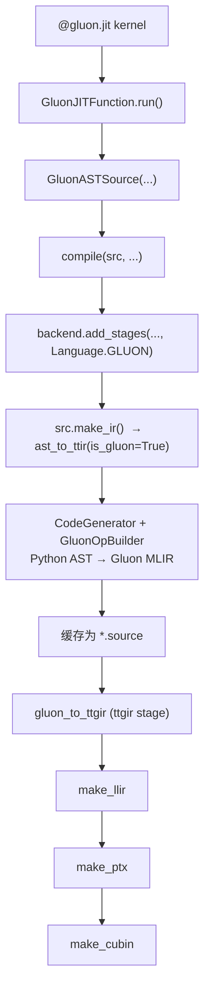
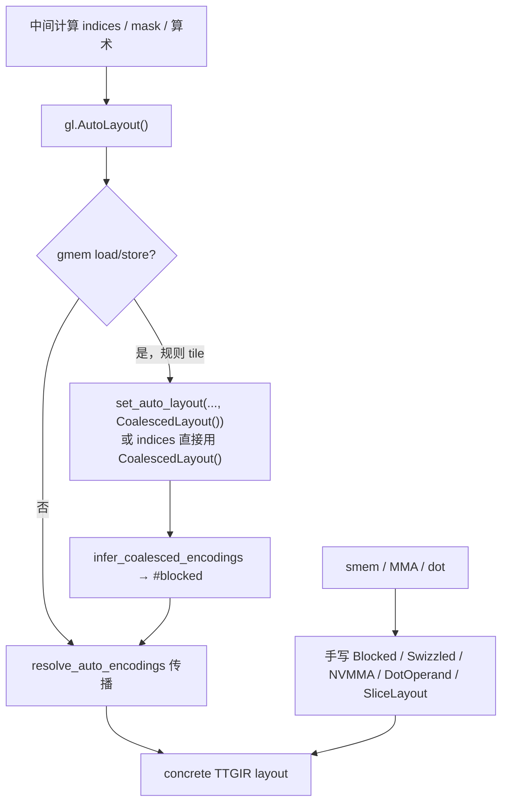

# Gluon 编译流程：AST → Gluon MLIR → `gluon_to_ttgir`

这份笔记说明 **Gluon kernel** 从 `@gluon.jit` 源码到 **TTGIR** 的完整路径，重点在 NVIDIA CUDA 后端的 `gluon_to_ttgir` stage。

与 Triton 路径的对照见 [`000_jit_overview.md`](000_jit_overview.md) 与 [`002_make_ttir.md`](002_make_ttir.md)。

---

## 1) 全局定位

Gluon 与 Triton **共用** `compile()` 编排框架，但前端 lowering 与 `ttgir` stage 的实现不同：

| 阶段 | Triton (`Language.TRITON`) | Gluon (`Language.GLUON`) |
|------|------------------------------|---------------------------|
| 装饰器 | `@triton.jit` | `@gluon.jit` |
| 语言 API | `triton.language as tl` | `triton.experimental.gluon.language as gl` |
| Source 类 | `ASTSource`，`ext = "ttir"` | `GluonASTSource`，`ext = "ttgir"` |
| IR 初始化 | `ast_to_ttir` → 初始 **TTIR** | 同一个 `ast_to_ttir`，但 `is_gluon=True` → 初始 **Gluon/TTGPUIR MLIR** |
| `ttir` stage | `make_ttir`（TTIR 优化） | **不存在** |
| `ttgir` stage | `make_ttgir`（TTIR→TTGPUIR + 大量 GPU 优化） | `gluon_to_ttgir`（layout/encoding 解析 + 轻量规范化） |
| 后续 | `llir → ptx → cubin` | 相同 |

一句话：**Gluon 跳过 TTIR 与 `make_ttgir` 的重优化路径；前端直接 emit 带显式 layout 的 TTGPUIR 级 MLIR，后端用 `gluon_to_ttgir` 把 `Auto`/`Coalesced` encoding 解析成具体 layout，再并入统一的 LLVM/PTX 管线。**

---

## 2) 完整调用链



### 2.1 运行时入口

`@gluon.jit` 返回 `GluonJITFunction`（继承 `JITFunction`），编译时构造 `GluonASTSource` 而非普通 `ASTSource`：

```13:18:triton/python/triton/experimental/gluon/_runtime.py
class GluonASTSource(ASTSource):
    def __init__(self, fn, signature, constexprs=None, attrs=None) -> None:
        super().__init__(fn, signature, constexprs, attrs)
        self.language = Language.GLUON
        self.ext = "ttgir"
```

`GluonJITFunction.is_gluon()` 返回 `True`，供 `ast_to_ttir` 选择 Gluon builder。

### 2.2 通用 `compile()` 如何调度

```287:329:triton/python/triton/compiler/compiler.py
    stages = dict()
    backend.add_stages(stages, options, src.language)
    first_stage = list(stages.keys()).index(src.ext)
    ...
    module = src.make_ir(target, options, codegen_fns, module_map, context)
    ...
    for ext, compile_ir in list(stages.items())[first_stage:]:
        next_module = compile_ir(module, metadata)
```

对 Gluon：

- `src.ext == "ttgir"`，`first_stage == 0`（stages 里第一个 key 就是 `ttgir`）
- `make_ir` 产物先存为 `*.source`（不是 IR 文件输入）
- stage 循环从 `gluon_to_ttgir` 开始，输出 `*.ttgir`，再跑 `llir/ptx/cubin`

### 2.3 CUDA 后端注册 stages

```537:546:triton/third_party/nvidia/backend/compiler.py
    def add_stages(self, stages, options, language):
        capability = self._parse_arch(options.arch)
        if language == Language.TRITON:
            stages["ttir"] = lambda src, metadata: self.make_ttir(src, metadata, options, capability)
            stages["ttgir"] = lambda src, metadata: self.make_ttgir(src, metadata, options, capability)
        elif language == Language.GLUON:
            stages["ttgir"] = lambda src, metadata: self.gluon_to_ttgir(src, metadata, options, capability)
        stages["llir"] = lambda src, metadata: self.make_llir(src, metadata, options, capability)
        stages["ptx"] = lambda src, metadata: self.make_ptx(src, metadata, options, self.target.arch)
        stages["cubin"] = lambda src, metadata: self.make_cubin(src, metadata, options, self.target.arch)
```

---

## 3) 阶段 A：AST → Gluon MLIR（`make_ir`）

**入口函数**：`GluonASTSource.make_ir` → `ast_to_ttir`。

### 3.1 `GluonASTSource.make_ir`

在调用 `ast_to_ttir` 之前，预先创建 module 并写入 TTGPUIR 所需的 module 级属性（layout 校验依赖这些 attr）：

```20:41:triton/python/triton/experimental/gluon/_runtime.py
    def make_ir(self, target, options, codegen_fns, module_map, context):
        ...
        module.set_attr("ttg.target", builder.get_string_attr(target))
        module.set_attr("ttg.num-warps", builder.get_int32_attr(options.num_warps))
        module.set_attr("ttg.num-ctas", builder.get_int32_attr(options.num_ctas))
        module.set_attr("ttg.threads-per-warp", builder.get_int32_attr(options.warp_size))
        ...
        module = ast_to_ttir(self.fn, self, context=context, options=options, codegen_fns=codegen_fns,
                             module_map=module_map, module=module)
        return module
```

### 3.2 `ast_to_ttir`（Triton / Gluon 共用）

```1600:1639:triton/python/triton/compiler/code_generator.py
def ast_to_ttir(fn, src, context, options, codegen_fns, module_map, module=None):
    ...
    generator = CodeGenerator(..., is_gluon=fn.is_gluon())
    generator.visit(fn.parse())
    ...
    if not module.verify():
        if not fn.is_gluon():
            print(module)
        raise RuntimeError("error encountered during parsing")
    return module
```

函数名历史原因仍叫 `ast_to_ttir`；Gluon 路径下产物已是 **Gluon dialect + TritonGPU dialect** 混合的 MLIR，而非 TTIR。

### 3.3 `CodeGenerator` 的 Gluon 分支

```297:304:triton/python/triton/compiler/code_generator.py
        if is_gluon:
            from triton.experimental.gluon.language._semantic import GluonSemantic
            self.builder = gluon_ir.GluonOpBuilder(context)
            self.semantic = GluonSemantic(self.builder)
        else:
            from triton.language.semantic import TritonSemantic
            self.builder = ir.builder(context)
            self.semantic = TritonSemantic(self.builder)
```

`generator.visit(fn.parse())` 遍历 kernel 的 Python AST；`gl.load` / `gl.store` / `gl.arange(..., layout=...)` / `gl.allocate_shared_memory` 等通过 `GluonSemantic` + `GluonOpBuilder` 生成 MLIR op。

### 3.4 前端 emit 的 IR 特征

与 Triton 相比，Gluon 前端 IR 的典型特征：

1. **显式 layout**：`BlockedLayout`、`SwizzledSharedLayout`、`NVMMADistributedLayout`、`DotOperandLayout` 等（见 `triton/python/triton/experimental/gluon/language/_layouts.py`）
2. **待解析 encoding**：
   - `AutoLayout` → IR 中为 `AutoEncodingAttr`，常伴随 `gluon.set_auto_layout` op
   - `CoalescedLayout` → `CoalescedEncodingAttr`，用于 gmem load/store 的合并访存推断
3. **Shared memory 描述符**：`gl.allocate_shared_memory` → smem 分配 op，layout 由用户指定
4. **Module 属性**：`ttg.target`、`ttg.num-warps`、`ttg.num-ctas`、`ttg.threads-per-warp` 等已在 `make_ir` 阶段设置

此阶段 **不做** `convert_to_ttgpuir`（Gluon 已在 TTGPUIR 层编写），也 **不做** `make_ttgir` 里的 coalesce/pipeline/warp-specialize 等重优化。

---

## 4) 阶段 B：`gluon_to_ttgir`

**实现位置**：`CUDABackend.gluon_to_ttgir`（`triton/third_party/nvidia/backend/compiler.py`）。

**输入**：`make_ir` 产出的 Gluon MLIR（cache 中为 `*.source`）。

**输出**：layout/encoding 已解析完毕的标准 TTGIR（cache 中为 `*.ttgir`），可交给 `make_llir`。

与 `make_ttgir` 对比：`gluon_to_ttgir` **没有** `convert_to_ttgpuir`、`coalesce`、`accelerate_matmul`、`pipeline`、`warp_specialize` 等 pass；核心工作是 **layout/encoding 推断与解析**，外加少量通用清理。

### 4.1 Pass 管线总览

```320:349:triton/third_party/nvidia/backend/compiler.py
    def gluon_to_ttgir(self, src, metadata, options, capability):
        mod = src
        pm = ir.pass_manager(mod.context)
        pm.enable_debug()

        # Inline nested @gluon.jit callees first. Auto/Coalesced encodings cannot
        # cross function boundaries; layout inference requires a single function body.
        passes.gluon.add_inliner(pm)
        # Resolve gl.CoalescedLayout() (#gluon.coalesced_encoding): for gmem
        # load/store, infer a concrete BlockedEncodingAttr from axis analysis so
        # threads issue coalesced memory accesses (same logic as Triton coalesce).
        passes.gluon.add_infer_coalesced_encodings(pm)
        # Resolve gl.AutoLayout() (#gluon.auto_encoding): propagate layouts from
        # gl.set_auto_layout seeds, then erase set_auto_layout ops.
        passes.gluon.add_resolve_auto_encodings(pm)
        # Lower TensorDescriptor / TMA ops to TritonNvidiaGPU dialect (Hopper+).
        nvidia.passes.ttnvgpuir.add_tma_lowering(pm)
        ...
        pm.run(mod, 'gluon_to_ttgir')
```

| 序号 | Python 注册 API | MLIR Pass 名 | 主要 dialect |
|------|-----------------|--------------|--------------|
| 1 | `passes.gluon.add_inliner` | `gluon-inline` | Gluon |
| 2 | `passes.gluon.add_infer_coalesced_encodings` | `gluon-infer-coalesced-encodings` | Gluon / TTGPUIR |
| 3 | `passes.gluon.add_resolve_auto_encodings` | `gluon-resolve-auto-encodings` | Gluon / TTGPUIR |
| 4 | `nvidia.passes.ttnvgpuir.add_tma_lowering` | `triton-nvidia-tma-lowering` | TritonNvidiaGPU |
| 5 | `passes.gluon.add_canonicalizer` | `gluon-canonicalize` | arith / scf / cf / Triton |
| 6 | `passes.common.add_sccp` | MLIR `sccp` | 全 module |
| 7 | `passes.ttir.add_loop_aware_cse` | Triton loop-aware CSE | Triton / TTGPUIR |
| 8 | `passes.gluon.add_canonicalizer` | `gluon-canonicalize` | 同上（第二次） |
| 9 | `passes.ttgpuir.add_combine_tensor_select_and_if` | `tritongpu-combine-tensor-select-and-if` | TTGPUIR |

**顺序设计要点**：

1. **先 inline** — Auto/Coalesced encoding 不允许跨 function call 边界，嵌套 `@gluon.jit` 必须先展开。
2. **先 Coalesced 后 Auto** — Coalesced 推断不跨越 `set_auto_layout` 边界；Auto 解析会 erase 这些 op。
3. **layout 解析完再做 TMA lowering** — TMA op 需要 concrete encoding。
4. **canonicalize → SCCP → CSE → canonicalize** — 在不动 layout 的前提下做常量折叠与冗余消除；第二次 canonicalize 清理 CSE 产物。
5. **最后 combine select/if** — 控制流层面的 peephole，不影响 layout 推断。

---

### 4.2 Pass 1：`gluon-inline`

| 项 | 内容 |
|----|------|
| Python API | `passes.gluon.add_inliner(pm)` |
| MLIR 名 | `gluon-inline` |
| 源码 | `triton/lib/Dialect/Gluon/Transforms/Inline.cpp` |
| Pass 定义 | `triton/include/triton/Dialect/Gluon/Transforms/Passes.td` → `GluonInline` |

**做什么**：

- 内部构造子 `PassManager`，注册 MLIR 标准 `InlinerPass`。
- 对被 inline 函数的 region，再跑 `gluon-simplify-control-flow`（`SimplifyControlFlow.cpp`）做控制流简化。

**为什么需要**：

- Gluon kernel 常通过 `@gluon.jit` 调用另一个 `@gluon.jit` helper（如 dot wrapper、layout 工具函数）。
- 后续 `infer-coalesced-encodings` / `resolve-auto-encodings` 要求：**带 `AutoEncodingAttr` / `CoalescedEncodingAttr` 的函数参数和返回值必须在 inline 前消除**（见 `InferLayoutUtils.cpp` 中对 function boundary 的检查）。
- 不 inline 则 layout 推断无法跨 call 传播，编译会报错。

**`gluon-simplify-control-flow` 子 pass 注意点**：

- 仅跑 `scf` / `cf` 的 canonicalize pattern + `populateForOpDeadArgumentElimination`。
- **刻意关闭 constant CSE**（`enableConstantCSE(false)`），因为在 Auto layout 尚未 resolve 前合并常量可能引入 layout 冲突。

---

### 4.3 Pass 2：`gluon-infer-coalesced-encodings`

> **一句话**：用户写 `gl.CoalescedLayout()` 表示「这里要做合并访存，但具体 BlockedLayout 不想手算」；此 pass 根据 axis 分析 + warp 数自动算出 concrete `#blocked` encoding 并传播到相关 tensor 上。

对应 `compiler.py` 注释：

```python
# Resolve gl.CoalescedLayout() (#gluon.coalesced_encoding): for gmem
# load/store, infer a concrete BlockedEncodingAttr from axis analysis so
# threads issue coalesced memory accesses (same logic as Triton coalesce).
passes.gluon.add_infer_coalesced_encodings(pm)
```

| 项 | 内容 |
|----|------|
| Python API | `passes.gluon.add_infer_coalesced_encodings(pm)` |
| MLIR 名 | `gluon-infer-coalesced-encodings` |
| 源码 | `triton/lib/Dialect/Gluon/Transforms/InferCoalescedEncodings.cpp` |
| 依赖工具 | `InferLayoutUtils.cpp`、`ModuleAxisInfoAnalysis`、`buildCoalescedEncoding` |
| 与 Triton 关系 | 复用 `buildCoalescedEncoding`（`make_ttgir` 里 `coalesce` pass 的同一套逻辑） |

**输入 / 输出**：

- **输入**：tensor 带 `#gluon.coalesced_encoding`（Python 侧 `gl.CoalescedLayout()`）
- **输出**：同一 tensor 换成 concrete `#blocked` 等 TTGPUIR encoding；module 中不再残留 `#coalesced_encoding`

**做什么**（每个 `tt.func` 内）：

1. **收集 seed**：遍历 gmem load/store，找到 operand 为 `tensor<tt.ptr<>>` 且带 `#gluon.coalesced_encoding` 的访存。
2. **生成 concrete layout**：对该 load/store 用 `ModuleAxisInfoAnalysis` + `buildCoalescedEncoding` 算出具体 `BlockedEncodingAttr`（合并访存 layout），写入 seed 列表。
3. **传播 layout**：调用 `inferLayout(func, isCoalescedEncodingTensorType, seedEncodings)`，在 def-use 图上前向/后向传播，直到不动点或发现冲突。
4. **校验**：`doubleCheckEncodings` 确保 module 中不再残留 `CoalescedEncodingAttr`。

**Python 侧对应写法**：

```python
indices = gl.arange(0, BLOCK, gl.CoalescedLayout())
ptrs = in_ptr + offsets   # tensor<tt.ptr<>, #coalesced>
value = gl.load(ptrs, mask=mask)
```

**传播边界**：

- **不跨越** `gluon.set_auto_layout` op（注释写明：此处只把 `CoalescedLayout()` 替换为 concrete coalesced layout，其余交给 `resolve-auto-encodings`）。
- 对 `JoinOp` / `SplitOp` / `ReshapeOp` / `CatOp` / `TransOp` 等 op，传播结果标记 `mayVary=true`，允许冲突时优先选非 vary 的 encoding。

**失败表现**：同一 value 收到两个不兼容 encoding 时，`emitOpError("found conflicting encodings for value")`，pass 失败。

---

### 4.4 Pass 3：`gluon-resolve-auto-encodings`

| 项 | 内容 |
|----|------|
| Python API | `passes.gluon.add_resolve_auto_encodings(pm)` |
| MLIR 名 | `gluon-resolve-auto-encodings` |
| 源码 | `triton/lib/Dialect/Gluon/Transforms/ResolveAutoEncodings.cpp` |
| 依赖工具 | `InferLayoutUtils.cpp` |

**做什么**（每个 `tt.func` 内）：

1. **收集 seed**：遍历所有 `gluon.set_auto_layout` op，取 `(src, target_encoding)` 作为 seed（用户显式钉 layout 的点）。
2. **传播 layout**：对带 `#gluon.auto_encoding` 的 tensor 做与 Pass 2 相同的 `inferLayout` 固定点迭代。
3. **清理**：assert `set_auto_layout` 的 src/result type 一致后，用 `src` 替换所有 use，erase op。
4. **校验**：`doubleCheckEncodings` 确保无残留 `AutoEncodingAttr`。

**Python 侧对应写法**：

```python
# 中间态用 AutoLayout
offsets = gl.arange(0, BLOCK, gl.AutoLayout())
# 在 load 边界钉 coalesced
ptrs = gl.set_auto_layout(in_ptr + offsets, gl.CoalescedLayout())
value = gl.load(ptrs, mask=mask)
```

**与 Pass 2 的分工**：

| | Coalesced Pass | Auto Pass |
|--|----------------|-----------|
| 待解析 encoding | `#gluon.coalesced_encoding` | `#gluon.auto_encoding` |
| seed 来源 | gmem load/store 的 axis 分析 | `set_auto_layout` op |
| 典型用途 | 自动合并访存 | 算术/mask 中间态，仅在边界定 layout |

**Gluon Dialect 的 `InferLayoutInterface`**（`Dialect.cpp`）对 Auto/Coalesced encoding 的默认策略是 **原样传播**（reduce/trans/expand_dims/dot 等 op 都把 operand encoding 传给 result），具体 concrete layout 由 seed + 传播决定。

---

### 4.5 Pass 4：`triton-nvidia-tma-lowering`（NVIDIA 专属）

| 项 | 内容 |
|----|------|
| Python API | `nvidia.passes.ttnvgpuir.add_tma_lowering(pm)` |
| MLIR 名 | `triton-nvidia-tma-lowering` |
| 源码 | `triton/lib/Dialect/TritonNvidiaGPU/Transforms/TMALowering.cpp` |
| Pass 定义 | `triton/include/triton/Dialect/TritonNvidiaGPU/Transforms/Passes.td` |

**做什么**：

将高层 TMA / TensorDescriptor 相关 op **降级**为 `TritonNvidiaGPUDialect` 中的具体 TMA op。注册的 rewrite pattern 包括：

| Pattern | 作用 |
|---------|------|
| `TMACreateDescLowering` | `TensormapCreateOp` → smem 上构造 tensormap + `ReinterpretTensorDescOp` |
| `TMALoadLowering` | descriptor load → `ttng` TMA load |
| `TMAStoreLowering` | descriptor store → `ttng` TMA store |
| `TMAGatherLowering` / `TMAScatterLowering` | gather/scatter 变体 |
| `TMAReduceLowering` | TMA reduce 变体 |

**为什么放在 layout 解析之后**：

- TMA op 对 tensor layout / descriptor encoding 有 concrete 要求；必须在 Auto/Coalesced 全部 resolve 后再 lowering。
- Gluon 前端可直接使用 Hopper TMA API（`TensorDescriptor`、`tma.load` 等），此 pass 是 TTGIR → 后续 `make_llir` 之间的桥梁。

---

### 4.6 Pass 5 & 8：`gluon-canonicalize`（跑两次）

| 项 | 内容 |
|----|------|
| Python API | `passes.gluon.add_canonicalizer(pm)` |
| MLIR 名 | `gluon-canonicalize` |
| 源码 | `triton/lib/Dialect/Gluon/Transforms/Canonicalize.cpp` |

**做什么**：

对 module 跑 greedy pattern rewrite，注册：

- **MLIR 标准**：`arith`、`scf`、`cf` 的全部 canonicalization pattern + `populateForOpDeadArgumentElimination`。
- **Triton 选择性 pattern**：`LoadOp`、`StoreOp`、`BroadcastOp`、`ExpandDimsOp`、`WarpSpecializeOp` 的 canonicalization。

**刻意不注册什么**：

- 注释明确：**排除会修改 layout 的 pattern**，尤其 `ConvertLayoutOp` 相关 canonicalization。
- Gluon 假设用户显式指定的 layout 在 TTGIR 阶段不应被编译器"顺手"改掉。

**为什么跑两次**：

- **第一次**（Pass 5）：layout 解析 + TMA lowering 后，清理明显冗余（dead for args、常量折叠等）。
- **中间** SCCP + loop-aware CSE 可能产生新的 canonicalization 机会。
- **第二次**（Pass 8）：收敛 IR，再进入 control-flow peephole。

---

### 4.7 Pass 6：`common SCCP`

| 项 | 内容 |
|----|------|
| Python API | `passes.common.add_sccp(pm)` |
| MLIR 名 | `sccp`（Sparse Conditional Constant Propagation） |
| 注册 | `triton/python/src/passes.cc` → `createSCCPPass` |

**做什么**：

- MLIR 标准 SCCP：在 control-flow 分支上传播常量，折叠能确定值的 op。
- 典型效果：`arith.constant` 折叠、dead branch 简化、部分 `scf.if` 条件化简。

**在 Gluon 管线中的角色**：

- layout 已全部 concrete 后安全运行；与第一次 `gluon-canonicalize` 配合，进一步简化 `*.source` 里前端生成的冗长算术（例如 constexpr 展开后的多层 `arith.extsi` / `arith.cmpi`）。

---

### 4.8 Pass 7：`ttir loop-aware-cse`

| 项 | 内容 |
|----|------|
| Python API | `passes.ttir.add_loop_aware_cse(pm)` |
| 注册 | `triton/python/src/passes.cc` → `createTritonLoopAwareCSE` |

**做什么**：

- Triton 定制的 **循环感知 CSE**（Common Subexpression Elimination）。
- 比普通 CSE 更理解 `scf.for` / Triton loop 结构，能在 loop body 内消除重复计算。
- 与 `make_ttgir` 管线中多次使用的同一 pass。

**在 Gluon 管线中的角色**：

- layout 推断可能使原本因 encoding 不同而无法 CSE 的 op 变为可合并；此 pass 清理重复 load/index 计算等。
- 例：`memcpy_kernel.source` 中大量重复的 `arith.extsi` / `arith.cmpi` 边界检查，经 canonicalize + SCCP + CSE 后在 `.ttgir` 中显著缩短。

---

### 4.9 Pass 9：`tritongpu-combine-tensor-select-and-if`

| 项 | 内容 |
|----|------|
| Python API | `passes.ttgpuir.add_combine_tensor_select_and_if(pm)` |
| MLIR 名 | `tritongpu-combine-tensor-select-and-if` |
| 源码 | `triton/lib/Dialect/TritonGPU/Transforms/CombineTensorSelectAndIf.cpp` |

**做什么**（两步）：

1. **`canonicalizeSelectUsersInSCFIf`**：若 `arith.select` 的结果被同条件的 `scf.if` 分支使用，先把 select 的用户替换为 then/else 对应 operand（预处理）。
2. **合并 select → if**：对 **tensor 类型** 的 `arith.select`，若同一 basic block 中存在 **相同 condition** 的 `scf.if`，且 dominance 允许，则把 select 合并进 if 的 yield（then 返回 trueVal，else 返回 falseVal），删除 select。

**为什么只处理 tensor select**：

- Pass 注释：标量 select 的 predicate 代价足够低，不值得合并。
- Gluon 中 mask / 条件 load 常产生 tensor select，合并后可减少 predicated 指令。

**在 Gluon 管线中的位置**：

- 放在最后：不影响 layout 推断，纯 control-flow / tensor predication 优化。
- 与 Triton `make_ttgir` 末尾使用同一 pass。

---

### 4.10 `pm.run` 与返回值

```python
pm.run(mod, 'gluon_to_ttgir')
metadata["tensordesc_meta"] = mod.get_tensordesc_metadata()
return mod
```

| 项 | 说明 |
|----|------|
| pipeline tag | `'gluon_to_ttgir'`，用于 `TRITON_REPRODUCER_PATH` 生成 reproducer 文件名后缀 |
| 修改方式 | **原地**改写 `mod`；失败抛异常 |
| `tensordesc_meta` | 从 module 提取 TMA tensor descriptor 元信息，供后续 stage / runtime 使用（与 `make_ttgir` 相同字段） |

### 4.11 Pass 完成后的 IR 不变量

- module 中 **不应再存在** `#gluon.auto_encoding` / `#gluon.coalesced_encoding`。
- 所有 tensor 带 **concrete TTGPUIR encoding**（如 `#blocked`、`#shared`、`#dot_operand` 等）。
- `gluon.set_auto_layout` op 已全部消除。
- cache 落盘为 `*.ttgir`，交给 `make_llir`。

---

## 5) `gluon_to_ttgir` vs `make_ttgir`

| 维度 | `make_ttgir`（Triton） | `gluon_to_ttgir`（Gluon） |
|------|------------------------|---------------------------|
| 输入 | 经 `make_ttir` 清洗的 TTIR | 前端直接 emit 的 Gluon/TTGPUIR MLIR |
| TTIR→TTGPUIR | `convert_to_ttgpuir` | 不需要 |
| Layout 来源 | 编译器 pass 推断（coalesce 等） | 用户 Python 显式指定 + Gluon pass 解析 Auto/Coalesced |
| 主要优化 | coalesce、matmul、pipeline、warp spec、tmem/tma… | 以 layout 解析为主，优化 pass 极少 |
| 适用场景 | 常规 Triton kernel | 需精细控制 smem/layout/MMA 的高性能 kernel（如 FA、GQA） |

Gluon 的设计假设：**性能关键 layout 决策由用户在 Python 层完成**，编译器只做合法性校验、Auto/Coalesced 补全和必要 lowering，而非重新跑一遍 Triton 的全套 GPU 优化。

---

## 6) `AutoLayout` 与 `CoalescedLayout` 具体用法

这两种都是 **layout 占位符**，在 `*.source` 里分别对应 `#gluon.auto_encoding` / `#gluon.coalesced_encoding`，由 `gluon_to_ttgir` 解析成 concrete `#blocked` 等 encoding。**不能**用于 smem / MMA / dot（那些必须手写 `BlockedLayout` / `SwizzledSharedLayout` / `NVMMADistributedLayout`）。

### 6.1 对比速查

| | `gl.AutoLayout()` | `gl.CoalescedLayout()` |
|--|-------------------|------------------------|
| 含义 | layout 待定，从锚点**传播** | gmem 要**合并访存**，编译器**计算** blocked layout |
| 解析 pass | `resolve_auto_encodings` | `infer_coalesced_encodings` |
| 锚点 / seed | `gl.set_auto_layout(t, concrete_layout)` | gmem `load`/`store`（operand 为 `tensor<tt.ptr<>>` 且带 coalesced encoding） |
| 典型场景 | mask、算术、indices 中间态 | 规则 2D/ND tile 的 gmem load/store |
| 能否单独用于 smem/MMA | ❌ | ❌ |

---

### 6.2 `CoalescedLayout()` — 直接用于 gmem tile

**适用**：规则网格、按 stride 访问的 global load/store；不想手填 `BlockedLayout([1,1],[1,32],...)`。

**做法**：在 `arange` 或 pointer tensor 上直接用 `CoalescedLayout()`，编译器根据 axis 分析 + warp 数算出合并访存 layout。

参考 `triton/python/test/gluon/test_core.py` → `test_coalesced_layout`：

```python
from triton.experimental import gluon
from triton.experimental.gluon import language as gl

@gluon.jit
def coalesced_copy_kernel(in_ptr, out_ptr,
                          xnumel, ynumel,
                          xstride_in, ystride_in, xstride_out, ystride_out,
                          XBLOCK: gl.constexpr, YBLOCK: gl.constexpr):
    pid_x = gl.program_id(0)
    pid_y = gl.program_id(1)

    # indices 直接用 CoalescedLayout —— 无需 BlockedLayout 四元组
    indices_x = pid_x * XBLOCK + gl.arange(0, XBLOCK, gl.CoalescedLayout())
    indices_y = pid_y * YBLOCK + gl.arange(0, YBLOCK, gl.CoalescedLayout())

    in_offsets = xstride_in * indices_x[:, None] + ystride_in * indices_y[None, :]
    out_offsets = xstride_out * indices_x[:, None] + ystride_out * indices_y[None, :]
    mask = (indices_x[:, None] < xnumel) & (indices_y[None, :] < ynumel)

    # load/store 时 pointer tensor 带 #coalesced_encoding → infer_coalesced_encodings 算 #blocked
    value = gl.load(in_ptr + in_offsets, mask=mask)
    value = gl.maximum(gl.sin(value), 0.0)
    gl.store(out_ptr + out_offsets, value, mask=mask)
```

**编译期发生了什么**：

1. `gl.CoalescedLayout()` → IR 中 `#gluon.coalesced_encoding`
2. `infer_coalesced_encodings` 对 load/store 调用 `buildCoalescedEncoding`（与 Triton `coalesce` pass 同源）
3. 沿 def-use 传播，module 中不再残留 `#coalesced_encoding`

**注意**：

- 仅对 **gmem** 的 `tensor<tt.ptr<>>` load/store 有效；scatter/gather 稀疏访存通常 **不适用**，仍需显式 layout 或 `convert_layout`。

---

### 6.3 `AutoLayout()` — 中间态 + 锚点传播

**适用**：layout 暂时不重要、或只在某几个边界才需要 concrete layout 的中间计算（mask、offset 组合、算术）。

**默认行为**：`gl.full` / `gl.zeros` / `gl.arange` 不传 `layout` 时，默认就是 `AutoLayout()`。

#### 模式 A：Auto 中间态 + `set_auto_layout` 在 gmem 边界钉 Coalesced

参考 `test_convert_auto_layout_to_coalesced_layout`：

```python
@gluon.jit
def auto_to_coalesced_kernel(in_ptr, out_ptr, ...,
                             XBLOCK: gl.constexpr, YBLOCK: gl.constexpr):
    pid_x = gl.program_id(0)
    pid_y = gl.program_id(1)

    # 中间 indices / mask 用 Auto —— 不必手算 layout
    indices_x = pid_x * XBLOCK + gl.arange(0, XBLOCK, gl.AutoLayout())
    indices_y = pid_y * YBLOCK + gl.arange(0, YBLOCK, gl.AutoLayout())
    in_offsets = xstride_in * indices_x[:, None] + ystride_in * indices_y[None, :]
    mask = (indices_x[:, None] < xnumel) & (indices_y[None, :] < ynumel)  # 仍是 Auto

    # 锚点：在 load 前把 pointer / mask 钉到 CoalescedLayout
    in_ptrs = gl.set_auto_layout(in_ptr + in_offsets, gl.CoalescedLayout())
    value = gl.load(in_ptrs, mask=mask)

    out_ptrs = gl.set_auto_layout(out_ptr + out_offsets, gl.CoalescedLayout())
    out_mask = gl.set_auto_layout(mask, gl.CoalescedLayout())
    gl.store(out_ptrs, value, mask=out_mask)
```

**两阶段解析**：

1. `infer_coalesced_encodings`：从 `set_auto_layout(..., CoalescedLayout())` 的 seed + load/store 推断 coalesced → `#blocked`
2. `resolve_auto_encodings`：从同一锚点把 Auto 的 `indices` / `mask` 等传播成 concrete layout，并删除 `set_auto_layout` op

#### 模式 B：Auto 中间态 + 与已有 concrete tensor 运算时自动对齐

`GluonSemantic.broadcast` 在 **一侧 Auto、一侧已有 concrete layout** 时，会自动 `set_auto_layout`：

```python
# 若 lhs 是 AutoLayout，rhs 已是 BlockedLayout → 前端自动 set_auto_layout(lhs, rhs.layout)
lhs, rhs = ...  # broadcast 内部处理
```

无需手写，但仍属于 Auto 传播机制，不是 smem/MMA 路径。

#### 模式 C：FA 类 kernel 中的典型 Auto 用法

```python
# 稀疏 gather 的 slot 下标 —— layout 不关键，用 Auto
group_offsets = gl.arange(0, GROUP_SIZE, gl.AutoLayout())
slot_offsets = group_idx * GROUP_SIZE + group_offsets

# 性能边界 —— 必须手写，不能 Auto
mma_layout = gl.NVMMADistributedLayout(...)
valid_v = gl.convert_layout(valid, gl.SliceLayout(1, v_layout))  # 跨路径对齐，不是 Auto 能推断的
```

---

### 6.4 组合关系（何时用哪种）



| 场景 | 推荐 |
|------|------|
| 2D 规则 gmem copy / elementwise | `CoalescedLayout()` 直接用在 `arange` |
| 中间 mask + 规则 gmem | `AutoLayout()` + `set_auto_layout(..., CoalescedLayout())` |
| 稀疏 indices、gather 下标 | `AutoLayout()`；gmem 边界仍可能要 `convert_layout` |
| QK/PV dot、smem 双缓冲 | 手写 layout + `SliceLayout` / `convert_layout` |

---

### 6.5 常见错误

| 错误写法 | 原因 |
|----------|------|
| `allocate_shared_memory(..., layout=gl.AutoLayout())` | smem 必须 explicit `SwizzledSharedLayout` 等 |
| `mma_layout = gl.AutoLayout()` | MMA layout 编译器不会推断 |
| 函数参数/返回值带 Auto（未 inline 的 callee） | `inferLayout` 要求 **必须先 `gluon-inline`** |
| 同一 value 既要对齐 `mma_layout` 又要对齐 `v_layout` | Auto 只能传播 **一种** layout；需 `convert_layout` 或分两条链各算 |
| 在 Auto 未 resolve 前依赖 `convert_layout` 链过长 | 尽量在 gmem/MMA 边界前完成 `set_auto_layout` 或显式 layout |

---

### 6.6 在 IR 里如何确认已解析

```bash
export TRITON_KERNEL_DUMP=1
# 对比 *.source（可能有 #gluon.auto_encoding / #coalesced_encoding）
# 与 *.ttgir（应只剩 #blocked 等 concrete encoding）
```

`*.ttgir` 中若仍见 `#gluon.auto_encoding`，说明 `resolve_auto_encodings` 缺少锚点或传播冲突；若见 `#coalesced_encoding`，说明缺少 gmem load/store seed。

---

## 7) 后续 stage（与 Triton 相同）

`gluon_to_ttgir` 之后：

1. **`make_llir`**：TTGIR → LLVM IR（MLIR）；含 shared/tmem/global scratch 分配、`to_llvmir` 等；Gluon 路径在 llir 阶段也会再跑一次 `gluon.add_inliner`
2. **`make_ptx`**：LLVM IR → PTX 文本
3. **`make_cubin`**：调 `ptxas` → cubin 二进制

详见 [`000_jit_overview.md`](000_jit_overview.md) 第 6 节。

---

## 8) 调试与 dump

| 环境变量 | 作用 |
|----------|------|
| `MLIR_ENABLE_DUMP=1` | dump 每个 pass 前后的 MLIR（`pm.enable_debug()` 触发） |
| `TRITON_REPRODUCER_PATH=...` | pass 失败时写 reproducer（pipeline tag 为 `gluon_to_ttgir`） |
| `TRITON_KERNEL_DUMP=1` | 落盘各 stage IR（含 `.source`、`.ttgir` 等） |
| `TRITON_DUMP_AST_PATH=...` | dump kernel Python AST |

Gluon verify 失败时 **不会** 自动 print module（与 Triton 不同，见 `ast_to_ttir` 中 `if not fn.is_gluon()` 分支）。

---

## 9) 关键源码索引

| 组件 | 路径 |
|------|------|
| `@gluon.jit` / `GluonASTSource` | `triton/python/triton/experimental/gluon/_runtime.py` |
| Gluon 语言语义 / builder 调用 | `triton/python/triton/experimental/gluon/language/_semantic.py` |
| Layout Python 类型 | `triton/python/triton/experimental/gluon/language/_layouts.py` |
| AST → MLIR（共用） | `triton/python/triton/compiler/code_generator.py` → `ast_to_ttir` |
| 编译编排 | `triton/python/triton/compiler/compiler.py` → `compile` |
| CUDA `gluon_to_ttgir` | `triton/third_party/nvidia/backend/compiler.py` |
| Gluon Pass 注册 | `triton/python/src/passes.cc` |
| Gluon Pass 实现 | `triton/lib/Dialect/Gluon/Transforms/*.cpp` |
| Gluon Dialect | `triton/lib/Dialect/Gluon/IR/Dialect.cpp` |
| Pass 定义 | `triton/include/triton/Dialect/Gluon/Transforms/Passes.td` |
| 实验性 Triton→Gluon 翻译器 | `triton/python/triton/tools/triton_to_gluon_translater/translator.py` |

---

## 10) 一句话记忆

- **前端**：`@gluon.jit` → `GluonASTSource.make_ir` → `ast_to_ttir(is_gluon=True)` → 带显式 layout 的 Gluon MLIR（`*.source`）
- **后端 ttgir stage**：`gluon_to_ttgir` = inline → 推断 Coalesced → 解析 Auto → TMA lowering → canonicalize/CSE → 标准 TTGIR
- **之后**：与 Triton 完全相同的 `llir → ptx → cubin`
