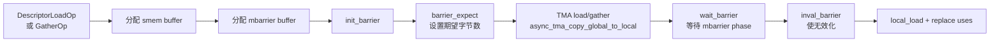
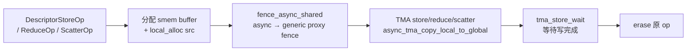
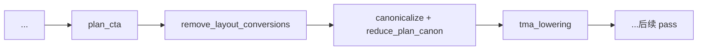
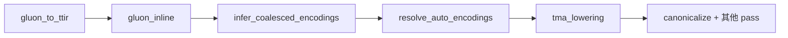

# TMA Lowering Pass 分析

## 一、概述

`TritonNvidiaGPUTMALoweringPass`（简称 **TMA Lowering Pass**）是 Triton Nvidia GPU 方言中的一个 Module 级 Pass，其核心目标是将高级的**描述符操作**（Descriptor Load/Store/Gather/Reduce/Scatter 以及描述符创建操作）lower 为**具体的 TMA 硬件指令操作**。

> **Pass 名称（CLI）**：`triton-nvidia-gpu-tma-lowering`
>
> **Python 入口**：`nvidia.passes.ttnvgpuir.add_tma_lowering(pm)`
>
> **依赖方言**：`TritonGPUDialect`、`TritonNvidiaGPUDialect`
>
> **操作粒度**：`mlir::ModuleOp`
>
> **最低硬件**：NVIDIA Hopper 架构（Compute Capability >= 9.0）及更新

### TMA 是什么

TMA（Tensor Memory Accelerator）是 Hopper 及更新架构上引入的硬件单元，用于在 **Global Memory（gmem）** 和 **Shared Memory（smem）** 之间进行**块状数据传输**。相比传统的手动 `cp.async` 或 `LDG/STG` 指令：

| 特性 | 传统方式（cp.async / LDG/STG） | TMA |
|------|-------------------------------|-----|
| 寻址方式 | 基址 + stride + mask（占用寄存器） | 描述符 + 块坐标（占用极少寄存器） |
| 数据传输路径 | generic proxy（通过寄存器中转） | async proxy（独立路径，绕过寄存器） |
| 读同步 | `cp.async.commit_group` / `wait_group` | **mbarrier**（64 位 smem 同步对象） |
| 写同步 | commit_group 机制 | **`tma.store_wait`** |
| smem 布局 | 灵活（`SwizzledSharedLayout` 等） | 固定为 **`NVMMASharedLayout`** |
| OOB（越界）处理 | 用户手动 mask | 描述符自带 shape，自动处理 |

**核心优势**：
- **降低寄存器压力**：描述符只需一个指针，块坐标只需少量寄存器
- **减少指令发射压力**：一次 TMA 指令搬运整个块
- **自动处理边界**：描述符知道全局 shape，越界自动填零

---

## 二、功能详解

### 2.1 整体流程

```
         ModuleOp（含描述符操作）
                │
                ▼
  ┌────────────────────────────────┐
  │  对每个 op 应用 6 种 rewrite   │  ← 模式匹配 + 贪心重写
  │  ┌──────────────────────────┐  │
  │  │  1. TMACreateDescLowering │  │  MakeTensorDescOp → TensormapCreateOp + fence
  │  │  2. TMALoadLowering       │  │  DescriptorLoadOp → AsyncTMACopyGlobalToLocal
  │  │  3. TMAGatherLowering     │  │  DescriptorGatherOp → AsyncTMAGather
  │  │  4. TMAStoreLowering      │  │  DescriptorStoreOp → AsyncTMACopyLocalToGlobal
  │  │  5. TMAReduceLowering     │  │  DescriptorReduceOp → AsyncTMAReduce
  │  │  6. TMAScatterLowering    │  │  DescriptorScatterOp → AsyncTMAScatter
  │  └──────────────────────────┘  │
  └──────────────┬─────────────────┘
                 │
                 ▼
     ModuleOp（TMA 硬件级操作）
```

### 2.2 两个关键子流程

TMA 操作按方向分为两类，各自有独立的 lowering 模版：

#### 读方向（Load/Gather）— `lowerTMALoad`



关键步骤：
1. **分配 smem buffer**：根据描述符编码的 block shape 计算所需 smem 大小
2. **创建 mbarrier**：分配 mbarrier buffer、执行 `init_barrier` 初始化
3. **设置期望**：`barrier_expect` 告诉 mbarrier 要等待多少字节
4. **发起 TMA 读**：`async_tma_copy_global_to_local` 通过 async proxy 将 gmem 数据搬到 smem
5. **等待完成**：`wait_barrier` 阻塞直到 mbarrier phase 完成（数据抵达 smem）
6. **清理屏障**：`inval_barrier` 使 mbarrier 可重用
7. **替换使用**：通过 `local_load` 将 smem 数据读入寄存器，替换原始 op 的所有结果使用者

#### 写方向（Store/Reduce/Scatter）— `lowerTMAStore`



关键步骤：
1. **分配 smem buffer**：放入源数据（src tensor）
2. **fence_async_shared**：在 async proxy（TMA 读）和 generic proxy（后续 smem 读）之间建立栅栏
3. **发起 TMA 写**：`async_tma_copy_local_to_global` 将 smem 数据写回 gmem
4. **等待写完成**：`tma_store_wait` 等待 TMA store fence 计数到达
5. **删除原 op**：所有 side effect 已被 TMA 操作替代

---

## 三、6 个 Rewrite Pattern 详解

### 3.1 TMACreateDescLowering — 描述符创建

| 属性 | 说明 |
|------|------|
| **源操作** | `MakeTensorDescOp`（构造张量描述符） |
| **目标操作** | `TensormapCreateOp` + `TensormapFenceproxyAcquireOp` + `ReinterpretTensorDescOp` |
| **功能** | 分配 128 字节对齐的全局 buffer，调用 `tensormap_create` 构建 TMA 描述符，通过 `tensormap_fenceproxy_acquire` 建立 fence 序，最后将裸指针重解释为类型化描述符 |

这是 TMA pipeline 的**入口**：在使用 TMA 搬运之前，必须先创建描述符。描述符包含了全局 shape、stride、元素类型、swizzle 模式、block shape 等信息。

### 3.2 TMALoadLowering — TMA 加载

| 属性 | 说明 |
|------|------|
| **源操作** | `DescriptorLoadOp`（描述符加载） |
| **目标操作** | `AsyncTMACopyGlobalToLocalOp` + mbarrier 序列 |
| **功能** | 将描述符指向的 gmem 数据块异步加载到 smem，通过 mbarrier 同步完成 |

加载时还会通过 `translateTMAIndices` 处理索引变换（例如 FP4 填充布局下的坐标调整），确保块坐标正确对应到描述符的 block shape。

### 3.3 TMAGatherLowering — TMA Gather

| 属性 | 说明 |
|------|------|
| **源操作** | `DescriptorGatherOp`（描述符 gather） |
| **目标操作** | `AsyncTMAGatherOp` + mbarrier 序列 |
| **功能** | 从 gmem 中 gather 多个索引行的数据到 smem，适用于不规则访存场景（如索引式查找表） |

与 `TMALoadLowering` 的区别在于：gather 的块坐标由 `x_offsets`（多个行号）和 `y_offset`（固定列偏移）共同决定，而不是统一的 `indices`。

### 3.4 TMAStoreLowering — TMA 存储

| 属性 | 说明 |
|------|------|
| **源操作** | `DescriptorStoreOp`（描述符存储） |
| **目标操作** | `AsyncTMACopyLocalToGlobalOp` + `FenceAsyncSharedOp` + `TMAStoreWaitOp` |
| **功能** | 将 smem 中的数据通过 async proxy 写回 gmem，写完成后等待确认 |

写操作不需要 mbarrier——TMA store 有自己的 fence 计数机制（`TMAStoreWaitOp`），与读操作的 mbarrier 体系相互独立。

### 3.5 TMAReduceLowering — TMA 原子规约

| 属性 | 说明 |
|------|------|
| **源操作** | `DescriptorReduceOp`（描述符原子规约） |
| **目标操作** | `AsyncTMAReduceOp` + `FenceAsyncSharedOp` + `TMAStoreWaitOp` |
| **功能** | 在 gmem 上执行原子规约（如 ADD、MIN、MAX 等），数据源来自 smem |

这是 TMA 的**计算类**操作：传统上原子规约需要反复读-改-写，TMA 将规约操作下沉到硬件，减少 gmem 往返。

### 3.6 TMAScatterLowering — TMA Scatter

| 属性 | 说明 |
|------|------|
| **源操作** | `DescriptorScatterOp`（描述符 scatter） |
| **目标操作** | `AsyncTMAScatterOp` + `FenceAsyncSharedOp` + `TMAStoreWaitOp` |
| **功能** | 将 smem 数据 scatter 到 gmem 的多个索引行 |

与 Gather 相反：Gather 是"从多处读"，Scatter 是"写到多处"。两者是 TMA 对不规则访存的一体两面。

---

## 四、在编译管线中的位置

### 4.1 传统管线（`make_ttgir`）



条件触发：仅当 `capability // 10 >= 9`（即 Hopper 及更新架构）时启用。

### 4.2 Gluon 管线（`gluon_to_ttgir`）



在 Gluon 管线中，TMA Lowering **总是启用**（因为 Gluon 本身就是面向 Hopper+ 的编程模型），位于 resolve_auto_encodings 之后、canonicalize 之前。

---

## 五、TMA 同步模型总结

TMA 引入了两套独立的同步机制，理解它们对正确使用 TMA 至关重要：

| 方向 | 同步机制 | 说明 |
|------|----------|------|
| **读（gmem → smem）** | **mbarrier** | 基于 phase + 字节计数的 64 位同步对象。`barrier_expect` 设定期望字节数，`wait_barrier` 等待当前 phase 完成，`inval_barrier` 使 barrier 可重用 |
| **写（smem → gmem）** | **tma.store_wait** | 类似 `cp.async.wait_group` 的计数机制。写 fence 与读 mbarrier **互不干扰** |
| **跨代理同步** | **fence_async_shared** | 在 async proxy（TMA 数据路径）和 generic proxy（指令级 smem 访问）之间建立序关系 |

---

## 六、与 Triton 其他 Pass 的关系

| Pass | 关系 |
|------|------|
| `InferCoalescedEncodingsPass` | 前驱 Pass，负责推导 layout 编码。TMA Lowering 依赖已解析的具体编码来计算 block shape 和 swizzle 模式 |
| `ResolveAutoEncodingsPass` | 前驱 Pass，消除符号化的 AutoEncodingAttr。只有在所有 layout 确定后，TMA Lowering 才能展开 |
| `OptimizeDescriptorEncodingPass` | 后置优化 Pass，在 TMA Lowering 之后进一步优化描述符的编码（如合并、消除冗余） |
| `LowerMMA` / `WarpSpecializeToLLVM` | 同属 nvidia GPU 后端的其他 lowering 路径，TMA 与 MMA 互不冲突，可混合使用 |

---

## 七、小结

**TMA Lowering Pass** 是 Triton Nvidia GPU 后端中的关键 Pass，它将高级描述符操作转换为具体的 TMA 硬件指令，是 Hopper+ 架构高性能计算的核心环节。

- 从**表现层**看：它将 6 种描述符操作拆解为 smem 分配 + mbarrier 同步（读）或 fence + wait（写）
- 从**编译管线**看：处于前序 layout 解析 Pass 之后、后续 LLVM 代码生成之前
- 从**硬件抽象**看：它让用户以描述符的方式编程，编译器自动处理 mbarrier、fence 等底层同步细节

> **硬件说明**：当前环境不支持 Hopper+ 架构的 TMA 硬件，因此无法运行包含 TMA 操作的 Triton 程序。本文档仅从源码和编译管线角度分析该 Pass 的语义和作用。
