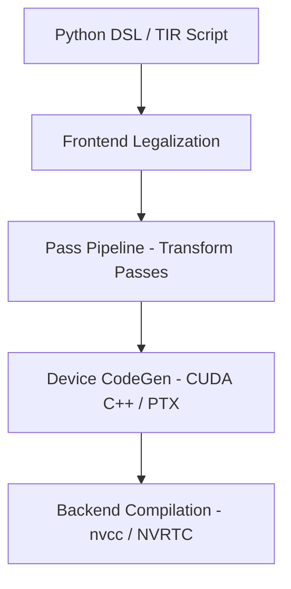

# TileLang CodeGen 流程分析与学习指导

> **目标读者**: 已经了解 TVM/TIR 基础，希望深入理解 TileLang 从高层 DSL 到 CUDA 二进制码的完整编译与代码生成流程的开发人员。
>
> **适用范围**: 主要聚焦 **NVIDIA (CUDA)** 后端的 CodeGen 流程。
>
> **版本参考**: TileLang `main` 分支 (2025-2026)

---

## 1. 总体架构概览

TileLang 是一个基于 **Apache TVM** (TIR/TIRX) 构建的 DSL 编译器框架，其 CodeGen 流程可概括为 **四阶段流水线**：



| 阶段 | 主要任务 | 核心文件 |
|------|---------|---------|
| **Frontend** | 将 Python DSL 函数编译为 `tirx.PrimFunc` | `language/eager/builder.py`, `language/ast/ir.py` |
| **Pass Pipeline** | 执行数十个 TIR 变换 pass，完成 layout inference、pipelining、线程同步等 | `cuda/pipeline.py`, `src/transform/*.cc` |
| **Device CodeGen** | 将经过 pipeline 处理后的 TIR IRModule 降级为 CUDA C++ 源码 | `src/cuda/codegen/codegen_cuda.cc`, `src/cuda/codegen/rt_mod_cuda.cc` |
| **Backend Compile** | 调用 nvcc/NVRTC 将 CUDA 源码编译为 cubin/fatbin | `engine/lower.py` 中的 `tilelang_callback_cuda_compile` |

---

## 1.5 `@tilelang.jit` vs `@T.prim_func` — 两个装饰器的区别

| | `@tilelang.jit` | `@T.prim_func` |
|---|---|---|---|
| **角色** | 完整的编译管线 + 运行时执行 | Python AST → `tirx.PrimFunc` 转换器 |
| **输出** | `JITKernel`（可执行的 kernel 适配器） | `tirx.PrimFunc`（TIR 中间表示） |
| **是否编译** | 是 — 自动调用 `lower()` + nvcc | 否 — 仅生成 TIR，需手动 `tilelang.compile()` |
| **是否可执行** | 是 — `kernel(a, b)` 直接运行 | 否 — 需要传给 `tilelang.compile()` |
| **执行模式** | **lazy**（返回 `PrimFunc`）和 **eager**（立即执行） | 无 |
| **两阶段特化** | 是 — phase1 构建 TIR 模板，phase2 根据具体 shape 特化 | 否 |

### 典型用法对比

```python
# ─── @tilelang.jit (lazy 模式) ───
@tilelang.jit
def matmul(M, N, K, block_M=128, block_N=128, block_K=32):
    @T.prim_func                          # ← 内部用 @T.prim_func 构建 TIR
    def kernel(A: T.Tensor((M, K), fp16),
               B: T.Tensor((K, N), fp16),
               C: T.Tensor((M, N), fp16)):
        ...
    return kernel                         # ← 显式返回 PrimFunc

k = matmul(1024, 1024, 1024)              # 编译（只发生一次）
k(a, b)                                   # 执行


# ─── @tilelang.jit (eager 模式) ───
@tilelang.jit
def gemm(A, B, C, block_M=64):
    M, N, K = T.const("M N K")
    A: T.Tensor[[M, K], fp16]
    B: T.Tensor[[K, N], fp16]
    C: T.Tensor[[M, N], fp16]
    with T.Kernel(M, N, thread=128) as (bx, by):
        ...                               # ← 直接写 kernel 逻辑

gemm(a, b, c)                             # 编译 + 立即执行


# ─── 纯 @T.prim_func (手动编译) ───
@T.prim_func
def my_kernel(A: T.Tensor((M, K), fp16),
              B: T.Tensor((K, N), fp16),
              C: T.Tensor((M, N), fp16)):
    ...

print(my_kernel.script())                 # 查看 TIR script
artifact = tilelang.lower(my_kernel, target="cuda")  # 手动编译
k = tilelang.compile(my_kernel, target="cuda")        # 或直接用 compile
```

### 调用链关系

```
@T.prim_func
    │ 将 Python 函数体做 AST 变换，构建 TIR
    │ 调用链: mutate(func) → IRGenerator → Builder → tirx.PrimFunc
    ▼
tirx.PrimFunc          ◄──── @tilelang.jit (lazy 模式)
    │                           │ 调用 prim_func 获得 TIR，
    │                           │ 再交给 lower() 编译
    ▼ lower()
编译管线 (Pass Pipeline + CodeGen + nvcc)
    │
    ▼
JITKernel (可执行)
```

### 本质区别一句话总结

> `@T.prim_func` **是一个 AST-to-TIR 宏展开器**，将 Python 语法映射为 TIR 中间表示，**不做编译**。
> `@tilelang.jit` **是一个完整的 JIT 编译器**，内部调用 `@T.prim_func`（或 builder）获取 TIR，再完成编译、缓存和执行

---

## 2. 代码仓库结构速览

```
tilelang/
├── tilelang/                    # Python 前端包
│   ├── __init__.py              # 包入口，加载 TVM/TileLang 共享库
│   ├── engine/
│   │   └── lower.py             # ★ 核心编译入口函数 lower()
│   ├── backend/
│   │   ├── execution_backend.py # ExecutionBackend 注册/解析
│   │   ├── device_codegen.py    # DeviceCodegen 注册/解析
│   │   ├── host_codegen.py      # HostCodegen 注册/解析
│   │   ├── pass_pipeline/
│   │   │   ├── pipeline.py      # PassPipeline 抽象
│   │   │   └── pipeline_utils.py# 工具函数
│   │   └── target.py            # Target 自动检测/标准化
│   ├── cuda/
│   │   ├── codegen.py           # 注册 CUDA DeviceCodegen
│   │   ├── pipeline.py          # ★ CUDA Pass Pipeline 定义
│   │   ├── execution_backend.py # CUDA ExecutionBackend 注册
│   │   ├── target.py            # CUDA Target 检测/标准化
│   │   └── transform/           # CUDA 专用 transform pass
│   ├── jit/
│   │   ├── __init__.py          # @tilelang.jit / compile() API
│   │   └── kernel.py            # JITKernel 类
│   ├── language/                # DSL 前端 (AST, parser, TIR builder)
│   ├── cache/                   # 编译缓存
│   └── transform/               # 通用 transform pass (Python 绑定)
│
├── src/                         # C++ 后端 (通过 TVM FFI 与 Python 交互)
│   ├── cuda/
│   │   ├── codegen/
│   │   │   ├── codegen_cuda.h   # CodeGenTileLangCUDA 类声明
│   │   │   ├── codegen_cuda.cc  # ★ CUDA C++ 代码生成器 (~5700 行)
│   │   │   └── rt_mod_cuda.cc   # BuildTileLangCUDA 入口
│   ├── transform/               # C++ transform pass 实现
│   │   ├── layout_inference.cc
│   │   ├── split_host_device.cc
│   │   ├── inject_pipeline.cc
│   │   ├── loop_vectorize.cc
│   │   └── ...
│   └── tl_templates/
│       └── cuda/                # CUDA 运行时模板头文件
│           ├── reduce.h
│           ├── copy.h
│           ├── mma.h
│           └── ...
```

---

## 3. 主入口到代码生成：逐级追踪

### 3.1 JIT 入口 (`tilelang.jit`)

用户代码入口：

```python
@tilelang.jit
def my_kernel(...):
    ...
```

或直接调用 `tilelang.compile(prim_func)`。两者的核心流程都收敛到 `JITKernel._compile_and_create_adapter()`。

**调用链**：

```
JITImpl.__call__()
  └─> JITImpl.compile()
       └─> tilelang.jit.compile()
            └─> cached()  →  JITKernel.__init__()
                 └─> JITKernel._compile_and_create_adapter()
                      └─> tilelang.lower()   [engine/lower.py]
```

### 3.2 `tilelang.lower()` 编译流程

```
文件: tilelang/engine/lower.py

lower()
  ├─> lower_to_host_device_ir()          # 核心变编译
  │    ├─> PreLowerSemanticCheck()        # 语义检查
  │    ├─> resolve_pipeline(target).lower()  # 运行 CUDA Pass Pipeline
  │    ├─> Filter() → split host/device    # 切分 host/device
  │    └─> return host_mod, device_mod
  │
  ├─> device_codegen()                    # 设备端代码生成
  │    ├─> _prepare_device_codegen_mod()  # 预备 pass
  │    │    ├─> LowerIntrin
  │    │    ├─> Simplify
  │    │    └─> HoistBroadcastValues
  │    └─> resolve_device_codegen().lower() → 调用 C++ FFI
  │         └─> "target.build.tilelang_cuda" (BuildTileLangCUDA)
  │
  ├─> host_codegen()                      # 宿主机端代码生成 (可选)
  └─> return CompiledArtifact
```

### 3.3 CUDA Pass Pipeline

定义在 `tilelang/cuda/pipeline.py` 的 `CUDAPassPipelineBody()` 中。这是整个编译过程中最关键的阶段，包含约 40+ 个 pass，按顺序执行：

**第一阶段 — Prologue (布局和前处理)**

```
1.  BindTarget              — 将 target 信息绑定到 IR
2.  MaterializeKernelLaunch — 将 T.Kernel 标记的循环展开为 thread/block 绑定
3.  LetInline               — 内联 Let 语句
4.  AddWrapperForSingleBufStore — 单 buffer store 包装
5.  LegalizeNegativeIndex   — 规范化负数下标
6.  VerifyParallelLoop      — 验证并行循环正确性
7.  InjectAssumes           — 注入 shape boundary assumption
8.  Simplify                — 表达式简化
9.  LayoutReducer           — 设置 reducer 的 layout
10. [CUDA] ProducerConsumerWarpSpecialized — Warp specialization (SM90+)
11. [CUDA] LowerBlackwell2SM — Blackwell 2SM 优化 (SM100+)
12. IfStmtBinding           — if-without-else 规范化
13. PipelinePlanning        — 软件流水线规划
14. InjectSoftwarePipeline  — 注入软件流水线
15. Simplify
16. LayoutInference         — ★ 推断 fragment 和 shared memory 的 layout
17. LayoutVisual            — 可视化 layout (可选)
18. LowerTileOp             — ★ 将高层 tile 操作降级为低层操作
```

**第二阶段 —  Buffer 与同步**

```
19. [CUDA] LowerL2Persistent    — L2 persistent map 降级
20. DecoupleTypeCast            — 解耦类型转换
21. LegalizeVectorizedLoop      — 向量化循环合法性检查
22. LegalizeSafeMemoryAccess    — 安全内存访问检查
23. LowerAccessPtr              — 降级 access_ptr 为 tvm_access_ptr
24. Simplify
25. HoistNonRestrictParams
26. [CUDA] LowerSharedTmem      — Shared TMEM 降级 (SM100+)
27. PlanAndUpdateBufferAllocationLocation
28. [CUDA] LowerSharedBarrier   — Mbarrier 降级 (SM90+)
29. [CUDA] FuseMBarrierArriveExpectTx
30. HoistGlobalBufferAllocations
31. LowerOpaqueBlock
32. Simplify + NarrowDataType + FlattenBuffer + ConfigIndexBitwidth
33. VectorizeLoop               — 循环向量化
34. StorageRewrite              — 存储重写
35. LoopUnswitching + UnrollLoop
36. RenormalizeSplitPattern + Simplify + RemoveNoOp + HoistIfThenElse
37. VerifyMemory + AnnotateEntryFunc
```

**第三阶段 — 设备代码生成准备**

```
38. InferFragment           — 推断 fragment 信息
39. LowerThreadAllreduce    — 线程级 allreduce 降级
40. [CUDA] LowerLDGSTG      — LDG/STG 指令降级
41. [CUDA] LowerHopperIntrin— Hopper 相关 intrinsic 降级
42. AnnotateDeviceRegions   — 标注设备区域
43. SplitHostDevice         — ★ 切分 host/device 函数
44. [CUDA] MarkCudaSyncCalls— 标记 CUDA 同步调用
45. AnnotateReadOnlyParams  — 标注只读参数
46. MergeSharedMemoryAllocations — 合并 shared memory 分配
47. [CUDA] InjectFenceProxy — 注入 fence proxy
48. ThreadSync("shared") / ThreadSync("shared.dyn") — 线程同步插入
49. [CUDA] InjectTcgen05Fence — TCGen05 fence (SM100+)
50. MergeIfStmt
51. [CUDA] AnnotateWarpGroupRegAlloc — Warp 组寄存器分配
52. MakePackedAPI           — 生成 Packed API
53. LowerDeviceKernelLaunch — 降级设备 kernel launch
54. [CUDA] PersistThreadblock — 持久化 threadblock
```

### 3.4 C++ 设备代码生成

## 4. C++ Device CodeGen 详解

### 4.1 入口点

```cpp
// src/cuda/codegen/rt_mod_cuda.cc
Module BuildTileLangCUDA(IRModule mod, Target target) {
    CodeGenTileLangCUDA cg;   // 实例化代码生成器
    cg.Init(output_ssa);       // 初始化

    ValidateUniqueDeviceGlobalSymbols(mod);  // 校验符号唯一性
    回调 tilelang_callback_cuda_validate(mod);  // Python 端验证

    // 遍历所有 PrimFunc，逐个添加到代码生成器
    for (auto kv : mod->functions) {
        auto f = Downcast<PrimFunc>(kv.second);
        ICHECK(calling_conv == CallingConv::kDeviceKernelLaunch);
        cg.AddFunction(gvar, f);
    }

    std::string code = cg.Finish();  // ★ 生成最终 CUDA 源码

    回调 tilelang_callback_cuda_postproc(code, target);  // Python 后处理

    // 调用 Python 端的 nvcc 编译回调
    ptx = tilelang_callback_cuda_compile(code, target, pass_ctx);
    return CUDAModuleCreateWithFallback(ptx, "ptx", func_info, source_map);
}
```

对应的 TVM FFI 注册：
```cpp
// 文件末尾
TVM_FFI_STATIC_INIT_BLOCK() {
    reflection::GlobalDef()
        .def("target.build.tilelang_cuda", BuildTileLangCUDA)
        .def("target.build.tilelang_cuda_without_compile",
             BuildTileLangCUDAWithoutCompile);
}
```

### 4.2 `CodeGenTileLangCUDA` 类架构

继承自 `tvm::codegen::CodeGenC`（TVM 的 C 代码生成器基类）。

```
CodeGenC (TVM 基类)
  └─ CodeGenTileLangCUDA (~5700 行)
       ├── 构造函数: 初始化所有 need_* 标志位为 false
       ├── Init(): 注册 intrinsics + 保留关键字
       ├── AddFunction(): 添加 PrimFunc 到代码生成
       ├── Finish(): ★ 生成完整 CUDA 源码
       ├── PrintFuncPrefix(): 输出 "extern \"C\" __global__"
       └── 数十个 VisitExpr_ / VisitStmt_ 重载
```

核心设计：每个 `need_*_` 布尔标志位 控制是否在生成的 CUDA 代码中包含对应的模板头文件。

```
Finish() 方法:
  1. 生成 #include 头文件列表:
     - need_mma_h_           → <mma.h>
     - need_mma_instruction_h_ → "tl_templates/cuda/instruction/mma.h"
     - need_wgmma_instruction_h_ → "tl_templates/cuda/instruction/wgmma.h"
     - need_tcgen05mma_instruction_h_ → "tl_templates/cuda/instruction/tcgen05mma.h"
     - need_intrin_h_        → "tl_templates/cuda/intrin.h"
     - need_atomic_h_        → "tl_templates/cuda/atomic.h"
     - need_barrier_h_       → "tl_templates/cuda/barrier.h"
     - need_copy_h_ / need_copy_sm90_h_ / need_copy_sm100_h_
     - enable_fp8_ / fp6_ / fp4_ → 对应的 fp 头文件
     - need_cooperative_groups_ → <cooperative_groups.h>
     - need_cluster_h_       → "tl_templates/cuda/cluster.h"
     - 始终包含: reduce.h, scan.h, ldsm.h, threadblock_swizzle.h, debug.h
  2. 调用基类的 CodeGenC::Finish() 产生函数定义

PrintFuncPrefix():
  os << "extern \"C\" __global__ ";  // 所有 kernel 函数都是 __global__
```

### 4.3 核心 IR Visitor 重载

`CodeGenTileLangCUDA` 重载了大量 `VisitExpr_` 和 `VisitStmt_` 方法，以下是最关键的：

| 访问者方法 | 作用 |
|-----------|------|
| `VisitStmt_(const ForNode*)` | 生成带 `#pragma unroll` 的 CUDA for 循环 |
| `VisitExpr_(const CallNode*)` | ★ 将 TIR intrinsic call 映射为 CUDA 内置函数/PTX |
| `VisitExpr_(const CastNode*)` | 类型转换 (fp16/bf16/fp8 特殊处理) |
| `VisitExpr_(const ShuffleNode*)` | warp shuffle 指令生成 |
| `VisitStmt_(const AllocBufferNode*)` | Shared memory / local memory 分配 |
| `VisitStmt_(const BufferStoreNode*)` | 向量化 store 生成 |
| `VisitExpr_(const BufferLoadNode*)` | 向量化 load 生成 |
| `VisitStmt_(const AttrStmtNode*)` | thread_extent, storage_scope 等属性处理 |
| `VisitExpr_(const RampNode*)` | Ramp (向量索引) 表达式处理 |
| `VisitExpr_(const BroadcastNode*)` | Broadcast 表达式处理 |
| `VisitStmt_(const EvaluateNode*)` | 副作用 call (如 cp.async) |

### 4.4 Intrinsic 映射机制

`HandleLateIntrinsicCall()` 是 CUDA intrinsic 分发的核心方法。它将 TIR 中的 builtin call 映射为 CUDA 内置函数。

**映射表结构**（截取自 `codegen_cuda.cc` 中的 `OpAttrMap`）：

| TIR Intrinsic | CUDA 输出 |
|--------------|-----------|
| `tir.exp(floats)` | `expf(val)` / `hexp(val)` |
| `tir.log(fp32)` | `logf(val)` |
| `tir.tanh(fp32)` | `tanhf(val)` |
| `tir.floor(fp32)` | `floorf(val)` |
| `tir.atomic_add` | `atomicAdd(&addr, val)` |
| `tl.cp_async` | `cp.async.ca.shared.global` PTX |
| `tl.lds` | Shared memory 加载 |
| `tl.tma_load` | TMA load (SM90+) |
| `tl.mma_sync` | `nvcuda::wmma::mma_sync` |
| `tl.wgmma` | `wgmma` PTX (SM90+) |
| `tl.tcgen05` | TC Gen5 指令 (SM100+) |

### 4.5 nvcc 编译回调

```python
# engine/lower.py
@tvm_ffi.register_global_func("tilelang_callback_cuda_compile")
def tilelang_callback_cuda_compile(code, target, pass_config=None):
    target_arch = nvcc.get_target_arch_and_code(target)  # e.g. "90"
    arch = [f"-arch=sm_{target_arch}"]
    compile_format = "fatbin"  # 多架构时为 fatbin

    # 编译选项
    options = [
        "-std=c++20",           # reduce.h 需要 C++20 lambda template
        f"-I{TILELANG_TEMPLATE_PATH}",
        f"-I{CUTLASS_INCLUDE_DIR}",
    ]
    if enable_fast_math:
        options.append("--use_fast_math")

    # 调用 nvcc compiler
    ptx = nvcc.compile_cuda(code, compile_format, arch, options=options)
    CUDABinaryCache.save(cache_key, compile_format, ptx)
    return ptx  # 以字节流返回 cubin/fatbin
```

---

## 5. 学习路径建议

### Phase 1: 理解整体流程（1-2 天）

1. **通读入口代码**：从 `tilelang/engine/lower.py` 开始，跟踪从 `lower()` 到 `lower_to_host_device_ir()` 再到 `device_codegen()` 的路径。
2. **阅读 `tilelang/cuda/pipeline.py`** 中的 `CUDAPassPipelineBody`，逐一了解各个 pass 的作用顺序。
3. **快速浏览 `tilelang/backend/`** 下的四个基础抽象文件：`device_codegen.py`, `host_codegen.py`, `execution_backend.py`, `pass_pipeline/pipeline.py`。

### Phase 2: 深入 Transform Passes（3-5 天）

4. **LayoutInference (`src/transform/layout_inference.cc`)**：这是 TileLang 最核心的 pass，负责推断 tensor 在 fragment 和 shared memory 中的内存布局。理解它就能理解 TileLang 的"灵魂"。
5. **LowerTileOp (`src/transform/lower_tile_op.cc`)**：将高层的 tile 操作 (matmul, copy 等) 降级为低层级循环和指令，与 LayoutInference 紧密配合。
6. **SplitHostDevice (`src/transform/split_host_device.cc`)**：了解 host/device 函数如何分离，device kernel launch 是如何生成的。
7. **InjectSoftwarePipeline (`src/transform/inject_pipeline.cc`)**：软件流水线注入，对理解吞吐优化至关重要。

### Phase 3: 精读 CUDA CodeGen（3-5 天）

8. **`src/cuda/codegen/codegen_cuda.h`**：先看类声明，了解有哪些 `need_*_` 标志和私有成员，这些就是生成 CUDA 代码时需要关注的所有"维度"。
9. **`src/cuda/codegen/codegen_cuda.cc` 的 `Finish()` 方法**：理解最终 CUDA 源码的组装过程——包含哪些头文件、如何布局。
10. **`VisitExpr_(const CallNode*)`**：这是最长的 visitor 方法，理解 TIR intrinsic → CUDA 内置函数的映射规律。
11. **`PrintType()`**：了解各种数值类型（fp16, bf16, fp8, tf32）到 CUDA 类型的映射规则。
12. **`rt_mod_cuda.cc` 的 `BuildTileLangCUDA()`**：代码生成的最终入口，理解整个 C++ 端的工作流。

### Phase 4: 对照 TVM 源码理解差异（2-3 天）

13. **对比 TVM 的 `codegen_cuda.cc`**：TileLang 继承自 TVM 的 `CodeGenC`，可以对比 TVM 上游版本，理解 TileLang 做了哪些定制（wmma, mma, wgmma, tcgen05 等）。
14. **对比 TVM 的 transform pipeline**：TileLang 的 pipeline 与 TVM 的标准 ANSOR/AutoTVM pipeline 有显著差异——TileLang 的工作在 tile 级别（tile-level optimization），比 TVM 的 statement-level 抽象层次更高。

---

## 6. CUDA Backend 关键特性

### 6.1 CUDA Architecture 支持矩阵

| 架构代际 | SM 版本 | 特性 |
|---------|---------|------|
| Volta (V100) | sm_70 | WMMA (mma.sync), Tensor Core 1st gen |
| Turing (T4) | sm_75 | WMMA int8/int4 |
| Ampere (A100) | sm_80 | WMMA bf16/tf32, cp.async, async copy |
| Ada (RTX 4090) | sm_89 | 增强 WMMA |
| Hopper (H100) | sm_90 | WGMMA, TMA, mbarrier, warp specialization |
| Blackwell (B100) | sm_100 | TC Gen5, TMEM, 2SM |

### 6.2 代码生成的关键 CUDA 特性

- **WMMA (Warp Matrix Multiply-Accumulate)**：通过 `nvcuda::wmma::fragment` 实现 Volta/Ampere Tensor Core 编程。
- **WGMMA (Warp Group MMA)**：Hopper 架构的异步 warp-group 级矩阵乘累加，通过 PTX `wgmma` 指令实现。
- **TMA (Tensor Memory Accelerator)**：Hopper 架构的异步数据搬运单元，支持 1D/2D/3D bulk copy。
- **TC Gen5 (Tensor Core Gen5)**：Blackwell 架构的第五代 Tensor Core 及 TMEM（Tensor Memory）支持。
- **Mbarrier**：Hopper+ 的硬件屏障机制，用于异步复制与 warp specialization。
- **Warp Specialization**：将 warp 划分为 producer/consumer roles，实现指令级流水线。
- **Persistent Threadblock**：threadblock 持久化执行，实现 Stream-K 等并行模式。
- **LDG/STG**：全局内存 load/store 的直接 PTX 指令。
- **L2 Persistent**：L2 cache 驻留控制。

### 6.3 模板头文件系统

`src/tl_templates/cuda/` 下的头文件是 CUDA 代码生成的重要组成部分。它们提供了运行时的 C++ 辅助函数：

```
tl_templates/cuda/
├── common.h                  # 公共类型定义
├── reduce.h                  # 线程束/block 级别 reduction
├── scan.h                    # 并行扫描
├── copy.h                    # 普通拷贝 + cp.async
├── copy_sm90.h               # Hopper (SM90) TMA 拷贝
├── copy_sm100.h              # Blackwell (SM100) TMA 拷贝
├── barrier.h                 # Mbarrier 操作
├── cluster.h                 # 集群操作
├── intrin.h                  # 运行时 intrinsic 辅助函数
├── atomic.h                  # 原子操作
├── math.h                    # 数学函数辅助
├── debug.h                   # 调试工具
├── ldsm.h                    # LDSM (load matrix) 指令
├── threadblock_swizzle.h     # Threadblock 洗牌
├── instruction/
│   ├── mma.h                 # WMMA 指令封装
│   ├── mma_sm70.h            # Volta WMMA 指令
│   ├── mma_sp.h              # 稀疏 WMMA 指令
│   ├── wgmma.h               # Hopper WGMMA 指令
│   ├── wgmma_sp.h            # 稀疏 WGMMA 指令
│   └── tcgen05mma.h          # Blackwell TCGen5 MMA 指令
├── cuda_fp8.h                # FP8 类型支持
├── cuda_fp4.h                # FP4 类型支持
├── cuda_bf16_wrapper.h       # BF16 回退
└── nvrtc_std.h               # NVRTC 标准库包装
```

---

## 7. 端到端示例追踪

假设我们编译一个简单的 GEMM kernel:

```python
@tilelang.jit
def gemm(A: T.Tensor((M, K), fp16), B: T.Tensor((K, N), fp16), C: T.Tensor((M, N), fp16)):
    with T.Kernel(M, N, thread=128) as (bx, by):
        tx = T.thread_binding(0, "threadIdx.x")
        
        # Tile 声明
        TA = T.alloc_fragment((bm, bk), fp16)
        TB = T.alloc_fragment((bk, bn), fp16)
        TC = T.alloc_fragment((bm, bn), fp16)
        T.fill(TC, 0)
        
        for k in T.Pipelined(K // bk, num_stages=3):
            T.copy(A[bx*bm:, k*bk], TA)    # → TMA load (if sm90+) or cp.async
            T.copy(B[k*bk:, by*bn], TB)
            T.gemm(TA, TB, TC)              # → wgmma (if sm90+) or mma_sync
        
        T.copy(TC, C[bx*bm:, by*bn])        # → stg / TMA store
```

**编译流程追踪**：

| 步骤 | Pass/Stage | 发生了什么 |
|------|-----------|-----------|
| 1 | `MaterializeKernelLaunch` | `T.Kernel(M, N)` → `blockIdx.x * blockDim.x + threadIdx.x` 等 |
| 2 | `PipelinePlanning` | 识别 `T.Pipelined` 循环，规划 3 级软件流水线 |
| 3 | `InjectSoftwarePipeline` | 将 pipeline 循环展开为 prologue + body + epilogue |
| 4 | `LayoutInference` | 推断 `TA`, `TB`, `TC` 的 fragment layout (如 row-major/col-major) |
| 5 | `LowerTileOp` | `T.gemm` → MMA 相关 intrinsic；`T.copy` → load/store 指令 |
| 6 | `LowerHopperIntrin` | 将 `T.copy` 中的异步拷贝转为 `cp.async` 或 `tma_load` |
| 7 | `SplitHostDevice` | 分离出 `__global__` kernel 函数和 host wrapper 函数 |
| 8 | `CodeGenTileLangCUDA` | 将 TIR 中的循环、load/store、intrinsic 输出为 CUDA C++ |
| 9 | `nvcc` | CUDA C++ → PTX → cubin/fatbin |

---

## 8. 调试与可视化技巧

### 8.1 查看中间 IR

```python
import tilelang
from tilelang import tvm

# 获取 PrimFunc 的 TIR Script
print(prim_func.script())

# 在 PassContext 中启用 IR dump
with tvm.transform.PassContext(config={"tl.enable_dump_ir": True}):
    artifact = tilelang.lower(prim_func, target="cuda")
```

### 8.2 查看最终生成的 CUDA 代码

```python
kernel = tilelang.compile(prim_func, target="cuda")
print(kernel.get_kernel_source())
```

### 8.3 可视化 Layout

```python
with tvm.transform.PassContext(config={
    "tl.layout_visualization_enable": True,
    "tl.layout_visualization_formats": "txt,png",
}):
    artifact = tilelang.lower(prim_func, target="cuda")
```

### 8.4 设置 TILELANG_PASS_DIFF

```bash
export TILELANG_PASS_DIFF=1
```

可以在每个 pass 前后打印 IR diff，便于定位 pass 引入的变更。

---

## 9. 与传统 TVM CodeGen 的对比

| 维度 | 传统 TVM | TileLang |
|------|---------|----------|
| 输入 | TE/Relay → TIR | TIR Script (Python DSL) |
| 抽象层次 | Statement-level | **Tile-level** (tensor blocks) |
| Layout 推断 | 基于 compute/schedule | 自动 LayoutInference pass |
| Pipeline | 手写 schedule | `T.Pipelined` 声明式 + 自动注入 |
| GEMM 支持 | TE extern call | MMA/WGMMA/TCGen05 intrinsic |
| Warp Specialization | 不支持 | 内置 pass 支持 (SM90+) |
| TMA | 不支持 | 内置支持 (SM90+) |
| Host CodeGen | LLVM | C host (TVM FFI) 或指定 backend |

---

## 10. 推荐阅读路径

### 必须阅读的核心文件（按顺序）

| # | 文件 | 重要性 | 说明 |
|---|------|--------|------|
| 1 | `tilelang/engine/lower.py` | ★★★★★ | 编译入口，理解整体流程 |
| 2 | `tilelang/cuda/pipeline.py` | ★★★★★ | CUDA pass pipeline 定义 |
| 3 | `src/cuda/codegen/rt_mod_cuda.cc` | ★★★★★ | CUDA codegen 入口 |
| 4 | `src/cuda/codegen/codegen_cuda.h` | ★★★★★ | 代码生成器类声明 |
| 5 | `src/cuda/codegen/codegen_cuda.cc` | ★★★★★ | CUDA 代码生成器实现 |
| 6 | `src/transform/layout_inference.cc` | ★★★★★ | Layout 推断核心 |
| 7 | `src/transform/lower_tile_op.cc` | ★★★★★ | Tile 操作降级 |
| 8 | `tilelang/backend/device_codegen.py` | ★★★★ | Device codegen 注册机制 |
| 9 | `tilelang/jit/kernel.py` | ★★★★ | JITKernel 编译流程 |
| 10 | `src/transform/split_host_device.cc` | ★★★★ | Host/device 切分 |

### 扩展阅读

| # | 文件 | 说明 |
|---|------|------|
| 11 | `src/tl_templates/cuda/instruction/wgmma.h` | WGMMA 模板实现 |
| 12 | `src/tl_templates/cuda/instruction/mma.h` | WMMA 模板实现 |
| 13 | `src/cuda/transform/lower_hopper_intrin.cc` | Hopper intrinsic 降级 |
| 14 | `src/cuda/transform/producer_consumer_ws.cc` | Warp specialization 实现 |
| 15 | `src/cuda/transform/lower_shared_barrier.cc` | Mbarrier 降级 |
| 16 | `src/transform/inject_pipeline.cc` | 流水线注入 |
| 17 | `src/cuda/codegen/ptx.h` | PTX inline assembly 生成 |

---

## 11. 常见问题 FAQ

**Q: TileLang 的 codegen 是直接生成 PTX 还是 CUDA C++？**

A: 先生成 **CUDA C++** 源码（通过 `CodeGenTileLangCUDA`），然后调用 `nvcc`（或 `NVRTC`）编译为 PTX/cubin。模板头文件 (`tl_templates/cuda/`) 提供了运行时的 CUDA C++ 辅助函数。

**Q: `cutedsl` backend 与普通 CUDA backend 有什么区别？**

A: `cutedsl` 是 CuTe DSL 的集成，提供基于 CuTe 的布局和操作支持。它注册了独立的 `DeviceCodegen` (`target.build.tilelang_cutedsl`)，生成使用 CuTe 库的 CUDA 代码，而不是直接输出模板化的 CUDA C++。

**Q: Host CodeGen 的作用是什么？**

A: Host CodeGen 生成在 CPU 上运行的代码（调用 device kernel launch），用于与 PyTorch/TensorFlow 集成。Host codegen 目前生成 **C 代码** 并通过 `tvm_ffi` 进行运行时调用。也可以选择 Cython/NVRTC backend 直接生成 Python C 扩展。

**Q: 如何为新的后端添加 CodeGen 支持？**

A: 注册链如下：
1. 实现 `DeviceCodegen`（继承/实例化 `backend.device_codegen.DeviceCodegen`）
2. 实现 `PassPipeline`（定义目标 backends 的 transform passes）
3. 注册 `register_device_codegen("target_kind", codegen)`
4. 注册 `register_pipeline(pipeline)`
5. (可选) 注册 `ExecutionBackend` 用于运行时执行

---

## 12. 总结流程图

```
用户编写 Python DSL
       │
       ▼
   JITKernel.compile()
       │
       ▼
   lower()                          [engine/lower.py]
       │
       ├─ lower_to_host_device_ir()
       │      │
       │      ├─ PassPipeline.lower()
       │      │      └─ CUDAPassPipelineBody (40+ passes)
       │      │
       │      ├─ Filter(host)    → host_mod
       │      └─ Filter(device)  → device_mod
       │
       ├─ device_codegen()
       │      │
       │      ├─ _prepare_device_codegen_mod()
       │      └─ CodeGenCUDABackend.lower()
       │             │
       │             └─ BuildTileLangCUDA (C++ FFI)
       │                    │
       │                    ├─ CodeGenTileLangCUDA
       │                    │      ├─ AddFunction() × N
       │                    │      └─ Finish()
       │                    │           → CUDA C++ 源码
       │                    │
       │                    ├─ tilelang_callback_cuda_postproc
       │                    └─ tilelang_callback_cuda_compile
       │                           │
       │                           └─ nvcc -arch=sm_XX → cubin/fatbin
       │
       └─ host_codegen() (可选)
              │
              └─ C host code → tvm_ffi runtime module
```

---

*本文件由 AI 辅助生成，基于 TileLang 主分支源代码分析。*
