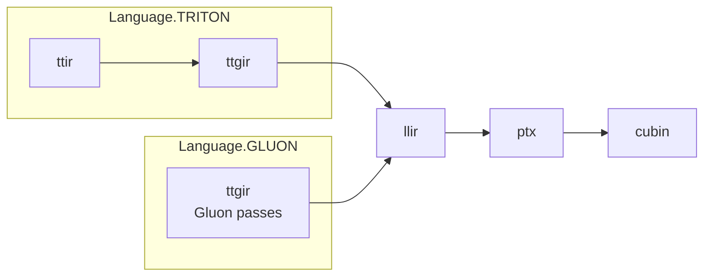

# NVIDIA CUDA 后端：`add_stages` 编译流水线

本文梳理 `triton/third_party/nvidia/backend/compiler.py` 中 `CUDABackend.add_stages`（约 537–548 行）注册的编译阶段，及其在总编译器中的执行方式。

## 在总流程中的位置

`python/triton/compiler/compiler.py` 在编译内核时会：

1. 构造空字典 `stages`
2. 调用 `backend.add_stages(stages, options, src.language)` 由各后端填入阶段
3. 根据源码扩展名 `src.ext` 决定从哪一阶段开始执行（支持从中间 IR 切入）
4. 按 `stages` 的**插入顺序**依次调用每个阶段的 lambda：`module = compile_ir(module, metadata)`

因此 `add_stages` 里**登记顺序**就是流水线顺序。

## `add_stages` 做了什么

1. **`capability`**：由 `options.arch` 解析出的 SM 能力值（整数），后续各阶段用于选 Pass、PTX 目标等。
2. **按语言分支**（`Language` 来自 `triton.backends.compiler`）：
   - **`Language.TRITON`**：先 Triton IR，再 GPU IR。
   - **`Language.GLUON`**：跳过 TTIR，直接从 Gluon 模块进 TTGIR 变换。
3. **公共后缀**：无论上面哪种语言，都会接上 **`llir` → `ptx` → `cubin`**。
4. **可选钩子**：若 `knobs.runtime.add_stages_inspection_hook` 已设置，在登记完成后调用，便于测试或观测各阶段。

## 阶段一览（有序）

| 阶段键 | 何时注册 | 作用概要 |
|--------|----------|----------|
| `ttir` | 仅 `TRITON` | `make_ttir`：TTIR 上 inliner、tensor pointer/descriptor 重写、规范化、CSE、循环展开等。 |
| `ttgir` | `TRITON` 时为 `make_ttgir`；`GLUON` 时为 `gluon_to_ttgir` | **Triton**：TTIR → TTGPUIR，并按架构跑大量 TTGPUIR / Hopper / Blackwell 相关优化。**Gluon**：在已有 Gluon/TTGPUIR 模块上跑 Gluon + NV 相关 Pass。二者都会写入 `metadata["tensordesc_meta"]`（在对应实现里）。 |
| `llir` | 总是 | `make_llir`：TTGPUIR → LLVM IR（MLIR），再经 LLVM 落到字符串 LLVM IR；更新 `num_warps`、`shared`、`tmem_size`、scratch 等 metadata。 |
| `ptx` | 总是 | `make_ptx`：LLVM IR 字符串 → NVPTX 汇编文本；解析 `.entry` 得到 kernel 名写入 `metadata["name"]`。 |
| `cubin` | 总是 | `make_cubin`：写临时 `.ptx`，调用 **`ptxas`** 生成目标 cubin 字节流；失败时抛 `PTXASError`。 |

## 流程图（概念）

## 与 `compiler.py` 其它逻辑的衔接

- **起点**：Python 侧 `src.make_ir(...)` 先得到 MLIR `module`（对应源码或 IR 文件），再进入 `stages` 循环。
- **`ir_override` / 覆盖文件**：某阶段若配置了对应扩展名的覆盖文件，可在该阶段用磁盘上的 IR 替换 `compile_ir` 的输出。
- **`knobs.compilation.store_binary_only`**：为真时，缓存里可能只保留最终二进制等，中间 IR 不落盘（见核心编译循环中的条件）。

## 代码锚点

- 阶段注册：`triton/third_party/nvidia/backend/compiler.py` — `CUDABackend.add_stages`
- 阶段执行与缓存：`triton/python/triton/compiler/compiler.py` — `compile` 内 `for ext, compile_ir in list(stages.items())[first_stage:]:`
